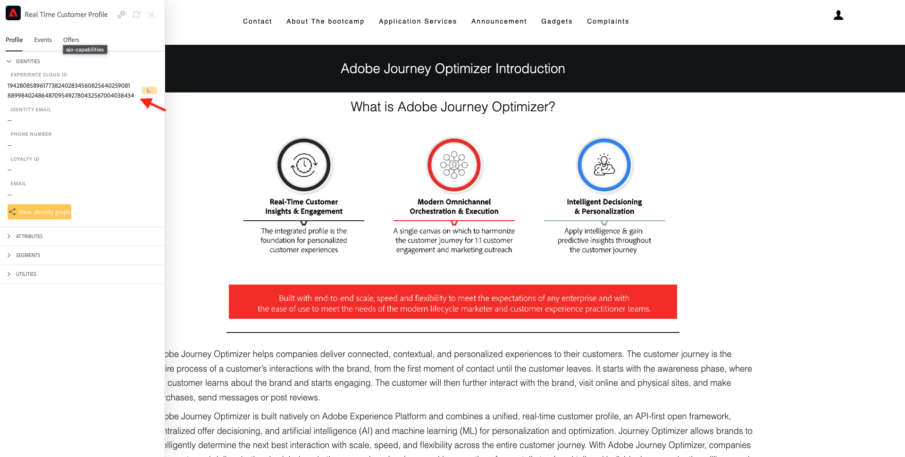
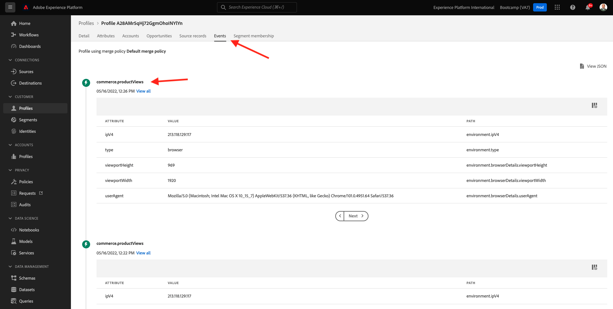

# 1.2 Visualizzare seu próbucperfezionil de cliente em tempo reale - UI

Neste exercício, você irá fazer login na Adobe Experience Platform e visalizar seu próbupribupre Perfil de cliente tempo real na UI.

## História

Nessun Perfil do cliente em tempo reale, todos os dados do perfil são exibidos juntamente com os dados do evento, além das associações de segmentos esiste. Os dados mostrados podem vir de qualquer chargar, de aplicativos da Adobe e soluções externas. Essa é a exibição mais poderosa da Adobe Experience Platform, o verdadeiro locale do sistema de experiência.

## 1.2.1 Utilizzare una visualizzazione sul tipo di prodotto o la qualità del cliente di Adobe Experience Platform

Acesse [Adobe Experience Platform](https://experience.adobe.com/platform). Depois de fazer login, você irá acessar a página inicial da Adobe Experience Platform.

Antes de continuar, você precisa selionar um **sandbox**. O nome fare sandbox un ser selionado é Bootcamp. É possível fazer isso clicando nessun texto **[!UICONTROL Produzione Prod]** na linha azul na parte superior da tela. depois de selionar o sandbox apropriado, você verá a tela mudando e agora você está em seu [!UICONTROL sandbox] dedica.

Nessun menu à esquerda, acesse **Profili** e **Sfoglia**.

Nessun doloroso Visualizador de perfil sul sito seu, você pode encontrar a visão geral da identidade. Cada identidade está vinculada a um namespace.

No antidel Visualizador de perfil, agora você pode ver esta identidade:

| Namespace | Identità |
|:-------------:| :---------------:|
| Experience Cloud ID (ECID) | 19428085896177382402834560825640259081 |

Com a Adobe Experience Platform, todos os ID são igualmente importantes. Anteriore, o era ECID o mais importante no contexto da Adobe e toos outros IDs estavam vinculados ao ECID em uma relação hierárquica. Com a Adobe Experience Platform, isso mudou e cada ID pode ser considerado um identificador primário.

Normalmente, o identificatore primário depende do contexto. Se você perguntar ao seu Call Centre: **Qual è il valore dell&#39;ID?** Eles provavelmente responderão: **o número de telefone!** Mas se você perguntar à sua equipe de CRM, eles responderão: **o endereço de mail!** Una Adobe Experience Platform entende essa complessidade e gerencia isso para você. Cada aplicativo, seja um aplicativo da Adobe ou não, se comunicará com a Adobe Experience Platform referindo-se ao ID que consideram principal. E funzioni semplificate.

Para o campo **Spazio dei nomi identità**, selione **ECID** e para campo o campo **Valore identità** insira o ECID que você pode encontrar no antidolorel Visualizador de perfil do site do Bootcamp. Clipart **Visualizza**. Você verá seu perfil na lista. Cliff no **ID profilo** para abrir seu perfil.

Agora você tem uma visão geral de alguns **Atributos de perfil** importantes do seu perfil de cliente.

Acesse **Eventi**, onde você pode ver as entradas de cada evento de experiência vinculado ao seu Perfil.

Por fim, acesse a opção de menu **Iscrizione al segmento**. Agora você verá todos os segmentos que se Qualam para este perfil.

Agora vamos criar um novo segmento que permitirá que você personalizzare un experiência do cliente cliente anônimo ou conhecido.

Próxima etapa: [1.3 Crite um segmento - Interfaccia utente](./ex3.md)

[Retornar para Fluxo de Usuário 1](./uc1.md)

[Retornar para Todos os Módulos](../../overview.md)
