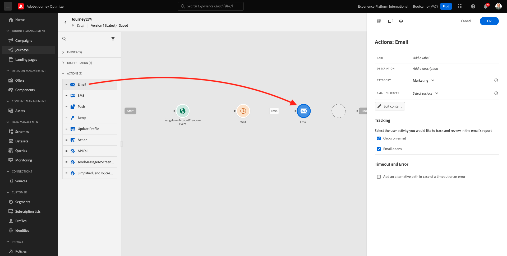
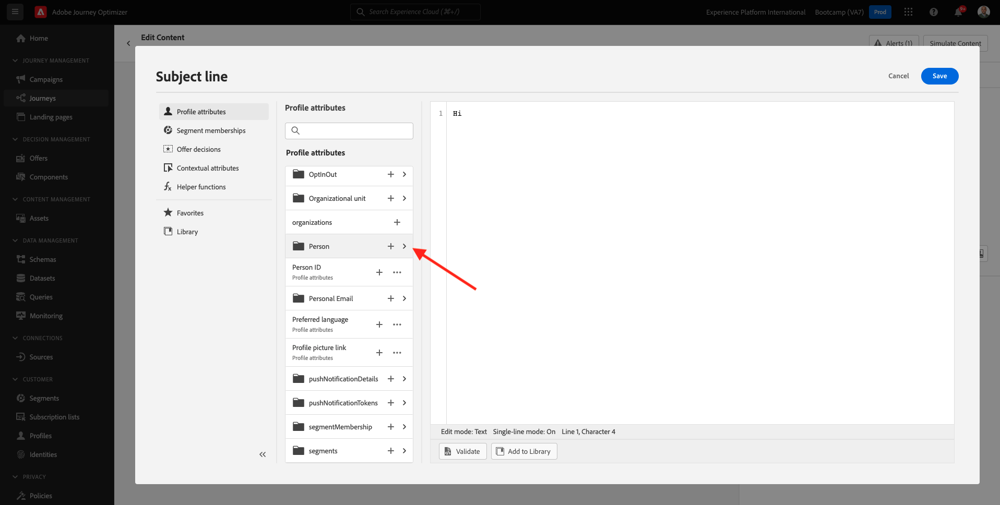
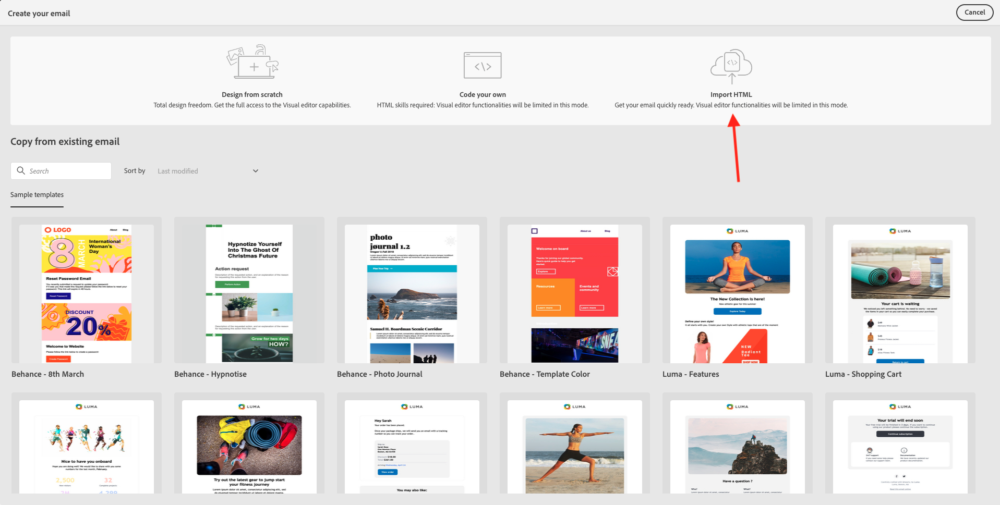
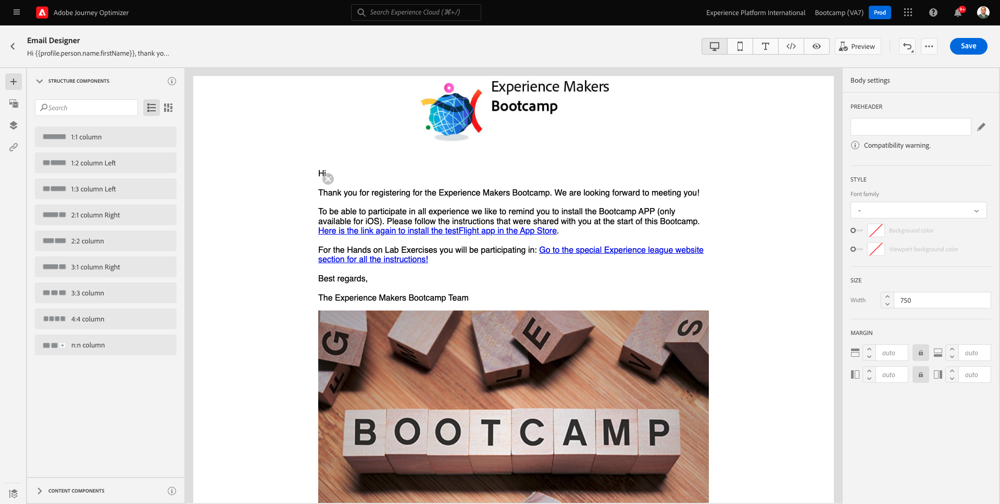
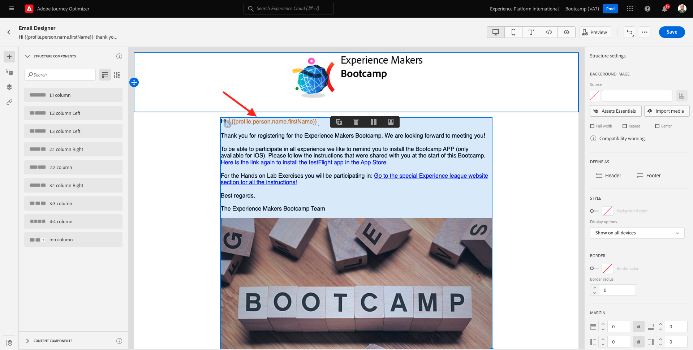

# 2.3 Crie sua jornada e mensagem de email

Neste exercício, você irá configurar a jornada que ser acionada quando alguém criar uma conta no site de dimostração.

Accesso Faça a Adobe Journey Optimizer acessando a [Adobe Experience Cloud](https://experience.adobe.com). Clique em **Journey Optimizer**.

Você será redirecionado para a visualização da **Home** no Journey Optimizer. Primeiro, verifique se você está o sandbox correto. O nome do sandbox que deve ser usado é `Bootcamp`. Para alternar de um sandbox para outro, cricca em **Prod** e selecione o sandbox na lista. Neste exemplo, o nome do sandbox é **Bootcamp**. Você estará na visualização da **Home** do seu sandbox `Bootcamp`.

## 2.3.1 Crie a sua jornada

Nessun menu à esquerda, cricca em **Percorsi**. Em seguida, cricca em **Crea Percorso** para criar uma nova jornada.

Você verá uma tela de jornada vazia

Nessun exercício anteriore, você criou um novo **Evento**. Você nomeou o evento `seuSobrenomeAccountCreationEvent` e substituiu `seuSobrenome` pelo seu sobrenome. Este foi o resultado da criação do Evento:

Agora você deve considerar este evento como o início desta Jornada. Você pode fazer isso indo para o lado esquerdo da tela e procurando pelo seu evento na lista de eventos.

Selecione seu evento, arraste e solte o evento na tela de Jornada. Sua Jornada agora deve ser semelhante ao seguinte:

Como segunda etapa da jornada, você deve adicionar uma etapa curta de **Aspetta**. Vá para o lado esquerdo da tela até a seção **Orchestrazione** para encontrar isso. Você usará atributos de perfil e precisará garantir que eles sejam preenchidos no Perfil do Cliente em tempo real.

Sua jornada agora deve ser semelhante ao seguinte. Non c&#39;è nessun lado direito da tela você configurar o tempo de espera. Defina como 1 minuto. Isso dará bastante tempo para que os atributos do perfil estejam disponíveis após o disparo do evento.

Cricca em **Ok** para salvar suas alterações.

Como terceira etapa da jornada, você deve adicionar uma ação **E-mail**. Vá para o lado esquerdo da tela para **Azioni**, selecione a ação **Email** e arraste e solte a ação no segundo nó da sua jornada. Agora o seguinte será exibido.

Definisci una **Categoria** como **Marketing** e selecione uma **superficie e-mail** que permita o envio de e-mail. Nesse caso, una **superficie di posta elettronica** un utente selecionada é E-mail. Certifique-se de que as caixas de seleção **Clicks on email** e **email opens** estejam marcadas.

Un próximo etapa é criar sua mensagem. Para isso, cricca em **Modifica contenuto**.

## 2.3.2 Crie a sua mensagem

Para criar sua mensagem, cricca em **Modifica contenuto**.

O seguinte será exibido.

Clique no campo de texto **Oggetto**.

Na área de texto, comece **Olá**

Una linha de l&#39;assunzione da não está pronta. Em seguida, você trazer o token de personalização para o **First name** que está armazenado em `profile.person.name.firstName`. Nessun menu à esquerda, ruolo para baixo para encontrar o elemento **Persona** e clique na seta para visualizar mais campos

Agora encontre o elemento **Nome completo** e clique na seta para visualizar mais campos.

Por fim, localizza o campo **Nome** e cricca no símbolo **+** ao lado dele. Você verá o token de personalização aparecer no campo de texto.

Em seguida, adicione o texto, **agradecemos a sua inscrição!**. **Salva**.

Voce irá retornar para esta tela. Clique em **Invia un&#39;email a Designer** para criar o conteúdo do e-mail.

Na próxima tela, será solicitado que você forneça o conteúdo do e-mail através de 3 métodos diferentes:

- **Disegno da zero**: Comece com uma tela em branco e use o editor WYSIWYG para arrastar e soltar a estrutura e os componentes de conteúdo para criar visualmente o conteúdo do e-mail.
- **Crea il tuo codice**: Crie seu próprio modelo de e-mail codificando HTML
- **Importa HTML**: Importe um modelo HTML EXISTente, que você poderá editar.

Coppia em **Importa HTML**.

Arraste e solte o arquivo **mailtemplatebootcamp.html**, que você pode baixa [aqui](../../assets/html/mailtemplatebootcamp.html.zip). Voce principale: Clique em Importar.

Você verá este modelo de e-mail padrão

Vamos personalizar o e-mail. Clique ao lado do texto **Olá** e, em seguida, clique no ícone **Aggiungi Personalization**.

Em seguida, você trazer o token de personalização **Nome** que está armazenado em `profile.person.name.firstName`. Nessun menu, localizzare o elemento **Persona**, faça uma busca detalhada no elemento **Nome completo** e cricca no ícone **+** para adicionar o campo **Nome** ao editor.

**Salva**.

Agora você verá como o campo de personalização foi adicionado ao seu texto.

Clique em **Salva** para salvar sua mensagem.

Retorne para o painel de mensagens clicando na seta ao lado do texto da linha de non canto superior esquerdo.

Agora você concludere una criação do seu e-mail de cadastro. Cricca na seta no canto superiore esquerdo para retornar à sua jornada.

Coppia em **Ok**.

## 2.3.3 Publlique a sua jornada

Você ainda dar um Nome à sua jornada. Você pode fazer isso clicando no ícone **Proprietà** no canto superior direito da tela.

Você pode fazer isso clicando no item clicar no item &quot;Name&quot; e inserindo o seguinte nome `yourLastName - Account Creation Journey`. Cricca em **OK** para salvar come mudanças.

Agora você pode publicar sua jornada clicando em **Publish**.

Clique em **Publish** novamente.

Você verá uma barra de confirm mação verde informando que sua jornada agora está Publicada.

Você terminou este exercício

Eta di Próxima: [2.4 Teste sua jornada](./ex4.md)

[Retornar para Fluxo de Usuário 2](./uc2.md)

[Retornar para Todos os Módulos](../../overview.md)
