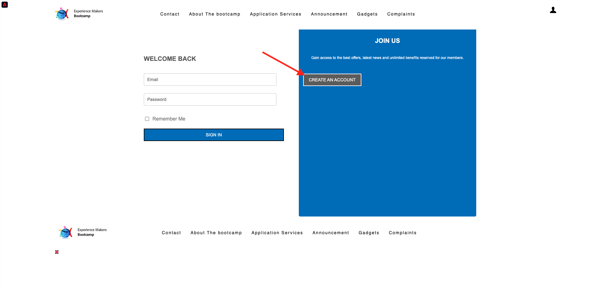

# 2.4 Test del percorso

## Flusso del percorso cliente

Apri una nuova finestra del browser, pulita e in incognito e vai a [https://bootcamp.aepdemo.net](https://bootcamp.aepdemo.net). Fai clic su **Consenti tutto**. In base al comportamento di navigazione nel flusso di utenti precedente, vedrai che la personalizzazione si verifica nella home page del sito web.

Fai clic sul pulsante **Profilo** nell’angolo in alto a destra dello schermo.

Fai clic su **Creare un account**.

Compila tutti i campi del modulo. Utilizza un valore reale per l’indirizzo e-mail e il numero di telefono, in quanto verrà utilizzato in esercizi successivi per la consegna di e-mail e SMS.

Scorri verso il basso. È ora necessario inserire l’ID evento dell’evento personalizzato creato nell’esercizio 2.2. È possibile trovarlo qui:

L’ID evento è ciò che deve essere inviato a Adobe Experience Platform per attivare il percorso generato. Questo è l&#39;ID evento in questo esempio: `19cab7852cdef99d25b6d5f1b6503da39d1f486b1d585743f97ed2d1e6b6c74f`

Compila l’ID evento nel campo . **ID evento creazione account** e fai clic su **Registro**.

Vedrete questo.

Riceverai anche questa e-mail, che è l’e-mail che ti sei creato come parte di questo esercizio.

Ora avete finito questo esercizio.

Passaggio successivo: [2.5 Installare e utilizzare l’app mobile](./ex5.md)

[Torna al flusso utente 2](./uc2.md)

[Torna a tutti i moduli](../../overview.md)
