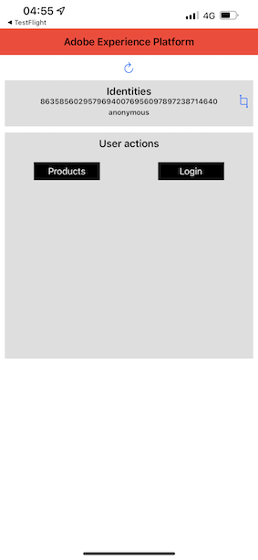

# 2.5 Instale e use o aplicativo móvel

## Instale o aplicativo móvel

Antes de instalar o aplicativo, é necessário habilitar Rastreamento no seu dispositivo iOS. Para isso, acesse Configurações > Privacidade e segurança > Rastreamento e conferme a opção Permitir que os aplicativos solicitem o rastreamento.

Acesse a App Store da Apple e pesquise `aepmobile-bootcamp`.\
Clique em **Installa** ou **Scarica**.

Depois que o aplicativo estiver instalado, cricca em **Abrir**.

Clique em **OK**.

Clique em **Autorizzazione**.

Clique em **Concordo**.

Clique em **Permitir enquanto uso o app**.

Clique em **Autorizzazione**.

Agora você está no aplicativo, na página inicial, pronto(a) para verificar toda a jornada do cliente.

## Fluxo da jornada do cliente

Primeiramente, é necessário fazer o login. Clique em **Login**.

Depois de criar sua conta nos exercícios anteriores, isso é exibido no site. Agora é necessário reutilizar o endereço de e-mail da conta que você criou no aplicativo para fazer o login.

Digite o endereço de e-mail que você usou no site e clique em **Login**.

Você receberá uma confermação de que está conectado e receberá uma notifica ação push.

Retorne para a página inicial do aplicativo e os recursos adicionais irão aparecer.

Acesse **Prodotti**. Clique em qualquer produto, neste campione: **Caffè a disposizione**.

Você verá a página do produto **Caffè a disposizione** non applicabile. Clique em **Acquista**.

Agora você terminou este exercício e está pronta para nel ruolo di próximas atividades.

Próxima etapa [ 2.6 Personalização nessun call center](./ex6.md)

[Retornar para Fluxo de Usuário 2](./uc2.md)

[Retornar para Todos os Módulos](../../overview.md)
