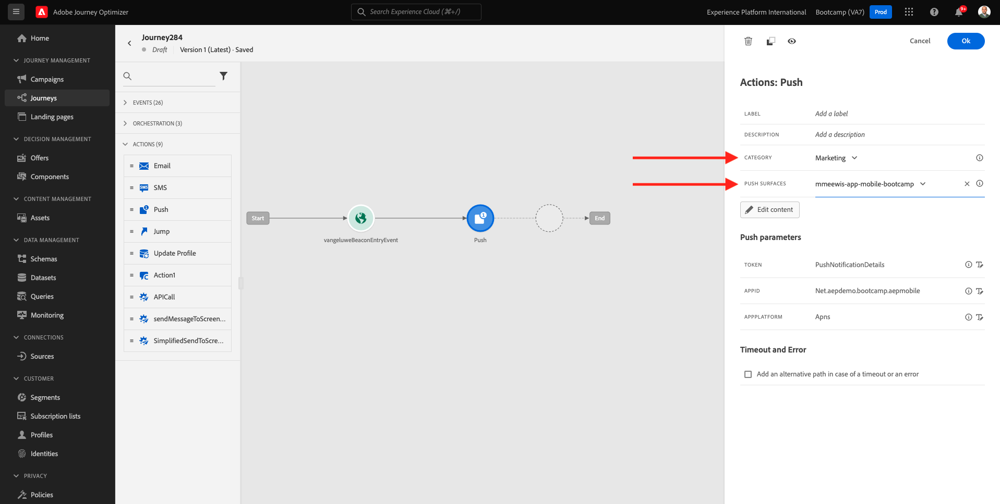
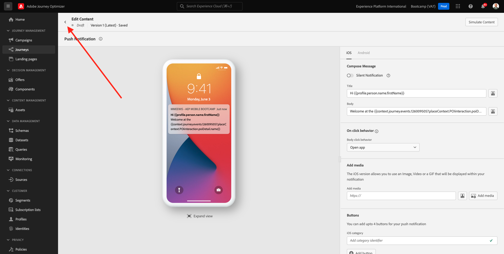

# 3.3 Crie sua jornada e notificação push

Neste exercício, você irá configurar a jornada e a mensagem que precisa ser acionada quando alguém inserir uma sinalização (beacon) o aplicativo móvel.

Accesso Faça su Adobe Journey Optimizer acessando a [Adobe Experience Cloud](https://experience.adobe.com). Clipart **Journey Optimizer**.

Você será redirecionado para a visualização da a **Pagina principale** niente Journey Optimizer. Primeiro se você está germente sandbox corrispondente. O nome do sandbox que dev ser usado é `Bootcamp`. Para alternar de um sandbox para outro, clique em **Prod** e selione o sandbox na lista. Neste esempio, o nome do sandbox é **Bootcamp**. Você estará na visualização da **Pagina principale**  sandbox da fare `Bootcamp`.

## 3.3.1 Crie a sua jornada

Nessun menu à esquerda, clique em **Percorsi**. Em seguida, clique em **Crea Percorso** para criar uma nova jornada.

Você verá uma tela de jornada vazia.

Nessun exercício anteriore, você criou um novo **Evento**. Você nomeou o evento `yourLastNameBeaconEntryEvent` e sostituito `yourLastName` pelo seu sobrenome. Este foi o risultanti da criação do evento:

Agora você deve considerar este evento como o início desta Jornada. Você pode fazer isso indo para o lado esquerdo da tela e procurando pelo seu evento na lista de eventos.

Selecione seu evento, arraste e solte o evento na tela de jornada. Sua Jornada agora deve ser semelhante ao seguinte. Clipart **Ok** para salvar suas alterações.

Como segunda etapa da jornada, você adicionar uma ação **Push**. Vá para o lado esquerdo da tela para **Azioni**, selione a ação **Push** e arraste e solte a ação no segundo nó da sua jornada.

No lado direito da tela, agora você Deve criar sua notificação push.

Definisci a **Categoria** como **Marketing** e selecione um push Surface que permite enviar notificações push. Nesse caso, una superfície spingere un utente selionada é **mmeeewis-app-mobile-bootcamp**.

## 3.3.2 Crie a sua mensagem

Clipart **Modifica contenuto**.

Em seguida, a tela abaixo será exibida:

Vamos definir o conteúdo da notificação push.

Clique no campo de texto **Titolo**.

Na área de texto, comece **Olá**. Clique no ícone de personalização.

Agora você precisa trazer o token de personalização para o campo **Nome** que está armazenado em `profile.person.name.firstName`. Nessun menu à esquerda, selione **Attributi del profilo**, ruolo para baixo/navegue para encontrar o **Persona** e clique na seta para avançar um nível até chegar ao campo `profile.person.name.firstName`. Clique no ícone **+** para adicionar o campo à tela. Clipart **Salva**.

Então, você irá retornar para esta tela. Clique no ícone de personalização ao lado campo **Corpo**.

Na área de texto, escreva `Bem-vindo(a)`.

Em seguida, clique em  **Attributi contestuali** e **Journey Orchestration**.

Clipart **Eventi**.

Clique no nome do seu evento, que dev ser semelhante ao seguinte: **yourLastNameBeaconEntryEvent**.

Clipart **Posizionare il contesto**.

Clipart **Interazione POI**.

Clipart **Dettagli POI**.

Cliff no **+** icona no **Nome POI**.
Em seguida, o seguinte será exibido. Clipart **Salva**.

Sua Mensagem agora está pronta. Clique na seta no canto superiore esquerdo para retornar à sua jornada.

Clipart **Ok**.

## 3.3.2 Envie uma mensagem para uma tela

Como terceira etapa da jornada, você adicionar uma ação  **sendMessageToScreen**. Vá para o lado esquerdo da tela para **Azioni**, selione a ação **sendMessageToScreen** e arraste e solte a ação no terceiro nó da sua jornada. Em seguida, você verá a tela abaixo.

**sendMessageToScreen** é uma ação personalizada que irá publar uma mensagem no **Endpoint** usado pela exibição na loja. A ação **sendMessageToScreen** espera que múltiplas variáveis sejam definidas. Você pode visalizaliziana essas variáveis rolando para baixo até ver **Parametri azione**.

Agora você precisa definir os valores para cada parâmetro de ação. Siga esta tabela para entender quais valores são necessários e onde.

| Parametro | Valore  |
|:-------------:| :---------------:|
| CONSEGNA | `'image'` |
| ECID | `@{yourLastNameBeaconEntryEvent._experienceplatform.identification.core.ecid}` |
| NOME | `#{ExperiencePlatform.ProfileFieldGroup.profile.person.name.firstName}` |
| EVENTSUBJECT | `#{ExperiencePlatform.ProductListItems.experienceevent.first(currentDataPackField.eventType == "commerce.productViews").productListItems.first().name}` |
| EVENTSUBJECTURL | `#{ExperiencePlatform.ProductListItems.experienceevent.first(currentDataPackField.eventType == "commerce.productViews").productListItems.first()._experienceplatform.core.imageURL}` |
| SANDBOX | `'bootcamp'` |
| CONTAINERIA | `''` |
| ACTIVITYID | `''` |
| PLACEMENTID | `''` |

{style=&quot;table-layout:auto&quot;}

Para definir esses valores, clique no ícone **Modifica**.

Em seguida, selione **Modalità avanzata**.

Em seguida, cole o valor com base na tabela acima. Clipart **Ok**.

Repita esse sette sella adicionar valores para cada campo.

>[!IMPORTANT]
>
>Para o campo ECID, há uma referência ao evento`yourLastNameBeaconEntryEvent`. Lembre-se de sostituir  `yourLastName` pelo seu sobrenome.

O risultante sviluppo sostenibile semelhante ao seguinte:

Ruolo per la cima e clique em **Ok**.

Devi ancora dare un Nome al tuo percorso. Per farlo, fai clic sul pulsante **Proprietà** in alto a destra sullo schermo.

Você pode inserir o nome da jornada aqui. Seleziona `yourLastName - Beacon Entry Journey`. Clipart **OK** para salvar suas alterações.

Agora você pode pubblicitario sua jornada clicando em **Pubblica**.

Clipart **Pubblica** novamente.

Você verá uma barra de confirmação verde informando que sua jornada agora está Publicada.

Sua jornada agora está ativa e pode ser acionada.

Você terminou este exercício.

Próxima etapa: [3.4 Teste sua jornada](./ex4.md)

[Retornar para Fluxo de Usuário 3](./uc3.md)

[Retornar para Todos os Módulos](../../overview.md)
