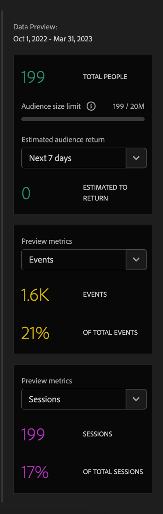
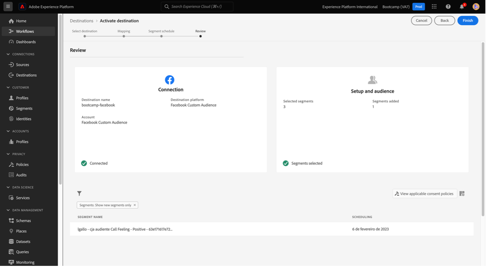

# 4.6 Approfondimenti sul dos à ação

## Objetivos

- Entenda como criar um público com base em uma visão coletada no Customer Journey Analytics
- Utilizza esse público no CDP em tempo real e no Adobe Journey Optimizer

## 4.6.1 Crie uma audiência e publique-a

Em seu projeto, você criou um filtro chamado **Chiama i sentimenti** e conseguiu visualizar a quantidade de usuários que tiveram suas ligações ao call center classificadas como **positivas**. Agora, você poderá criar um com esses usuários e ativação-los em jornadas ou em canais de comunicação.

O primeiro passo é: No painel criado no último exercício, selecione a linha **1. Sentimento di chiamata - Positivo**, cricca com o botão direito de seu mouse e selecione a opção **Crea pubblico da selezione**:

Em seguida, dê um nome para a sua audiência seguindo o modelo **yourLastName - cia audience call sensazione positiva**:

Note que é possível ter um preview da audiência que está sendo criada:

Para finalizar, cricca em **Publicar**:

## 4.6.2 Utilizzare la sua audiência como parte de um

Voltando para a Adobe Experience Platform, vá em **Segmenti > Sfoglia** e você irá visualizar o seu criado no CJA pronto e ível para ser usado nas suas ativações e jornadas!

Vamos agora usar esse em uma ativação no Facebook e em uma jornada do cliente!

## 4.6.3 Utilizzare seu na Real-Time CDP em tempo real

Na Adobe Experience Platform, vá em **Segmenti > Sfoglia** e contre a audiência que você criou no CJA:

Clique no seu, em seguida, em **Attiva nella destinazione**:

Selecione una destinazione chamada bootcamp-facebook e, em seguida, cricca em Next:

Em seguida, cricca em Next novamente:

Selecione a opção **Origine del pubblico** e defina como **Direttamente dai clienti** e clique em Avanti:

Por fim, na página **Recensione** cricca em Finish!

Pronto! Agora o seu está vinculado aos públicos personalizados do Facebook.
Agorà, vamos utilizar esse no AJO!

## 4.6.4 Uso di seu non Adobe Journey Optimizer

Interfaccia Na da Adobe Experience Platform cricca em Journey Optimizer e, em seguida, nessun menu esquerdo laterale, cricca em **Percorsi** e comece un criar uma jornada clicando em **Crea Percorso**:

Em seguida, nessun menu laterale esquerdo, em Eventos, selecione **Qualificazione del segmento** e arraste-o até a jornada:

Em seguida, em **Segmento** cricca em **Modifica** para selecionar um:

Selecione a audiência que você criou no CJA e clique em **Salva**:

Pronto! Un partir daí você pode criar uma jornada para clientes que se qualificam para esse!

[Torna a Flusso utente 4](./uc4.md)

[Voltar para todos os módulos](./../../overview.md)
