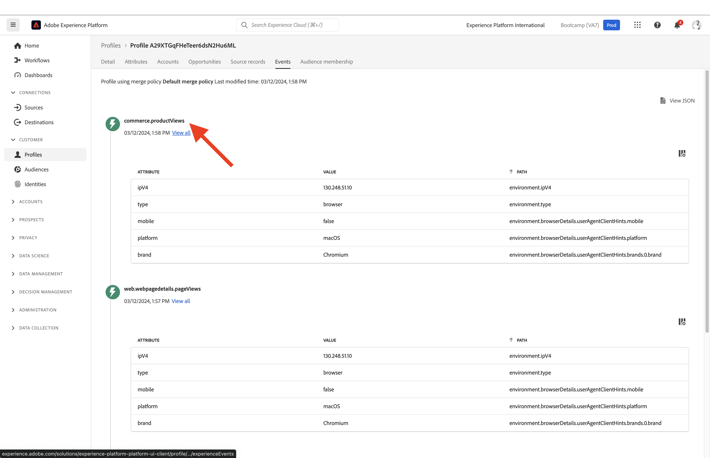

# 1.2 Visualizzare il proprio profilo cliente in tempo reale - Interfaccia utente

In questo esercizio, accederai a Adobe Experience Platform e visualizzerai il tuo Profilo cliente in tempo reale nell&#39;interfaccia utente.

## Storia

Nel Profilo del cliente in tempo reale, tutti i dati del profilo vengono visualizzati insieme ai dati dell’evento, nonché alle appartenenze al segmento esistenti. I dati mostrati possono provenire da qualsiasi luogo, da applicazioni di Adobe e soluzioni esterne. Questa è la visione più potente di Adobe Experience Platform, il vero sistema di esperienza di record.

## 1.2.1 Utilizzare la visualizzazione Profilo cliente in Adobe Experience Platform

Vai a [Adobe Experience Platform](https://experience.adobe.com/platform). Dopo aver effettuato l&#39;accesso, si aprirà la homepage di Adobe Experience Platform.

Prima di continuare, devi selezionare un **sandbox**. La sandbox da selezionare è denominata ``Bootcamp``. Per eseguire questa operazione, fai clic sul testo **[!UICONTROL Produzione Prod]** nella linea blu sopra lo schermo. Dopo aver selezionato il [!UICONTROL sandbox], vedrai la modifica dello schermo e ora sei nel tuo dedicato [!UICONTROL sandbox].

Nel menu a sinistra, vai a **Profili** e **Sfoglia**.

Nel pannello Visualizzatore profilo del sito web puoi trovare la panoramica dell’identità . Ogni identità è collegata a uno spazio dei nomi.

Al momento, nel pannello Visualizzatore profilo puoi vedere questa identità:

| Namespace | Identità |
|:-------------:| :---------------:|
| Experience Cloud ID (ECID) | 19428085896177382402834560825640259081 |

Con Adobe Experience Platform, tutti gli ID sono ugualmente importanti. In precedenza, l’ECID era l’ID più importante nel contesto di Adobe e tutti gli altri ID erano collegati all’ECID in una relazione gerarchica. Con Adobe Experience Platform questo non succede più e ogni ID può essere considerato un identificatore principale.

In genere, l’identificatore principale dipende dal contesto. Se chiedi al tuo call center, **Qual è l&#39;ID più importante?** probabilmente risponderanno, **il numero di telefono!** Ma se chiedi al tuo team CRM, ti risponderanno, **L&#39;indirizzo e-mail!**  Adobe Experience Platform comprende questa complessità e la gestisce per voi. Ogni applicazione, sia che si tratti di un&#39;applicazione di Adobe o di un&#39;applicazione non di Adobe, parlerà con Adobe Experience Platform facendo riferimento all&#39;ID che considera primario. E funziona semplicemente.

Per il campo **Spazio dei nomi identità**, seleziona **ECID** e per il campo **Valore identità** inserisci l’ECID che puoi trovare nel pannello Visualizzatore profilo del sito web di bootcamp. Fai clic su **Visualizza**. Vedrai il tuo profilo nell&#39;elenco. Fai clic sul pulsante **ID profilo** per aprire il profilo.

Viene visualizzata una panoramica di un paio di elementi importanti **Attributi del profilo** del tuo profilo cliente.

Vai a **Eventi**, dove puoi visualizzare le voci per ogni evento di esperienza collegato al tuo profilo.

Infine, vai all&#39;opzione di menu **Iscrizione al segmento**. Ora vedrai tutti i segmenti idonei per questo profilo.

Ora creiamo un nuovo segmento che ti consentirà di personalizzare l’esperienza del cliente per un cliente anonimo o noto.

Passaggio successivo: [1.3 Creare un segmento - Interfaccia utente](./ex3.md)

[Torna al flusso utente 1](./uc1.md)

[Torna a tutti i moduli](../../overview.md)
