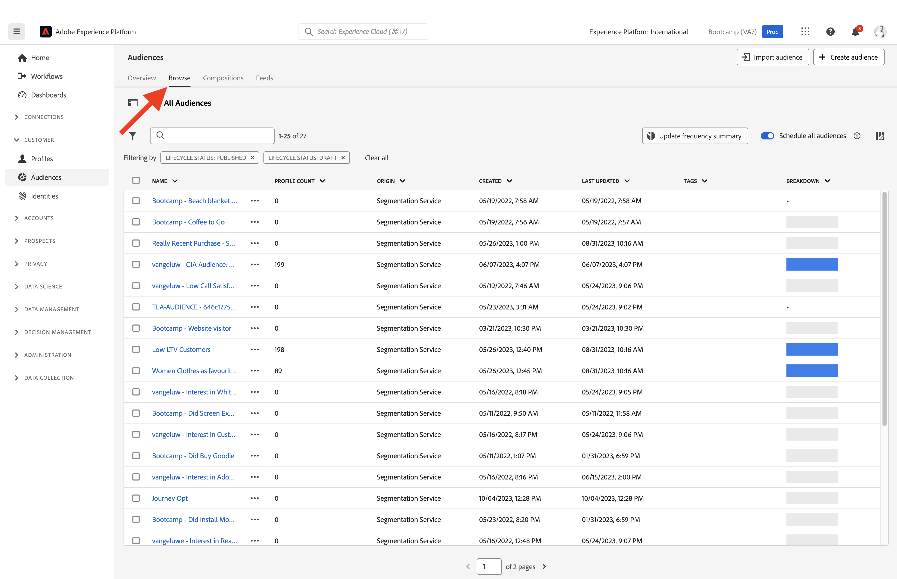

# 1.3 Creare un segmento - Interfaccia utente

In questo esercizio creerai un segmento utilizzando il Generatore di segmenti di Adobe Experience Platform.

## Storia

Vai a [Adobe Experience Platform](https://experience.adobe.com/platform). Dopo aver effettuato l’accesso, accedi alla home page di Adobe Experience Platform.

Prima di continuare, è necessario selezionare una **sandbox**. La sandbox da selezionare è denominata ``Bootcamp``. A tale scopo, fai clic sul testo **[!UICONTROL Prod produzione]** nella linea blu sopra lo schermo. Dopo aver selezionato la [!UICONTROL sandbox], verrà visualizzata la modifica dello schermo e ora si è nel [!UICONTROL sandbox].

Nel menu a sinistra, vai a **Segmenti**. In questa pagina è disponibile una panoramica di tutti i segmenti esistenti. Fai clic sul pulsante **+ Crea segmento** per iniziare a creare un nuovo segmento.

Quando ti trovi nel nuovo generatore di segmenti, noterai immediatamente **Attributi** e la **Profilo individuale XDM** riferimento.

Poiché XDM è il linguaggio che alimenta il business dell’esperienza, XDM è anche la base per il generatore di segmenti. Tutti i dati acquisiti in Platform devono essere mappati su XDM e, come tale, tutti i dati diventano parte dello stesso modello di dati, indipendentemente da dove provengono. Questo ti offre un grande vantaggio durante la creazione di segmenti: da questa interfaccia utente di Generatore di segmenti puoi combinare dati di qualsiasi origine nello stesso flusso di lavoro. I segmenti generati in Segment Builder possono essere inviati a soluzioni come Adobe Target, Adobe Campaign e Adobe Audience Manager per l&#39;attivazione.

Ora devi creare un segmento di tutti i clienti che hanno visualizzato il prodotto **Real-Time CDP**.

Per creare questo segmento, devi aggiungere un evento esperienza. Puoi trovare tutti gli eventi esperienza facendo clic sul pulsante **Eventi** icona in **Campi** barra dei menu.

Poi, vedrai il livello superiore, **XDM ExperienceEvents** nodo. Fai clic su **XDM ExperienceEvent**.

Vai a **Elementi elenco prodotti**.

Seleziona **Nome** e trascina **Nome** dal menu a sinistra nell’area di lavoro del generatore di segmenti in **Eventi** sezione. A questo punto viene visualizzato quanto segue:

Il parametro di confronto deve essere **è uguale a** e nel campo di immissione, immetti **Real-time CDP**.

Ogni volta che aggiungi un elemento al generatore di segmenti, puoi fare clic sul pulsante **Aggiorna stima** per ottenere una nuova stima della popolazione nel segmento.

As **Metodo di valutazione**, seleziona **Bordo**.

Infine, diamo un nome al segmento e salvalo.

Come convenzione di denominazione, utilizza:

- `yourLastName - Interest in Real-Time CDP`

Quindi, fai clic su **Salva e chiudi** per salvare il segmento.

Ora passerai alla pagina di panoramica dei segmenti, in cui vedrai un’anteprima di esempio dei profili cliente idonei per il tuo segmento.

Ora puoi continuare con l’esercizio successivo e utilizzare il segmento con Adobe Target.

Passaggio successivo: [1.4 Intervenire: inviare il segmento ad Adobe Target](./ex4.md)

[Torna a Flusso utente 1](./uc1.md)

[Torna a tutti i moduli](../../overview.md)
