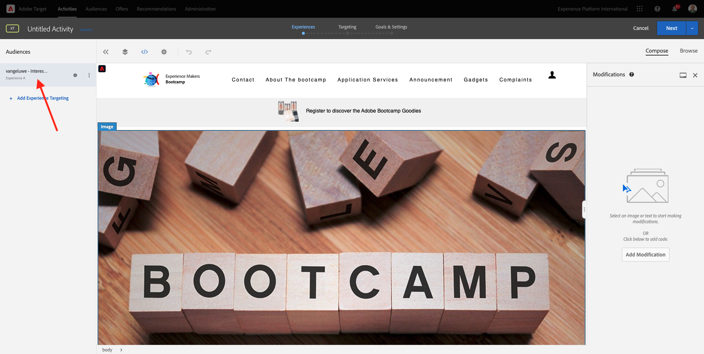

# 1.4 Intervenire: inviare il pubblico ad Adobe Target

Vai a [Adobe Experience Platform](https://experience.adobe.com/platform). Dopo aver effettuato l’accesso, accedi alla home page di Adobe Experience Platform.

Prima di continuare, devi selezionare una **sandbox**. La sandbox da selezionare è denominata ``Bootcamp``. A tale scopo, fai clic sul testo **[!UICONTROL Prod produzione]** nella riga blu nella parte superiore dello schermo. Dopo aver selezionato la [!UICONTROL sandbox] appropriata, la schermata verrà modificata e ora sei nella [!UICONTROL sandbox] dedicata.

## 1.4.1 Attiva il pubblico nella destinazione Adobe Target

Adobe Target è disponibile come destinazione da Real-Time CDP. Per configurare la tua integrazione con Adobe Target, vai a **Destinazioni**, **Catalogo**.

Fai clic su **Personalization** nel menu **Categorie**. Verrà visualizzata la scheda di destinazione **Adobe Target**. Fai clic su **Attiva pubblico**.

Selezionare la destinazione ``Bootcamp Target`` e fare clic su **Avanti**.

Nell&#39;elenco dei tipi di pubblico disponibili selezionare il pubblico creato in [1.3 Creare un pubblico](./ex3.md), denominato `yourLastName - Interest in Real-Time CDP`. Quindi fare clic su **Avanti**.

Nella pagina successiva, fai clic su **Avanti**.

Fai clic su **Fine**.

Il pubblico è ora attivato nei confronti di Adobe Target.

>[!IMPORTANT]
>
>Quando hai appena creato la destinazione Adobe Target in Real-Time CDP, la pubblicazione della destinazione potrebbe richiedere fino a un’ora. Si tratta di un tempo di attesa una tantum, dovuto alla configurazione del back-end. Al termine della configurazione del tempo di attesa iniziale di 1 ora e del back-end, i nuovi tipi di pubblico edge aggiunti, inviati alla destinazione Adobe Target, saranno disponibili per il targeting in tempo reale.

## 1.4.2 Configurare l’attività basata su moduli di Adobe Target

Ora che il pubblico di Real-Time CDP è configurato per essere inviato ad Adobe Target, puoi configurare la tua attività Targeting esperienza in Adobe Target. In questo esercizio configurerai un’attività basata sul Compositore esperienza visivo.

Vai alla home page di Adobe Experience Cloud da [https://experiencecloud.adobe.com/](https://experiencecloud.adobe.com/). Fai clic su **Target** per aprirlo.

Nella home page di **Adobe Target** verranno visualizzate tutte le attività esistenti.
Fai clic su **+ Crea attività** per creare una nuova attività.

Seleziona **Targeting esperienza**.

Selezionare **Visual** e impostare **URL attività** su `https://bootcamp.aepdemo.net/content/aep-bootcamp-experience/language-masters/en/exercises/particpantXX.html`. Prima di eseguire questa operazione, sostituire XX con un numero compreso tra 01 e 30.

>[!IMPORTANT]
>
>Ogni partecipante all’abilitazione deve utilizzare una pagina web separata per evitare conflitti tra diverse esperienze Adobe Target. È possibile scegliere una pagina Web e trovare l&#39;URL scegliendo il percorso seguente: [https://bootcamp.aepdemo.net/content/aep-bootcamp-experience/language-masters/en/exercises.html](https://bootcamp.aepdemo.net/content/aep-bootcamp-experience/language-masters/en/exercises.html).
>
>Tutte le pagine condividono lo stesso URL di base e terminano con il numero del partecipante.
>
>Ad esempio, il partecipante 1 deve utilizzare l&#39;URL `https://bootcamp.aepdemo.net/content/aep-bootcamp-experience/language-masters/en/exercises/particpant01.html`, il partecipante 30 l&#39;URL `https://bootcamp.aepdemo.net/content/aep-bootcamp-experience/language-masters/en/exercises/particpant30.html`.

Selezionare l&#39;area di lavoro **AT Bootcamp**.

Fai clic su **Avanti**.

Ora sei nel Compositore esperienza visivo. Potrebbero essere necessari 20-30 secondi prima che il sito web sia completamente caricato.

Il pubblico predefinito è attualmente **Tutti i visitatori**. Fai clic su **3 punti** accanto a **Tutti i visitatori** e fai clic su **Cambia pubblico**.

Ora visualizzi l’elenco dei tipi di pubblico disponibili e il pubblico Adobe Experience Platform creato in precedenza e inviato ad Adobe Target ora fa parte di questo elenco. Seleziona il pubblico creato in precedenza in Adobe Experience Platform. Fai clic su **Assegna pubblico**.

Il pubblico di Adobe Experience Platform ora fa parte di questa attività Targeting esperienza.

Prima di poter modificare l&#39;immagine protagonista, è necessario fare clic su **Consenti tutto** sul banner del cookie.

Per eseguire questa operazione, vai a **Sfoglia**

Fare clic su **Consenti tutto**.

Quindi, torna a **Componi**.

Ora cambiamo l&#39;immagine protagonista sulla homepage del sito web. Fare clic sull&#39;immagine protagonista predefinita nel sito Web, fare clic su **Sostituisci contenuto** e quindi selezionare **Immagine**.

Cerca il file di immagine **rtcdp.png**. Selezionarlo e fare clic su **Salva**.

Potrai quindi visualizzare la nuova esperienza con la nuova immagine, per il pubblico selezionato.

Fai clic sul titolo dell’attività nell’angolo in alto a sinistra per rinominarla.

Per il nome, utilizzare:

- `yourLastName - RTCDP - XT (VEC)`

Fai clic su **Avanti**.

Fai clic su **Avanti**.

Nella pagina **Obiettivi e impostazioni** - vai a **Metriche obiettivo**.

Imposta l&#39;obiettivo principale su **Coinvolgimento** - **Tempo sul sito**. Fai clic su **Salva e chiudi**.

Sei ora nella pagina **Panoramica attività**. Devi comunque attivare l&#39;attività.

Fai clic sul campo **Inattivo** e seleziona **Attiva**.

Otterrai quindi una conferma visiva che l’attività è ora live.

La tua attività è ora live e può essere testata sul sito web di bootcamp.

Se ora torni al sito Web di dimostrazione e visiti la pagina del prodotto di **Real-Time CDP**, potrai immediatamente qualificarti per il pubblico creato e l&#39;attività Adobe Target verrà visualizzata nella pagina principale in tempo reale.

>[!IMPORTANT]
>
>Ogni partecipante all’abilitazione deve utilizzare una pagina web separata per evitare conflitti tra diverse esperienze Adobe Target. È possibile scegliere una pagina Web e trovare l&#39;URL scegliendo il percorso seguente: [https://bootcamp.aepdemo.net/content/aep-bootcamp-experience/language-masters/en/exercises.html](https://bootcamp.aepdemo.net/content/aep-bootcamp-experience/language-masters/en/exercises.html).
>
>Tutte le pagine condividono lo stesso URL di base e terminano con il numero del partecipante.
>
>Ad esempio, il partecipante 1 deve utilizzare l&#39;URL `https://bootcamp.aepdemo.net/content/aep-bootcamp-experience/language-masters/en/exercises/particpant01.html`, il partecipante 30 l&#39;URL `https://bootcamp.aepdemo.net/content/aep-bootcamp-experience/language-masters/en/exercises/particpant30.html`.

Passaggio successivo: [1.5 Azione: inviare il pubblico a Facebook](./ex5.md)

[Torna a Flusso utente 1](./uc1.md)

[Torna a tutti i moduli](../../overview.md)
