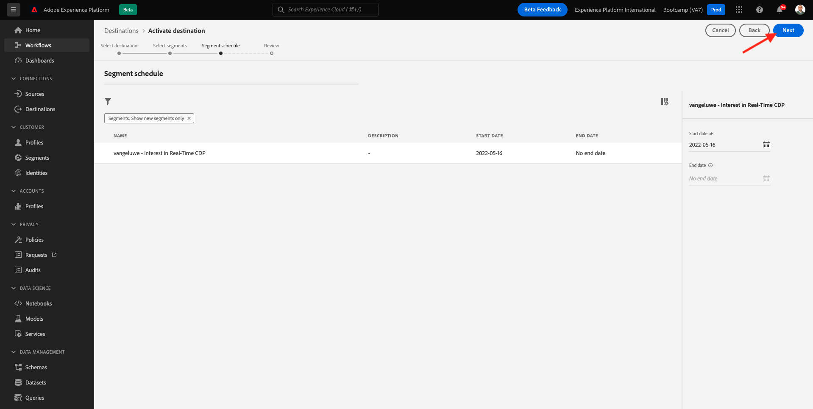
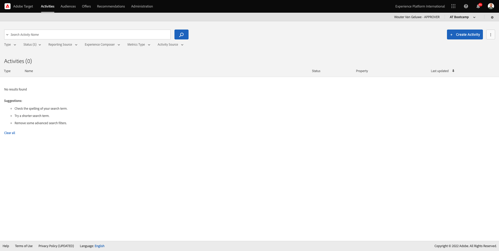

# 1.4 Intervenire: inviare il segmento ad Adobe Target

Vai a [Adobe Experience Platform](https://experience.adobe.com/platform). Dopo aver effettuato l’accesso, accedi alla home page di Adobe Experience Platform.

Prima di continuare, è necessario selezionare una **sandbox**. La sandbox da selezionare è denominata ``Bootcamp``. A tale scopo, fai clic sul testo **[!UICONTROL Prod produzione]** nella linea blu sopra lo schermo. Dopo aver selezionato la [!UICONTROL sandbox], verrà visualizzata la modifica dello schermo e ora si è nel [!UICONTROL sandbox].

## 1.4.1 Attiva il segmento nella destinazione Adobe Target

Adobe Target è disponibile come destinazione da Real-Time CDP. Per configurare la tua integrazione con Adobe Target, vai a **Destinazioni**, a **Catalogo**.

Clic **Personalizzazione** nel **Categorie** menu. Vedrai quindi il **Adobe Target** scheda di destinazione. Clic **Attivare segmenti**.

Seleziona la destinazione ``Bootcamp Target`` e fai clic su **Successivo**.

Nell’elenco dei segmenti disponibili, seleziona il segmento creato in [1.3 Creare un segmento](./ex3.md), che è denominato `yourLastName - Interest in Real-Time CDP`. Quindi, fai clic su **Successivo**.

Nella pagina successiva fare clic su **Successivo**.

Fai clic su **Fine**.

Il segmento è ora attivato verso Adobe Target.

>[!IMPORTANT]
>
>Quando hai appena creato la destinazione Adobe Target in Real-Time CDP, la pubblicazione della destinazione potrebbe richiedere fino a un’ora. Si tratta di un tempo di attesa una tantum, dovuto alla configurazione del back-end. Al termine della configurazione del tempo di attesa iniziale di 1 ora e del back-end, i nuovi segmenti edge aggiunti inviati alla destinazione Adobe Target saranno disponibili per il targeting in tempo reale.

## 1.4.2 Configurare l’attività basata su moduli di Adobe Target

Ora che il segmento di Real-Time CDP è configurato per essere inviato ad Adobe Target, puoi configurare l’attività Targeting esperienze in Adobe Target. In questo esercizio configurerai un’attività basata sul Compositore esperienza visivo.

Vai alla home page di Adobe Experience Cloud da [https://experiencecloud.adobe.com/](https://experiencecloud.adobe.com/). Clic **Target** per aprirlo.

Il giorno **Adobe Target** home page, vedrai tutte le attività esistenti.
Clic **+ Crea attività** per creare una nuova attività.

Seleziona **Targeting esperienza**.

Seleziona **Visivo** e imposta **URL attività** a `https://bootcamp.aepdemo.net/content/aep-bootcamp-experience/language-masters/en/exercises/particpantXX.html`, ma prima di farlo, sostituire XX con un numero compreso tra 01 e 30.

>[!IMPORTANT]
>
>Ogni partecipante all’abilitazione deve utilizzare una pagina web separata per evitare conflitti tra diverse esperienze Adobe Target. Puoi scegliere una pagina web e trovare l’URL andando qui: [https://bootcamp.aepdemo.net/content/aep-bootcamp-experience/language-masters/en/exercises.html](https://bootcamp.aepdemo.net/content/aep-bootcamp-experience/language-masters/en/exercises.html).
>
>Tutte le pagine condividono lo stesso URL di base e terminano con il numero del partecipante.
>
>Ad esempio, il partecipante 1 deve utilizzare l’URL `https://bootcamp.aepdemo.net/content/aep-bootcamp-experience/language-masters/en/exercises/particpant01.html`, partecipante 30 deve utilizzare l&#39;URL `https://bootcamp.aepdemo.net/content/aep-bootcamp-experience/language-masters/en/exercises/particpant30.html`.

Seleziona l’area di lavoro **AT Bootcamp**.

Fai clic su **Avanti**.

Ora sei nel Compositore esperienza visivo. Potrebbero essere necessari 20-30 secondi prima che il sito web sia completamente caricato.

Il pubblico predefinito è al momento **Tutti i visitatori**. Fai clic sul pulsante **3 punti** accanto a **Tutti i visitatori** e fai clic su **Cambia pubblico**.

Ora visualizzi l’elenco dei tipi di pubblico disponibili e il segmento Adobe Experience Platform creato in precedenza e inviato ad Adobe Target ora fa parte di questo elenco. Seleziona il segmento creato in precedenza in Adobe Experience Platform. Clic **Assegna pubblico**.

Il segmento Adobe Experience Platform ora fa parte di questa attività Targeting esperienza.

Prima di poter modificare l’immagine protagonista, fai clic su **Consenti tutto** sul banner dei cookie.

Per farlo, vai a **Sfoglia**

Quindi, fai clic su **Consenti tutto**.

Quindi, torna a **Componi**.

Ora cambiamo l&#39;immagine protagonista sulla homepage del sito web. Fai clic sull’immagine protagonista predefinita sul sito web, quindi fai clic su **Sostituisci contenuto** e quindi seleziona **Immagine**.

Cerca il file di immagine **rtcdp.png**. Selezionala e fai clic su **Salva**.

Potrai quindi visualizzare la nuova esperienza con la nuova immagine, per il pubblico selezionato.

Fai clic sul titolo dell’attività nell’angolo in alto a sinistra per rinominarla.

Per il nome, utilizzare:

- `yourLastName - RTCDP - XT (VEC)`

Fai clic su **Avanti**.

Fai clic su **Avanti**.

Il giorno **Obiettivi e impostazioni** - pagina, vai a **Metriche obiettivo**.

Imposta l’obiettivo principale su **Coinvolgimento** - **Tempo sul sito**. Fai clic su **Salva e chiudi**.

Ora sei sul **Panoramica delle attività** pagina. Devi comunque attivare l&#39;attività.

Fai clic sul campo **Inattivo** e seleziona **Attiva**.

Otterrai quindi una conferma visiva che l’attività è ora live.

La tua attività è ora live e può essere testata sul sito web di bootcamp.

Se ora torni al sito web della demo e visita la pagina del prodotto per **Real-Time CDP**, potrai quindi qualificarti immediatamente per il segmento creato e vedere l’attività Adobe Target visualizzata nella home page in tempo reale.

>[!IMPORTANT]
>
>Ogni partecipante all’abilitazione deve utilizzare una pagina web separata per evitare conflitti tra diverse esperienze Adobe Target. Puoi scegliere una pagina web e trovare l’URL andando qui: [https://bootcamp.aepdemo.net/content/aep-bootcamp-experience/language-masters/en/exercises.html](https://bootcamp.aepdemo.net/content/aep-bootcamp-experience/language-masters/en/exercises.html).
>
>Tutte le pagine condividono lo stesso URL di base e terminano con il numero del partecipante.
>
>Ad esempio, il partecipante 1 deve utilizzare l’URL `https://bootcamp.aepdemo.net/content/aep-bootcamp-experience/language-masters/en/exercises/particpant01.html`, partecipante 30 deve utilizzare l&#39;URL `https://bootcamp.aepdemo.net/content/aep-bootcamp-experience/language-masters/en/exercises/particpant30.html`.

Passaggio successivo: [1.5 Intervenire: inviare il segmento a Facebook](./ex5.md)

[Torna a Flusso utente 1](./uc1.md)

[Torna a tutti i moduli](../../overview.md)
