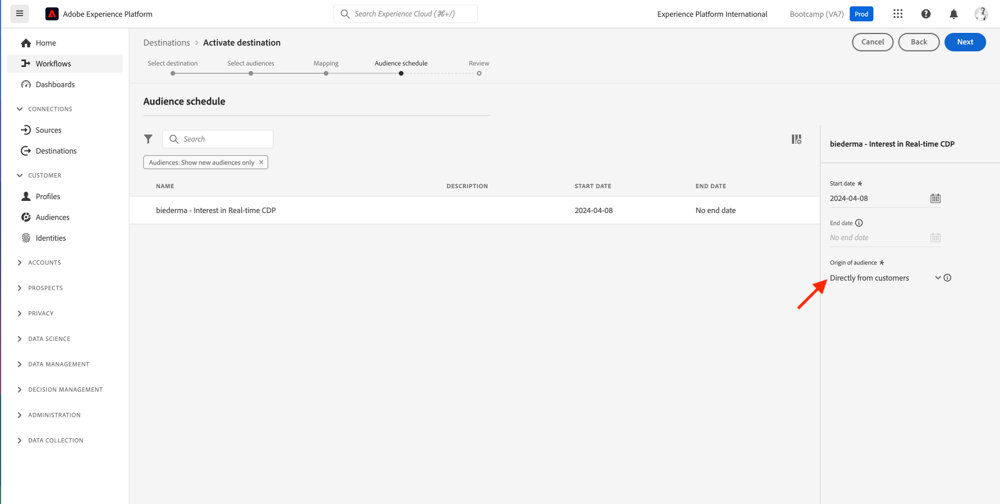

# 1.5 Intervenire: inviare il pubblico a Facebook

Vai a [Adobe Experience Platform](https://experience.adobe.com/platform). Dopo aver effettuato l’accesso, accedi alla home page di Adobe Experience Platform.

Prima di continuare, è necessario selezionare una **sandbox**. La sandbox da selezionare è denominata ``Bootcamp``. A tale scopo, fai clic sul testo **[!UICONTROL Prod produzione]** nella linea blu sopra lo schermo. Dopo aver selezionato la [!UICONTROL sandbox], verrà visualizzata la modifica dello schermo e ora si è nel [!UICONTROL sandbox].

Nel menu a sinistra, vai a **Destinazioni**, quindi vai a **Catalogo**. Vedrai quindi il **Catalogo delle destinazioni**. In entrata **Destinazioni**, fai clic su **Attiva tipi di pubblico** il **Pubblico personalizzato facebook** Card.

Seleziona la destinazione **bootcamp-facebook** e fai clic su **Successivo**.

Nell’elenco dei tipi di pubblico disponibili, seleziona il pubblico creato nell’esercizio precedente. Fai clic su **Avanti**.

Il giorno **Mappatura** , assicurati che il **Applica trasformazione** la casella di controllo è attivata. Fai clic su **Avanti**.

Il giorno **Pianificazione del pubblico** , seleziona la **Origine del pubblico** e impostarlo su **Direttamente dai clienti**. Fai clic su **Avanti**.

Infine, sulla **Revisione** pagina, fai clic su **Fine**.

Il pubblico è ora collegato ai tipi di pubblico personalizzati di Facebook. Ogni volta che un cliente si qualifica per questo pubblico, viene inviato un segnale a Facebook lato server per includere tale cliente nel pubblico personalizzato sul lato Facebook.

In Facebook, il pubblico si trova in Adobe Experience Platform in Tipi di pubblico personalizzati:

Ora puoi visualizzare il pubblico personalizzato in Facebook:

[Torna a Flusso utente 1](./uc1.md)

[Torna a tutti i moduli](../../overview.md)
