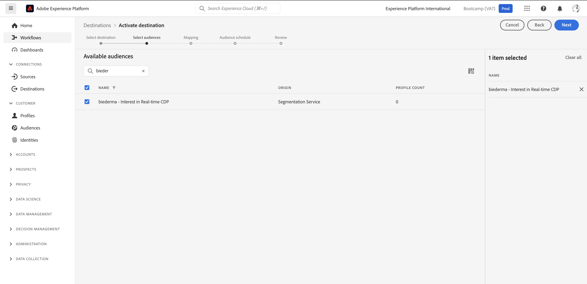

# 1.5 Intervenire: inviare il pubblico a Facebook

Vai a [Adobe Experience Platform](https://experience.adobe.com/platform). Dopo aver effettuato l’accesso, accedi alla home page di Adobe Experience Platform.

Prima di continuare, devi selezionare una **sandbox**. La sandbox da selezionare è denominata ``Bootcamp``. A tale scopo, fai clic sul testo **[!UICONTROL Prod produzione]** nella riga blu nella parte superiore dello schermo. Dopo aver selezionato la [!UICONTROL sandbox] appropriata, la schermata verrà modificata e ora sei nella [!UICONTROL sandbox] dedicata.

Nel menu a sinistra, vai a **Destinazioni**, quindi vai a **Catalogo**. Verrà quindi visualizzato il **Catalogo destinazioni**. In **Destinazioni**, fai clic su **Attiva tipi di pubblico** nella scheda **Pubblico personalizzato di Facebook**.

Seleziona la destinazione **bootcamp-facebook** e fai clic su **Avanti**.

Nell’elenco dei tipi di pubblico disponibili, seleziona il pubblico creato nell’esercizio precedente. Fai clic su **Avanti**.

Nella pagina **Mapping**, verificare che la casella di controllo **Applica trasformazione** sia abilitata. Fai clic su **Avanti**.

Nella pagina **Pianificazione pubblico**, seleziona **Origine del pubblico** e impostala su **Direttamente dai clienti**. Fai clic su **Avanti**.

Infine, nella pagina **Revisione**, fare clic su **Fine**.

Il pubblico è ora collegato ai tipi di pubblico personalizzati di Facebook. Ogni volta che un cliente si qualifica per questo pubblico, viene inviato un segnale a Facebook lato server per includere tale cliente nel pubblico personalizzato sul lato Facebook.

In Facebook, il pubblico si trova in Adobe Experience Platform in Tipi di pubblico personalizzati:

Ora puoi visualizzare il pubblico personalizzato in Facebook:

[Torna a Flusso utente 1](./uc1.md)

[Torna a tutti i moduli](../../overview.md)
