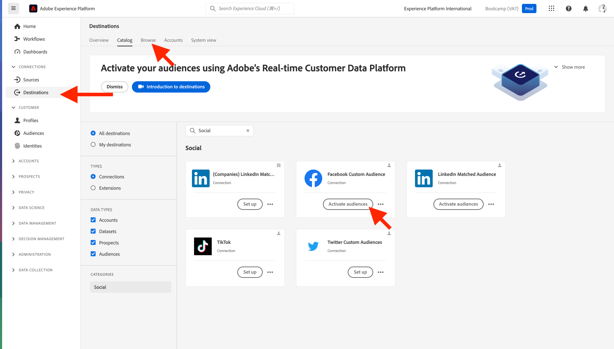

# 1.5 Intervenire: inviare il segmento a Facebook

Vai a [Adobe Experience Platform](https://experience.adobe.com/platform). Dopo aver effettuato l&#39;accesso, si aprirà la homepage di Adobe Experience Platform.

Prima di continuare, devi selezionare un **sandbox**. La sandbox da selezionare è denominata ``Bootcamp``. Per eseguire questa operazione, fai clic sul testo **[!UICONTROL Produzione Prod]** nella linea blu sopra lo schermo. Dopo aver selezionato il [!UICONTROL sandbox], vedrai la modifica dello schermo e ora sei nel tuo dedicato [!UICONTROL sandbox].

Nel menu a sinistra, vai a **Destinazioni**, quindi vai a **Catalogo**. Vedrai il **Catalogo delle destinazioni**. In **Destinazioni**, fai clic su **Attiva segmenti** sulla **Pubblico personalizzato facebook** il Card.

Selezionare la destinazione **bootcamp-facebook** e fai clic su **Successivo**.

Nell’elenco dei segmenti disponibili, seleziona il segmento creato nell’esercizio precedente. Fai clic su **Avanti**.

Sulla **Mappatura** assicurati che **Applica trasformazione** la casella di controllo è abilitata. Fai clic su **Avanti**.

Sulla **Pianificazione del segmento** , seleziona la **Origine del pubblico** e impostarlo su **Direttamente dai clienti**. Fai clic su **Avanti**.

Infine, **Revisione** pagina, fai clic su **Fine**.

Il segmento è ora collegato a tipi di pubblico personalizzati di Facebook. Ogni volta che un cliente si qualifica per questo segmento, viene inviato un segnale al server Facebook per includere tale cliente nel pubblico personalizzato sul lato Facebook.

In Facebook, troverai il segmento da Adobe Experience Platform in Tipi di pubblico personalizzati :

Ora puoi vedere il pubblico personalizzato visualizzato in Facebook:

[Torna al flusso utente 1](./uc1.md)

[Torna a tutti i moduli](../../overview.md)
