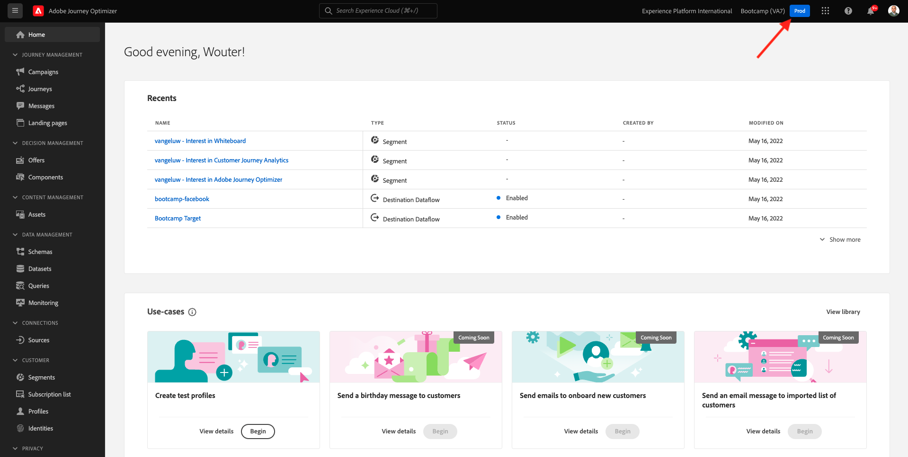
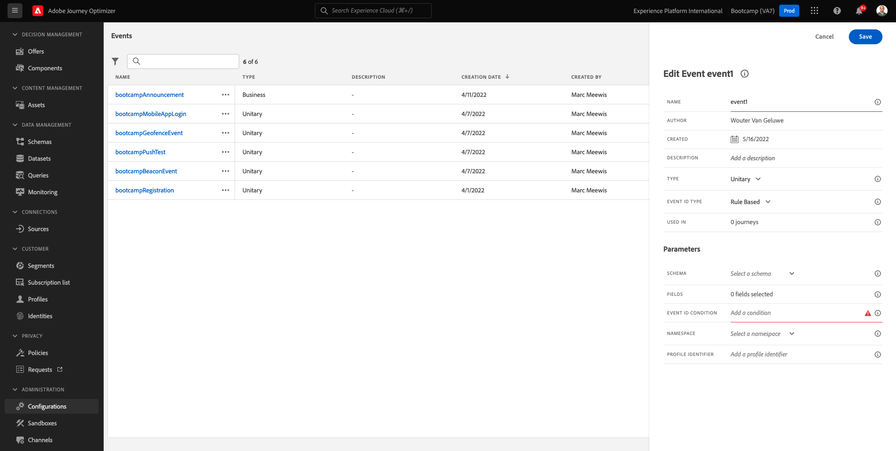

# 2.2 Creare l’evento

Accedi a Adobe Journey Optimizer da [Adobe Experience Cloud](https://experience.adobe.com). Clic **Journey Optimizer**.

Verrai reindirizzato al **Home**  in Journey Optimizer. Innanzitutto, assicurati di utilizzare la sandbox corretta. La sandbox da utilizzare si chiama `Bootcamp`. Per passare da una sandbox all’altra, fai clic su **Prod** e seleziona la sandbox dall’elenco. In questo esempio, la sandbox è denominata **Bootcamp**. Sarai quindi nel **Home** visualizzazione della sandbox `Bootcamp`.

Nel menu a sinistra, scorri verso il basso e fai clic su **Configurazioni**. Quindi, fai clic su **Gestisci** pulsante sotto **Eventi**.

Viene quindi visualizzata una panoramica di tutti gli eventi disponibili. Clic **Crea evento** per iniziare a creare un evento personalizzato.

Viene visualizzata una nuova finestra di evento vuota.

Prima di tutto, assegna all’evento un nome simile al seguente: `yourLastNameAccountCreationEvent` e aggiungi una descrizione come questa `Account Creation Event`.

Quindi, assicurati che le **Tipo** è impostato su **Unitario**, e per **Tipo ID evento** selezione, seleziona **Generato dal sistema**.

Di seguito è riportata la selezione dello schema. Per questo esercizio è stato preparato uno schema. Utilizza lo schema `Demo System - Event Schema for Website (Global v1.1) v.1`.

Dopo aver selezionato lo schema, vedrai una serie di campi selezionati nel **Campi** sezione. Ora dovresti passare il cursore sopra **Campi** e vedrai 3 icone a comparsa. Fai clic sul pulsante **Modifica** icona.

Vedrai un **Campi** finestra a comparsa, in cui è necessario selezionare alcuni dei campi necessari per personalizzare l’e-mail.  In seguito sceglieremo altri attributi di profilo, utilizzando i dati già presenti in Adobe Experience Platform.

Nell&#39;oggetto `_experienceplatform.demoEnvironment`, assicurati di selezionare i campi **brandLogo** e **brandName**.

Nell&#39;oggetto `_experienceplatform.identification.core`, assicurati di selezionare il campo **email**.

Clic **Ok** per salvare le modifiche.

Dovresti vedere questo. Clic **Salva** ancora una volta per salvare le modifiche.

L’evento è ora configurato e salvato.

Fai di nuovo clic sull’evento per aprire **Modifica evento** schermo di nuovo. Passa il cursore sopra **Campi** per visualizzare di nuovo le 3 icone. Fai clic sul pulsante **Visualizza payload** icona.

Ora vedrai un esempio del payload previsto.
L’evento ha un ID evento di orchestrazione univoco, che puoi trovare scorrendo verso il basso in tale payload fino a visualizzare `_experience.campaign.orchestration.eventID`.

L’ID evento è ciò che deve essere inviato a Adobe Experience Platform per attivare il percorso che creerai in uno degli esercizi successivi. Ricorda questo eventID, in quanto potrebbe essere necessario in un secondo momento.
`"eventID": "19cab7852cdef99d25b6d5f1b6503da39d1f486b1d585743f97ed2d1e6b6c74f"`

Clic **Ok**, seguito da clic **Annulla**.

Hai terminato questo esercizio.

Passaggio successivo: [2.3 Creare il messaggio e-mail](./ex3.md)

[Torna a Flusso utente 2](./uc2.md)

[Torna a tutti i moduli](../../overview.md)
