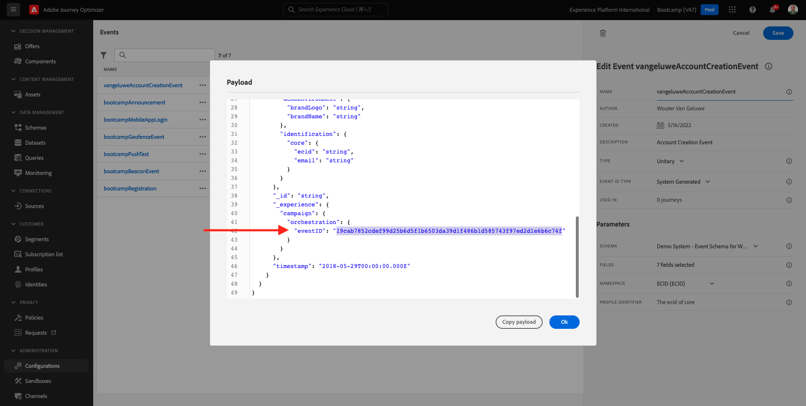

# 2.2 Creare un evento

Accedi a Adobe Journey Optimizer accedendo a [Adobe Experience Cloud](https://experience.adobe.com). Fai clic su **Journey Optimizer**.

Verrai reindirizzato al **Pagina principale**  in Journey Optimizer. In primo luogo, assicurati di utilizzare la sandbox corretta. La sandbox da utilizzare è denominata `Bootcamp`. Per passare da una sandbox all’altra, fai clic su **Prod** e selezionate la sandbox dall’elenco. In questo esempio, la sandbox è denominata **Bootcamp**. Allora sarai nel **Pagina principale** visualizzazione della sandbox `Bootcamp`.

Nel menu a sinistra, scorri verso il basso e fai clic su **Configurazioni**. Fai clic su **Gestisci** pulsante sotto **Eventi**.

Verrà visualizzata una panoramica di tutti gli eventi disponibili. Fai clic su **Crea evento** per iniziare a creare un proprio evento.

Viene quindi visualizzata una nuova finestra di evento vuota.

Prima di tutto, dai al tuo Evento un Nome come questo: `yourLastNameAccountCreationEvent` e aggiungi una descrizione come questa `Account Creation Event`.

Quindi, assicurati che **Tipo** è impostato su **Unitario** e per **Tipo ID evento** selezione, seleziona **Sistema generato**.

Segue la selezione dello schema. È stato preparato uno schema per questo esercizio. Utilizzare lo schema `Demo System - Event Schema for Website (Global v1.1) v.1`.

Dopo aver selezionato lo schema, nella sezione **Campi** sezione . Ora dovresti passare il cursore sul pulsante **Campi** e vedrai 3 icone a comparsa. Fai clic sul pulsante **Modifica** icona.

Vedrete un **Campi** finestra a comparsa, in cui è necessario selezionare alcuni dei campi necessari per personalizzare l’e-mail.  Sceglieremo altri attributi di profilo in un secondo momento, utilizzando i dati già presenti in Adobe Experience Platform.

Nell’oggetto `_experienceplatform.demoEnvironment`, assicurati di selezionare i campi **brandLogo** e **brandName**.

Nell’oggetto `_experienceplatform.identification.core`, assicurati di selezionare il campo **email**.

Fai clic su **Ok** per salvare le modifiche.

Dovresti vedere questo. Fai clic su **Salva** ancora una volta per salvare le modifiche.

L’evento è ora configurato e salvato.

Fai nuovamente clic sull&#39;evento per aprire **Modifica evento** schermo di nuovo. Passa il cursore **Campi** per vedere di nuovo le 3 icone. Fai clic sul pulsante **Visualizza payload** icona.

Viene ora visualizzato un esempio del payload previsto.
L&#39;evento dispone di un ID evento di orchestrazione univoco, che è possibile trovare scorrendo in quel payload fino a quando non viene visualizzato `_experience.campaign.orchestration.eventID`.

L’ID evento è ciò che deve essere inviato a Adobe Experience Platform per attivare il percorso che verrà generato in uno dei prossimi esercizi. Ricorda questo eventID, in quanto potrebbe essere necessario in seguito.
`"eventID": "19cab7852cdef99d25b6d5f1b6503da39d1f486b1d585743f97ed2d1e6b6c74f"`

Fai clic su **Ok**, seguito da clic su **Annulla**.

Ora avete finito questo esercizio.

Passaggio successivo: [2.3 Creare il messaggio e-mail](./ex3.md)

[Torna al flusso utente 2](./uc2.md)

[Torna a tutti i moduli](../../overview.md)
