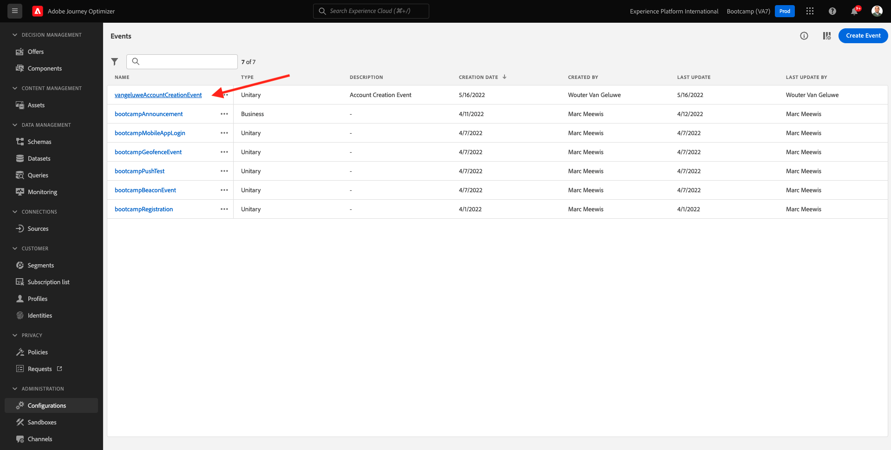

# 2.3 Creare il percorso e il messaggio e-mail

In questo esercizio configurerai il percorso che deve essere attivato quando qualcuno crea un account sul sito web demo.

Accedi a Adobe Journey Optimizer da [Adobe Experience Cloud](https://experience.adobe.com). Clic **Journey Optimizer**.

Verrai reindirizzato al **Home**  in Journey Optimizer. Innanzitutto, assicurati di utilizzare la sandbox corretta. La sandbox da utilizzare si chiama `Bootcamp`. Per passare da una sandbox all’altra, fai clic su **Prod** e seleziona la sandbox dall’elenco. In questo esempio, la sandbox è denominata **Bootcamp**. Sarai quindi nel **Home** visualizzazione della sandbox `Bootcamp`.

## 2.3.1 Creare il percorso

Nel menu a sinistra, fai clic su **Percorsi**. Quindi, fai clic su **Crea Percorso** per creare un nuovo percorso.

Viene quindi visualizzata una schermata di percorso vuota.

Nell’esercizio precedente, hai creato una nuova **Evento**. L&#39;hai chiamato così `yourLastNameAccountCreationEvent` e sostituito `yourLastName` con il tuo cognome. Questo è stato il risultato della creazione dell’evento:

Ora devi prendere questo evento come inizio di questo Percorso. Per farlo, vai sul lato sinistro della schermata e cerca l’evento nell’elenco degli eventi.

Seleziona l’evento, trascinalo sull’area di lavoro del Percorso. Il Percorso si presenta ora come segue:

Come secondo passaggio del percorso, è necessario aggiungere un breve **Wait** passaggio. Passa alla parte sinistra dello schermo per **Orchestrazione** per trovare questo. Utilizzerai gli attributi del profilo e dovrai accertarti che siano popolati in Real-time Customer Profile.

Il tuo percorso ora si presenta così. Sul lato destro dello schermo è necessario configurare il tempo di attesa. Imposta su 1 minuto. In questo modo gli attributi del profilo saranno disponibili dopo l’attivazione dell’evento.

Clic **Ok** per salvare le modifiche.

Come terzo passaggio del percorso, devi aggiungere un’ **E-mail** azione. Vai sul lato sinistro dello schermo per **Azioni**, seleziona la **E-mail** , quindi trascinarlo e rilasciarlo sul secondo nodo del percorso. Ora vedete questo.

Imposta il **Categoria** a **Marketing** e seleziona una superficie e-mail che ti consenta di inviare e-mail. In questo caso, la superficie e-mail da selezionare è **E-mail**. Assicurati che le caselle di controllo per **Clic sull’e-mail** e **aperture e-mail** sono entrambi abilitati.

Il passaggio successivo consiste nel creare il messaggio. A tale scopo, fai clic su **Modifica contenuto**.

## 2.3.2 Creare il messaggio

Per creare il messaggio, fai clic su **Modifica contenuto**.

Ora vedete questo.

Fai clic su **Oggetto** campo di testo.

Nell&#39;area di testo iniziare a scrivere **Ciao**

L’oggetto non è ancora stato completato. Ora devi inserire il token di personalizzazione per il campo **Nome** che è memorizzato in `profile.person.name.firstName`. Nel menu a sinistra, scorri verso il basso per trovare il **Persona** e fai clic sulla freccia per andare a un livello più profondo.

Ora trova il **Nome e cognome** e fai clic sulla freccia per andare a un livello più profondo.

Infine, trova il **Nome** e fai clic sul pulsante **+** accedi accanto. Il token di personalizzazione verrà quindi visualizzato nel campo di testo.

Aggiungere quindi il testo **, grazie per esserti registrato!**. Fai clic su **Salva**.

Allora tornerai qui. Clic **E-mail Designer** per creare il contenuto dell’e-mail.

Nella schermata successiva ti verranno richiesti 3 metodi diversi per fornire il contenuto dell’e-mail:

- **Progettare da zero**: inizia con un’area di lavoro vuota e utilizza l’editor WYSIWYG per trascinare e rilasciare i componenti struttura e contenuto per creare visivamente il contenuto dell’e-mail.
- **Crea il codice**: crea un modello e-mail personalizzato codificandolo con HTML
- **Importa HTML**: importa un modello di HTML esistente che potrai modificare.

Clic **Importa HTML**. In alternativa, è possibile fare clic su **Modelli salvati** e seleziona il modello **Bootcamp - Modello e-mail**.

Se hai selezionato **Importa HTML**, è ora possibile trascinare e rilasciare il file **mailtemplatebootcamp.html**, che puoi scaricare [qui](../../assets/html/mailtemplatebootcamp.html.zip). Fai clic su Importa.

Visualizzerai quindi questo modello e-mail predefinito:

Personalizziamo l’e-mail. Fai clic su accanto al testo **Ciao** e quindi fare clic su **Aggiungi personalizzazione** icona.

Quindi, devi portare il **Nome** token di personalizzazione memorizzato in `profile.person.name.firstName`. Nel menu, individua **Persona** , espandere fino a **Nome e cognome** e quindi fare clic sul pulsante **+** per aggiungere il campo First Name all’editor di espressioni.

Fai clic su **Salva**.

Ora noterai come il campo di personalizzazione è stato aggiunto al testo.

Clic **Salva** per salvare il messaggio.

Torna alla dashboard dei messaggi facendo clic sul pulsante **freccia** accanto al testo della riga oggetto nell&#39;angolo superiore sinistro.

Hai completato la creazione dell’e-mail di registrazione. Fai clic sulla freccia nell’angolo in alto a sinistra per tornare al percorso.

Clic **Ok**.

## 2.3.3 Pubblicare il percorso

È comunque necessario assegnare un nome al percorso. Per farlo, fai clic sul pulsante **Proprietà** in alto a destra.

È quindi possibile immettere qui il nome del percorso. Utilizza `yourLastName - Account Creation Journey`. Clic **OK** per salvare le modifiche.

Ora puoi pubblicare il percorso facendo clic su **Pubblica**.

Clic **Pubblica** di nuovo.

Viene visualizzata una barra di conferma verde che indica che il percorso è ora pubblicato.

Hai terminato questo esercizio.

Passaggio successivo: [2.4 Test del percorso](./ex4.md)

[Torna a Flusso utente 2](./uc2.md)

[Torna a tutti i moduli](../../overview.md)