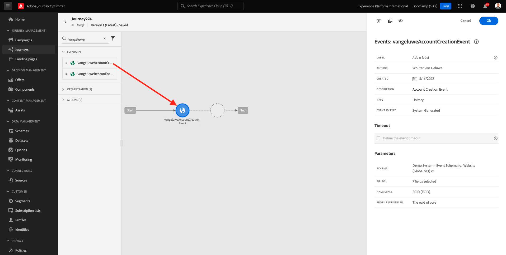

# 2.3 Creare il percorso e il messaggio e-mail

In questo esercizio, configurerai il percorso da attivare quando qualcuno crea un account sul sito web demo.

Accedi a Adobe Journey Optimizer accedendo a [Adobe Experience Cloud](https://experience.adobe.com). Fai clic su **Journey Optimizer**.

Verrai reindirizzato al **Pagina principale**  in Journey Optimizer. In primo luogo, assicurati di utilizzare la sandbox corretta. La sandbox da utilizzare è denominata `Bootcamp`. Per passare da una sandbox all’altra, fai clic su **Prod** e selezionate la sandbox dall’elenco. In questo esempio, la sandbox è denominata **Bootcamp**. Allora sarai nel **Pagina principale** visualizzazione della sandbox `Bootcamp`.

## 2.3.1 Crea il tuo percorso

Nel menu a sinistra, fai clic su **Percorsi**. Quindi, fai clic su **Crea Percorso** per creare un nuovo percorso.

Verrà visualizzata una schermata di percorso vuota.

Nell’esercizio precedente, hai creato una nuova **Evento**. L&#39;hai chiamato così `yourLastNameAccountCreationEvent` e sostituito `yourLastName` con il tuo cognome. Questo è stato il risultato della creazione dell’evento:

Ora devi prendere questo evento come inizio di questo Percorso. Per farlo, vai sul lato sinistro dello schermo e cerca l’evento nell’elenco degli eventi.

Seleziona l’evento, trascinalo sull’area di lavoro del Percorso e rilascialo. Il tuo Percorso ora si presenta così:

Come secondo passaggio del percorso, devi aggiungere una breve **Wait** passo. Passa al lato sinistro dello schermo e **Orchestrazione** per trovare questo. Utilizzerai gli attributi del profilo e dovrai accertarti che siano popolati nel Profilo del cliente in tempo reale.

Il tuo percorso ora assomiglia a questo. Sul lato destro dello schermo è necessario configurare il tempo di attesa. Impostalo a 1 minuto. In questo modo gli attributi del profilo saranno disponibili per un periodo di tempo sufficiente dopo l’attivazione dell’evento.

Fai clic su **Ok** per salvare le modifiche.

Come terzo passaggio del percorso, devi aggiungere un **E-mail** azione. Vai al lato sinistro dello schermo fino a **Azioni**, seleziona **E-mail** , quindi trascinalo sul secondo nodo del percorso. Ora vedete questo.

Imposta la **Categoria** a **Marketing** e seleziona una superficie e-mail che ti consente di inviare e-mail. In questo caso, la superficie dell’e-mail da selezionare è **E-mail**. Assicurati che le caselle di controllo per **Clic su e-mail** e **aperture e-mail** sono entrambi abilitati.

Il passaggio successivo consiste nel creare il messaggio. A tale scopo, fai clic su **Modifica contenuto**.

## 2.3.2 Creare il messaggio

Per creare il messaggio, fai clic su **Modifica contenuto**.

Ora vedete questo.

Fai clic sul pulsante **Linea oggetto** campo di testo.

Nell’area di testo inizia la scrittura **Ciao**

L&#39;oggetto non è ancora stato completato. Ora devi inserire il token di personalizzazione per il campo **Nome** che è immagazzinato in `profile.person.name.firstName`. Nel menu a sinistra, scorri verso il basso per trovare il **Persona** e fai clic sulla freccia per andare un livello più profondo.

Ora trova la **Nome completo** e fai clic sulla freccia per andare un livello più profondo.

Infine, trova il **Nome** e fai clic sul **+** firmi accanto a esso. Il token di personalizzazione verrà visualizzato nel campo di testo.

Quindi, aggiungi il testo **Grazie per esserti registrato!**. Fai clic su **Salva**.

Allora tornerai qui. Fai clic su **E-mail Designer** per creare il contenuto dell’e-mail.

Nella schermata successiva verranno visualizzati 3 metodi diversi per fornire il contenuto dell’e-mail:

- **Progettazione da zero**: Inizia con un’area di lavoro vuota e utilizza l’editor WYSIWYG per trascinare e rilasciare componenti di struttura e contenuto per creare visivamente il contenuto dell’e-mail.
- **Codice personalizzato**: Crea il tuo modello e-mail codificandolo utilizzando HTML
- **Importa HTML**: Importa un modello HTML esistente, che potrai modificare.

Fai clic su **Importa HTML**. In alternativa, puoi fare clic su **Modelli salvati** e seleziona il modello **Bootcamp - Modello e-mail**.

Se hai selezionato **Importa HTML**, ora puoi trascinare e rilasciare il file **mailtemplatebootcamp.html**, scaricabile [qui](../../assets/html/mailtemplatebootcamp.html.zip). Fai clic su Importa.

Verrà quindi visualizzato questo modello e-mail predefinito:

Personalizziamo l’e-mail. Fai clic accanto al testo **Ciao** quindi fai clic sul pulsante **Aggiungi personalizzazione** icona.

Successivamente, devi portare il **Nome** token di personalizzazione memorizzato in `profile.person.name.firstName`. Nel menu , trova la **Persona** elemento, scegli **Nome completo** , quindi fai clic sul **+** per aggiungere il campo Nome all’editor di espressioni.

Fai clic su **Salva**.

Ora noterai come il campo di personalizzazione è stato aggiunto al testo.

Fai clic su **Salva** per salvare il messaggio.

Torna al dashboard dei messaggi facendo clic sul pulsante **freccia** accanto all’oggetto nell’angolo in alto a sinistra.

Hai completato la creazione del messaggio e-mail di registrazione. Fai clic sulla freccia nell&#39;angolo in alto a sinistra per tornare al percorso.

Fai clic su **Ok**.

## 2.3.3 Pubblicare il percorso

Devi ancora dare un Nome al tuo percorso. Per farlo, fai clic sul pulsante **Proprietà** in alto a destra sullo schermo.

Potete quindi inserire il nome del percorso qui. Utilizzare `yourLastName - Account Creation Journey`. Fai clic su **OK** per salvare le modifiche.

Ora puoi pubblicare il percorso facendo clic su **Pubblica**.

Fai clic su **Pubblica** di nuovo.

Verrà visualizzata una barra di conferma verde che indica che il percorso è ora Pubblicato.

Ora avete finito questo esercizio.

Passaggio successivo: [2.4 Test del percorso](./ex4.md)

[Torna al flusso utente 2](./uc2.md)

[Torna a tutti i moduli](../../overview.md)