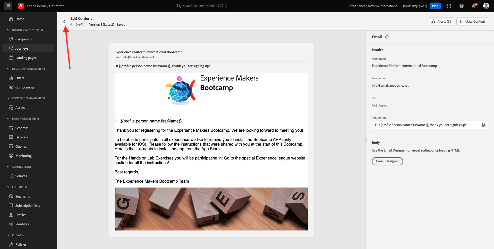

# 2.3 Creare il percorso e il messaggio e-mail

In questo esercizio configurerai il percorso che deve essere attivato quando qualcuno crea un account sul sito web demo.

Accedi a Adobe Journey Optimizer da [Adobe Experience Cloud](https://experience.adobe.com). Fare clic su **Journey Optimizer**.

Verrai reindirizzato alla visualizzazione **Home** in Journey Optimizer. Innanzitutto, assicurati di utilizzare la sandbox corretta. La sandbox da utilizzare si chiama `Bootcamp`. Per passare da una sandbox all&#39;altra, fare clic su **Prod** e selezionare la sandbox dall&#39;elenco. In questo esempio, la sandbox è denominata **Bootcamp**. Ti troverai quindi nella **Home** della tua sandbox `Bootcamp`.

## 2.3.1 Creare il percorso

Nel menu a sinistra, fai clic su **Percorsi**. Fare clic su **Crea Percorso** per creare un nuovo percorso.

Viene quindi visualizzata una schermata di percorso vuota.

Nell&#39;esercizio precedente è stato creato un nuovo **evento**. L&#39;utente ha assegnato un nome simile a `yourLastNameAccountCreationEvent` e ha sostituito `yourLastName` con il cognome. Questo è stato il risultato della creazione dell’evento:

Ora devi prendere questo evento come inizio di questo Percorso. Per farlo, vai sul lato sinistro della schermata e cerca l’evento nell’elenco degli eventi.

Seleziona l’evento, trascinalo sull’area di lavoro del Percorso. Il Percorso si presenta ora come segue:

Come secondo passaggio del percorso, devi aggiungere un breve passaggio **Attendi**. Vai sul lato sinistro della schermata alla sezione **Orchestration** per trovarlo. Utilizzerai gli attributi del profilo e dovrai accertarti che siano popolati in Real-time Customer Profile.

Il tuo percorso ora si presenta così. Sul lato destro dello schermo è necessario configurare il tempo di attesa. Imposta su 1 minuto. In questo modo gli attributi del profilo saranno disponibili dopo l’attivazione dell’evento.

Fai clic su **Ok** per salvare le modifiche.

Come terzo passaggio del percorso, devi aggiungere un&#39;azione **E-mail**. Vai sul lato sinistro della schermata a **Azioni**, seleziona l&#39;azione **E-mail**, quindi trascinala sul secondo nodo del percorso. Ora vedete questo.

Imposta **Categoria** su **Marketing** e seleziona una superficie e-mail che ti consenta di inviare messaggi e-mail. In questo caso, la superficie e-mail da selezionare è **E-mail**. Assicurati che le caselle di controllo per **Clic su e-mail** e **aperture e-mail** siano entrambe abilitate.

Il passaggio successivo consiste nel creare il messaggio. A tale scopo, fare clic su **Modifica contenuto**.

## 2.3.2 Creare il messaggio

Per creare il messaggio, fai clic su **Modifica contenuto**.

Ora vedete questo.

Fare clic sul campo di testo **Oggetto**.

Nell&#39;area di testo inizia a scrivere **Ciao**

L’oggetto non è ancora stato completato. Successivamente devi inserire il token di personalizzazione per il campo **First name**, memorizzato in `profile.person.name.firstName`. Nel menu a sinistra, scorri verso il basso per trovare l&#39;elemento **Person** e fai clic sulla freccia per approfondire il livello.

Trovare ora l&#39;elemento **Nome completo** e fare clic sulla freccia per approfondire il livello.

Infine, trovare il campo **Nome** e fare clic sul segno **+** accanto ad esso. Il token di personalizzazione verrà quindi visualizzato nel campo di testo.

Quindi, aggiungere il testo **. Grazie per la registrazione.**. Fai clic su **Salva**.

Allora tornerai qui. Fai clic su **Invia e-mail a Designer** per creare il contenuto dell&#39;e-mail.

Nella schermata successiva ti verranno richiesti 3 metodi diversi per fornire il contenuto dell’e-mail:

- **Progettazione da zero**: inizia con un&#39;area di lavoro vuota e utilizza l&#39;editor WYSIWYG per trascinare e rilasciare i componenti struttura e contenuto per creare visivamente il contenuto dell&#39;e-mail.
- **Crea un codice personale**: crea un modello di e-mail personalizzato codificandolo con HTML
- **Importa HTML**: importa un modello di HTML esistente che potrai modificare.

Fai clic su **Importa HTML**. In alternativa, è possibile fare clic su **Modelli salvati** e selezionare il modello **Bootcamp - Modello e-mail**.

Se hai selezionato **Importa HTML**, ora puoi trascinare il file **mailtemplatebootcamp.html**, che puoi scaricare [qui](../../assets/html/mailtemplatebootcamp.html.zip). Fai clic su Importa.

Viene quindi visualizzato questo modello e-mail predefinito:

Personalizziamo l’e-mail. Fai clic su accanto al testo **Ciao**, quindi fai clic sull&#39;icona **Aggiungi Personalization**.

Successivamente, devi portare il token di personalizzazione **First name** memorizzato in `profile.person.name.firstName`. Nel menu, trovare l&#39;elemento **Person**, espandere l&#39;elemento **Full Name** e quindi fare clic sull&#39;icona **+** per aggiungere il campo First Name all&#39;editor di espressioni.

Fai clic su **Salva**.

Ora noterai come il campo di personalizzazione è stato aggiunto al testo.

Fai clic su **Salva** per salvare il messaggio.

Torna alla dashboard dei messaggi facendo clic sulla **freccia** accanto al testo dell&#39;oggetto nell&#39;angolo in alto a sinistra.

Hai completato la creazione dell’e-mail di registrazione. Fai clic sulla freccia nell’angolo in alto a sinistra per tornare al percorso.

Fare clic su **Ok**.

## 2.3.3 Publish il tuo percorso

È comunque necessario assegnare un nome al percorso. Per farlo, fai clic sull&#39;icona **Matita** in alto a sinistra nella schermata.

È quindi possibile immettere qui il nome del percorso. Utilizzare `yourLastName - Account Creation Journey`. Fai clic su **OK** per salvare le modifiche.

È ora possibile pubblicare il percorso facendo clic su **Publish**.

Fai di nuovo clic su **Publish**.

Viene visualizzata una barra di conferma verde che indica che il percorso è ora pubblicato.

Hai terminato questo esercizio.

Passaggio successivo: [2.4 Verifica il percorso](./ex4.md)

[Torna a Flusso utente 2](./uc2.md)

[Torna a tutti i moduli](../../overview.md)