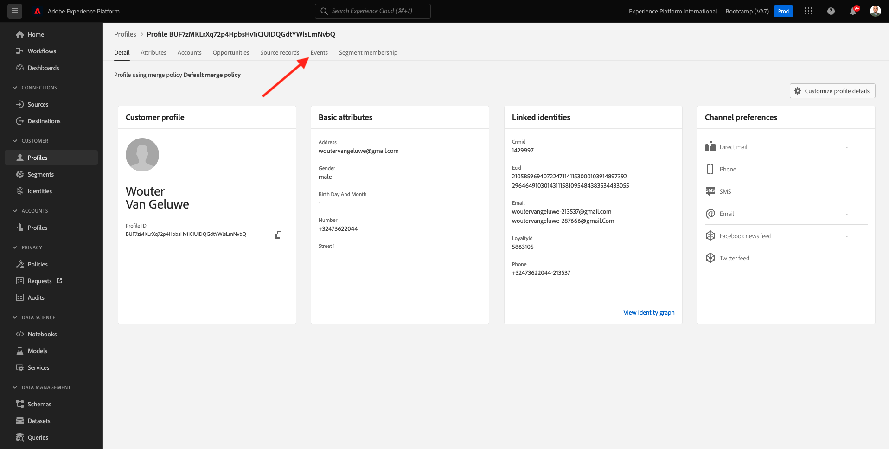
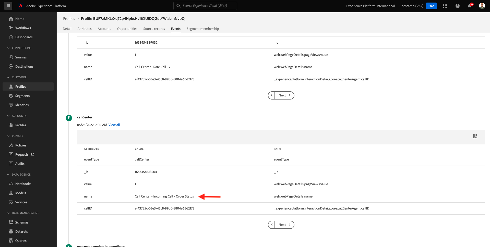

# 2.6 Personalization nel call center

Come discusso più volte durante il bootcamp, la personalizzazione dell’esperienza del cliente è qualcosa che dovrebbe accadere in modo omnicanale. Un call center è spesso abbastanza disconnesso dal resto del percorso di clienti e questo spesso porta a esperienze frustranti per il cliente, ma non è necessario che lo sia. Ecco un esempio di come il call center può essere facilmente collegato a Adobe Experience Platform in tempo reale.

## Flusso di Percorso cliente

Nell&#39;esercizio precedente, utilizzando l&#39;app mobile, hai acquistato un prodotto facendo clic sul pulsante **Acquista**.

Supponiamo che tu abbia una domanda sullo stato del tuo ordine, cosa faresti? In genere si chiama il call center.

Prima di chiamare il call center, è necessario conoscere il proprio **ID fedeltà**. Puoi trovare il tuo ID fedeltà nel Visualizzatore profili del sito web.

In questo caso, l&#39;**ID fedeltà** è **5863105**. Come parte dell&#39;implementazione personalizzata della funzionalità del call center nell&#39;ambiente demo, devi aggiungere un prefisso al tuo **ID fedeltà**. Il prefisso è **11373**, pertanto l&#39;ID fedeltà da utilizzare in questo esempio è **11373 5863105**.

Facciamolo adesso. Usa il telefono e chiama il numero **+1 (323) 745-1670**.

Ti verrà chiesto di immettere il tuo ID fedeltà, seguito da **#**. Immetti il tuo ID fedeltà.

Sentirai quindi **Ciao, nome**. Questo nome viene preso dal profilo cliente in tempo reale in Adobe Experience Platform. Sono quindi disponibili 3 opzioni. Premere il numero **1**, **Stato ordine**.

Dopo aver sentito lo stato dell&#39;ordine, potrai scegliere se premere **1** per tornare al menu principale oppure premere 2. Premere **2**.

Ti verrà quindi chiesto di valutare l’esperienza del call center selezionando un numero tra 1 e 5, tra 1 (minimo) e 5 (massimo). Fai la tua scelta.

La chiamata al call center terminerà.

Vai a [Adobe Experience Platform](https://experience.adobe.com/platform). Dopo aver effettuato l’accesso, accedi alla home page di Adobe Experience Platform.

Prima di continuare, devi selezionare una **sandbox**. La sandbox da selezionare è denominata ``Bootcamp``. A tale scopo, fai clic sul testo **[!UICONTROL Prod produzione]** nella riga blu nella parte superiore dello schermo. Dopo aver selezionato la [!UICONTROL sandbox] appropriata, la schermata verrà modificata e ora sei nella [!UICONTROL sandbox] dedicata.

Nel menu a sinistra, vai a **Profili** e a **Sfoglia**.

Seleziona lo spazio dei nomi **Identity** **Email** e immetti l&#39;indirizzo e-mail del tuo profilo cliente. Fare clic su **Visualizza**. Fai clic su per aprire il profilo.

Visualizzerai di nuovo il tuo profilo cliente. Vai a **Eventi**.

In eventi verranno visualizzati 2 eventi con eventType **callCenter**. Il primo evento è il risultato della risposta alla domanda **Valuta la soddisfazione della tua chiamata**.

Scorri verso il basso e vedrai l&#39;evento registrato quando hai selezionato l&#39;opzione per controllare il tuo **stato ordine**.

Vai a **Appartenenza al segmento**. Ora vedrai che 2 segmenti si qualificano sul tuo profilo, in tempo reale, in base alle interazioni che hai avuto attraverso il call center. Queste appartenenze a segmenti possono e devono quindi essere utilizzate per influire su ciò che avviene nella comunicazione e nella personalizzazione attraverso qualsiasi altro canale.

Hai terminato questo esercizio.

[Torna a Flusso utente 2](./uc2.md)

[Torna a tutti i moduli](../../overview.md)
