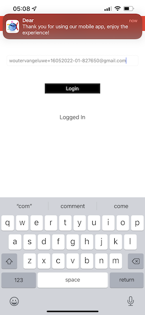

# 3.1 Usare l&#39;app mobile e attivare una voce beacon

## Installare l’app mobile

Prima di installare l’app, è necessario abilitare **Tracciamento** sul dispositivo iOS. Per farlo, vai a **Impostazioni** > **Privacy e sicurezza** > **Tracciamento** e assicurarsi che l&#39;opzione **Consenti alle app di richiedere il tracciamento**.

Vai a Apple App Store e cerca `aepmobile-bootcamp`. Clic **Installa** o **Scarica**.

Una volta installata l’app, fai clic su **Apri**.

Fai clic su **OK**.

Clic **Consenti**.

Clic **Accetto**.

Clic **Consenti durante l&#39;utilizzo dell&#39;app**.

Clic **Consenti**.

Ora sei nell’app, nella home page, pronto per passare attraverso il percorso di clienti.

## Flusso di percorso cliente

Prima di tutto, devi effettuare l’accesso. Fai clic su **Accedi**.

Dopo aver creato l’account negli esercizi precedenti, l’hai visto sul sito web. Per accedere, ora devi riutilizzare l’indirizzo e-mail dell’account creato nell’app.

Inserisci qui l’indirizzo e-mail utilizzato sul sito web e fai clic su **Login**.

Riceverai una conferma di accesso e una notifica push.

Torna alla home page dell’app per visualizzare funzionalità aggiuntive.

Per prima cosa, vai a **Prodotti**. Fai clic su qualsiasi prodotto, in questo esempio **Caffè a disposizione**.

Vedrai il **Caffè a disposizione** nell’app.

Ora simuli un evento di ingresso beacon in un percorso di archivio offline. L&#39;obiettivo di questa simulazione è quello di personalizzare l&#39;esperienza del cliente sugli schermi all&#39;interno del negozio. Per visualizzare l’esperienza nel negozio, è stata creata una pagina che mostra in modo dinamico le informazioni rilevanti per il cliente che è appena entrato nel negozio.

Prima di continuare, aprire la pagina Web nel computer: [https://bootcamp.aepdemo.net/content/aep-bootcamp-experience/language-masters/en/screen.html](https://bootcamp.aepdemo.net/content/aep-bootcamp-experience/language-masters/en/screen.html)

A questo punto viene visualizzato quanto segue:

Quindi, torna alla home page. Fai clic su **beacon** icona.

Poi vedrai questo. Seleziona innanzitutto **Beacon schermo bootcamp** e quindi fare clic su **voce** pulsante. Questo consente di simulare una voce beacon.

Dai un&#39;occhiata allo schermo del negozio. Vedrai l’ultimo prodotto visualizzato lì entro 5 secondi.

Quindi, torna a **Prodotti**. Fai clic su qualsiasi prodotto, in questo esempio **Coperta da spiaggia Tan**.

Quindi, torna alla home page. Fai clic su **beacon** icona.

Poi vedrai questo. Seleziona innanzitutto **Beacon schermo bootcamp** e quindi fare clic su **voce** pulsante di nuovo. Questo consente di simulare una voce beacon.

Dai un&#39;occhiata allo schermo del negozio. Vedrai l’ultimo prodotto visualizzato lì entro 5 secondi.

Diamo anche un’occhiata al tuo Visualizzatore profili sul sito web ora. Vedrai molti eventi aggiunti lì, solo per mostrare che ogni interazione con un cliente viene raccolta e memorizzata in Adobe Experience Platform.

Negli esercizi successivi, configurerai e verificherai il tuo percorso di ingresso beacon.

Passaggio successivo: [3.2 Creare l’evento](./ex2.md)

[Torna a Flusso utente 3](./uc3.md)

[Torna a tutti i moduli](../../overview.md)
