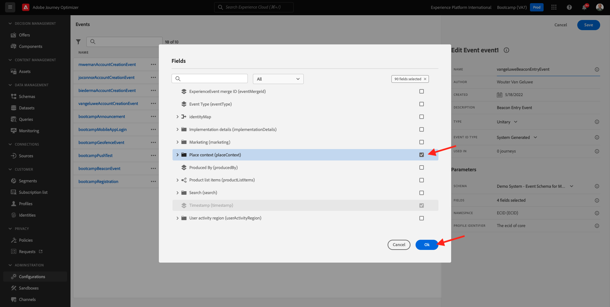

# 3.2 Creare l’evento

Accedi a Adobe Journey Optimizer da [Adobe Experience Cloud](https://experience.adobe.com). Fare clic su **Journey Optimizer**.

Verrai reindirizzato alla visualizzazione **Home** in Journey Optimizer. Innanzitutto, assicurati di utilizzare la sandbox corretta. La sandbox da utilizzare si chiama `Bootcamp`. Per passare da una sandbox all&#39;altra, fare clic su **Prod** e selezionare la sandbox dall&#39;elenco. In questo esempio, la sandbox è denominata **Bootcamp2**. Ti troverai quindi nella **Home** della tua sandbox `Bootcamp`.

Nel menu a sinistra, scorri verso il basso e fai clic su **Configurazioni**. Fare clic sul pulsante **Gestisci** in **Eventi**.

Viene quindi visualizzata una panoramica di tutti gli eventi disponibili. Fai clic su **Crea evento** per iniziare a creare il tuo evento.

Viene visualizzata una nuova finestra di evento vuota.

Prima di tutto, assegna all&#39;evento un nome come `yourLastNameBeaconEntryEvent` e aggiungi una descrizione come `Beacon Entry Event`.

Assicurarsi quindi che il tipo **Type** sia impostato su **Unitario** e per la selezione del tipo **ID evento** selezionare **Generato dal sistema**.

Di seguito è riportata la selezione dello schema. Per questo esercizio è stato preparato uno schema. Utilizzare lo schema `Demo System - Event Schema for Mobile App (Global v1.1) v.1`.

Dopo aver selezionato lo schema, nella sezione **Fields** verranno selezionati diversi campi. Passa il cursore del mouse sulla sezione **Campi** per visualizzare la finestra a comparsa delle 3 icone. Fai clic sull&#39;icona **Modifica**.

Verrà visualizzata una finestra popup **Campi** in cui è necessario selezionare alcuni dei campi necessari per personalizzare il percorso.  In seguito sceglieremo altri attributi di profilo, utilizzando i dati già presenti in Adobe Experience Platform.

Scorrere verso il basso fino a visualizzare l&#39;oggetto `Place context` e selezionare la casella di controllo. In questo modo, tutto il contesto della posizione del cliente sarà reso disponibile al percorso. Fai clic su **Ok** per salvare le modifiche.

Dovresti vedere questo. Fai clic ancora una volta su **Salva** per salvare le modifiche.

L’evento è ora configurato e salvato.

Fai di nuovo clic sull&#39;evento per aprire di nuovo la schermata **Modifica evento**. Passa nuovamente il puntatore del mouse su **Campi** per visualizzare le 3 icone. Fai clic sull&#39;icona **Visualizza**.

Ora vedrai un esempio del payload previsto.
L&#39;evento ha un ID evento di orchestrazione univoco, che puoi trovare scorrendo verso il basso in tale payload fino a visualizzare `_experience.campaign.orchestration.eventID`.

L’ID evento è ciò che deve essere inviato a Adobe Experience Platform per attivare il percorso che creerai in uno degli esercizi successivi. Ricorda questo eventID, in quanto potrebbe essere necessario in un secondo momento.
`"eventID": "e76c0bf0c77c3517e5b6f4c457a0754ebaf5f1f6b9357d74e0d8e13ae517c3d5"`

Fare clic su **Ok**, quindi su **Annulla**.

Hai terminato questo esercizio.

Passaggio successivo: [3.3 Crea il percorso e invia una notifica](./ex3.md)

[Torna a Flusso utente 3](./uc3.md)

[Torna a tutti i moduli](../../overview.md)
