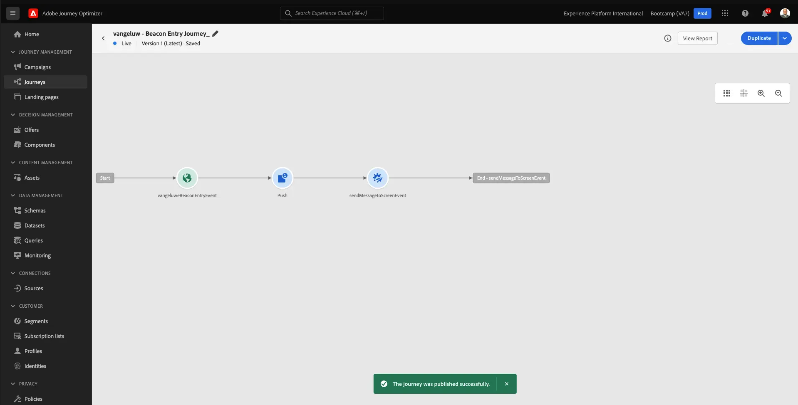

# 3.3 Creare il percorso e la notifica push

In questo esercizio configurerai il percorso e il messaggio da attivare quando qualcuno entra in un beacon utilizzando l&#39;app mobile.

Accedi a Adobe Journey Optimizer da [Adobe Experience Cloud](https://experience.adobe.com). Clic **Journey Optimizer**.

Verrai reindirizzato al **Home**  in Journey Optimizer. Innanzitutto, assicurati di utilizzare la sandbox corretta. La sandbox da utilizzare si chiama `Bootcamp`. Per passare da una sandbox all’altra, fai clic su **Prod** e seleziona la sandbox dall’elenco. In questo esempio, la sandbox è denominata **Bootcamp**. Sarai quindi nel **Home** visualizzazione della sandbox `Bootcamp`.

## 3.3.1 Creare il percorso

Nel menu a sinistra, fai clic su **Percorsi**. Quindi, fai clic su **Crea Percorso** per creare un nuovo percorso.

Viene quindi visualizzata una schermata di percorso vuota.

Nell’esercizio precedente, hai creato una nuova **Evento**. L&#39;hai chiamato così `yourLastNameBeaconEntryEvent` e sostituito `yourLastName` con il tuo cognome. Questo è stato il risultato della creazione dell’evento:

Ora devi prendere questo evento come inizio di questo Percorso. Per farlo, vai sul lato sinistro della schermata e cerca l’evento nell’elenco degli eventi.

Seleziona l’evento, trascinalo sull’area di lavoro del percorso. Il tuo percorso ora si presenta così. Clic **Ok** per salvare le modifiche.

Come secondo passaggio del percorso, devi aggiungere una **Push** azione. Vai sul lato sinistro dello schermo per **Azioni**, seleziona la **Push** , quindi trascinarlo e rilasciarlo sul secondo nodo del percorso.

Sul lato destro dello schermo, ora è necessario creare la notifica push.

Imposta il **Categoria** a **Marketing** e seleziona una superficie push che ti consenta di inviare notifiche push. In questo caso, la superficie push da selezionare è **meeewis-app-mobile-bootcamp**.

## 3.3.2 Creare il messaggio

Clic **Modifica contenuto**.

A questo punto viene visualizzato quanto segue:

Definiamo il contenuto della notifica push.

Fai clic su **Titolo** campo di testo.

Nell&#39;area di testo iniziare a scrivere **Ciao**. Fai clic sull’icona di personalizzazione.

Ora devi inserire il token di personalizzazione per il campo **Nome** che è memorizzato in `profile.person.name.firstName`. Nel menu a sinistra, seleziona **Attributi del profilo**, scorri verso il basso/naviga per trovare **Persona** e fai clic sulla freccia per andare a un livello più profondo fino a raggiungere il campo `profile.person.name.firstName`. Fai clic su **+** per aggiungere il campo all’area di lavoro. Fai clic su **Salva**.

Allora tornerai qui. Fai clic sull’icona di personalizzazione accanto al campo **Corpo**.

Nell&#39;area di testo, scrivere `Welcome at the `.

Quindi, fai clic su **Attributi contestuali** e poi **Journey Orchestration**.

Clic **Eventi**.

Fai clic sul nome dell’evento, che avrà un aspetto simile al seguente: **yourLastNameBeaconEntryEvent**.

Clic **Contesto del luogo**.

Clic **Interazione POI**.

Clic **Dettagli POI**.

Fai clic su **+** icona su **Nome punto di interesse**.
Poi vedrai questo. Fai clic su **Salva**.

Il messaggio è ora pronto. Fai clic sulla freccia nell’angolo in alto a sinistra per tornare al percorso.

Clic **Ok**.

## 3.3.2 Inviare un messaggio a uno schermo

Come terzo passaggio del percorso, devi aggiungere una **sendMessageToScreen** azione. Vai sul lato sinistro dello schermo per **Azioni**, seleziona la **sendMessageToScreen** , quindi trascinarlo e rilasciarlo sul terzo nodo del percorso. Poi vedrai questo.

Il **sendMessageToScreen** action è un’azione personalizzata che pubblicherà un messaggio sull’endpoint utilizzato dalla visualizzazione in-store. Il **sendMessageToScreen** L&#39;azione richiede la definizione di un numero di variabili. Puoi visualizzare queste variabili scorrendo verso il basso fino a visualizzare **Parametri azione**.

Ora devi impostare i valori per ogni parametro di azione. Segui questa tabella per capire quali valori sono richiesti e dove.

| Parametro | Valore  |
|:-------------:| :---------------:|
| CONSEGNA | `'image'` |
| ECID | `@{yourLastNameBeaconEntryEvent._experienceplatform.identification.core.ecid}` |
| NOME | `#{ExperiencePlatform.ProfileFieldGroup.profile.person.name.firstName}` |
| EVENTSUBJECT | `#{ExperiencePlatform.ProductListItems.experienceevent.first(currentDataPackField.eventType == "commerce.productViews").productListItems.first().name}` |
| EVENTSUBJECTURL | `#{ExperiencePlatform.ProductListItems.experienceevent.first(currentDataPackField.eventType == "commerce.productViews").productListItems.first()._experienceplatform.core.imageURL}` |
| SANDBOX | `'bootcamp'` |
| CONTAINERID | `''` |
| ACTIVITYID | `''` |
| PLACEMENTID | `''` |

{style="table-layout:auto"}

Per impostare tali valori, fare clic su **Modifica** icona.

Quindi, seleziona **Modalità avanzata**.

Quindi, incolla il valore in base alla tabella precedente. Clic **Ok**.

Ripetere questo processo per aggiungere valori per ogni campo.

>[!IMPORTANT]
>
>Per il campo ECID, esiste un riferimento all’evento `yourLastNameBeaconEntryEvent`. Sostituire `yourLastName` con il tuo cognome.

Il risultato finale dovrebbe essere simile al seguente:

Scorri verso l’alto e fai clic su **Ok**.

È comunque necessario assegnare un nome al percorso. Per farlo, fai clic sul pulsante **Proprietà** in alto a destra.

È quindi possibile immettere qui il nome del percorso. Utilizza `yourLastName - Beacon Entry Journey`. Clic **OK** per salvare le modifiche.

Ora puoi pubblicare il percorso facendo clic su **Pubblica**.

Clic **Pubblica** di nuovo.

Viene visualizzata una barra di conferma verde che indica che il percorso è ora pubblicato.

Il percorso è ora attivo e può essere attivato.

Hai terminato questo esercizio.

Passaggio successivo: [3.4 Test del percorso](./ex4.md)

[Torna a Flusso utente 3](./uc3.md)

[Torna a tutti i moduli](../../overview.md)
