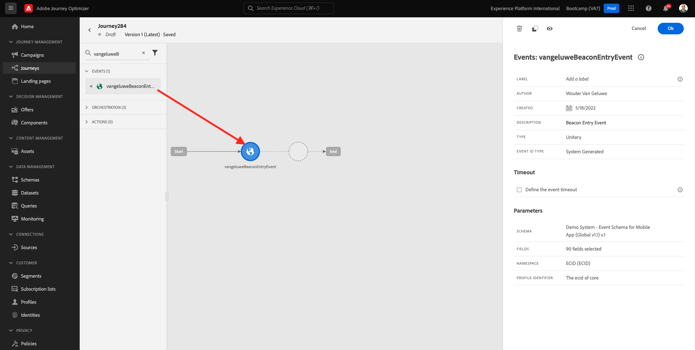
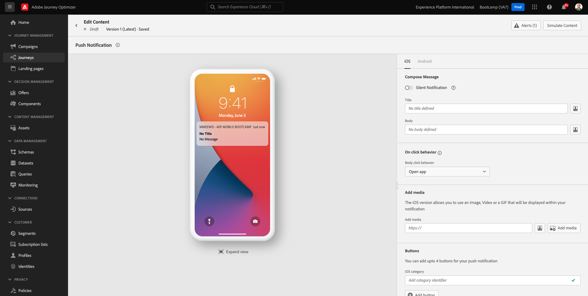
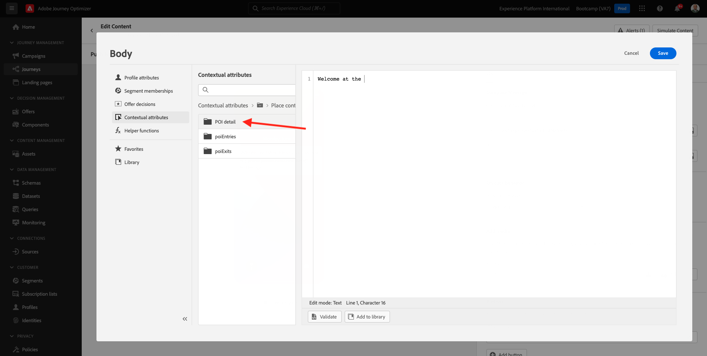
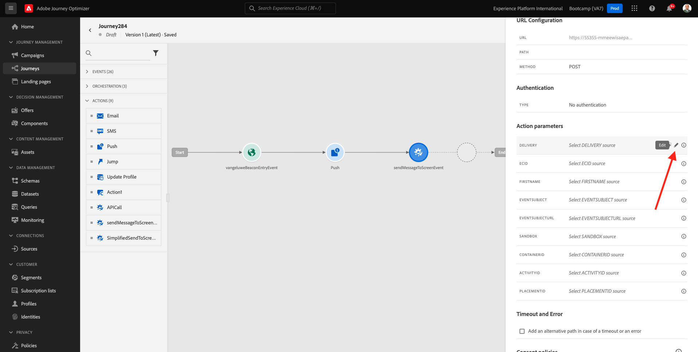

# 3.3 Creare il percorso e la notifica push

In questo esercizio configurerai il percorso e il messaggio da attivare quando qualcuno entra in un beacon utilizzando l&#39;app mobile.

Accedi a Adobe Journey Optimizer da [Adobe Experience Cloud](https://experience.adobe.com). Fare clic su **Journey Optimizer**.

Verrai reindirizzato alla visualizzazione **Home** in Journey Optimizer. Innanzitutto, assicurati di utilizzare la sandbox corretta. La sandbox da utilizzare si chiama `Bootcamp`. Per passare da una sandbox all&#39;altra, fare clic su **Prod** e selezionare la sandbox dall&#39;elenco. In questo esempio, la sandbox è denominata **Bootcamp**. Ti troverai quindi nella **Home** della tua sandbox `Bootcamp`.

## 3.3.1 Creare il percorso

Nel menu a sinistra, fai clic su **Percorsi**. Fare clic su **Crea Percorso** per creare un nuovo percorso.

Viene quindi visualizzata una schermata di percorso vuota.

Nell&#39;esercizio precedente è stato creato un nuovo **evento**. L&#39;utente ha assegnato un nome simile a `yourLastNameBeaconEntryEvent` e ha sostituito `yourLastName` con il cognome. Questo è stato il risultato della creazione dell’evento:

Ora devi prendere questo evento come inizio di questo Percorso. Per farlo, vai sul lato sinistro della schermata e cerca l’evento nell’elenco degli eventi.

Seleziona l’evento, trascinalo sull’area di lavoro del percorso. Il tuo percorso ora si presenta così. Fai clic su **Ok** per salvare le modifiche.

Come secondo passaggio del percorso, devi aggiungere un&#39;azione **Push**. Vai sul lato sinistro della schermata a **Azioni**, seleziona l&#39;azione **Invia**, quindi trascinala sul secondo nodo del percorso.

Sul lato destro dello schermo, ora è necessario creare la notifica push.

Imposta **Categoria** su **Marketing** e seleziona una superficie push che ti consenta di inviare notifiche push. In questo caso, la superficie push da selezionare è **mmeeewis-app-mobile-bootcamp**.

## 3.3.2 Creare il messaggio

Fare clic su **Modifica contenuto**.

A questo punto viene visualizzato quanto segue:

Definiamo il contenuto della notifica push.

Fai clic sul campo di testo **Titolo**.

Nell&#39;area di testo inizia a scrivere **Ciao**. Fai clic sull’icona di personalizzazione.

È ora necessario inserire il token di personalizzazione per il campo **First name** memorizzato in `profile.person.name.firstName`. Nel menu a sinistra, seleziona **Attributi profilo**, scorri verso il basso/sfoglia per trovare l&#39;elemento **Persona** e fai clic sulla freccia per andare più a fondo fino a raggiungere il campo `profile.person.name.firstName`. Fai clic sull&#39;icona **+** per aggiungere il campo all&#39;area di lavoro. Fai clic su **Salva**.

Allora tornerai qui. Fai clic sull&#39;icona di personalizzazione accanto al campo **Corpo**.

Nell&#39;area di testo, scrivere `Welcome at the `.

Fare clic su **Attributi contestuali** e quindi su **Journey Orchestration**.

Fai clic su **Eventi**.

Fai clic sul nome dell&#39;evento, che avrà un aspetto simile al seguente: **yourLastNameBeaconEntryEvent**.

Fare clic su **Inserisci contesto**.

Fai clic su **Interazione POI**.

Fai clic su **Dettagli POI**.

Fai clic sull&#39;icona **+** in **Nome POI**.
Poi vedrai questo. Fai clic su **Salva**.

Il messaggio è ora pronto. Fai clic sulla freccia nell’angolo in alto a sinistra per tornare al percorso.

Fare clic su **Ok**.

## 3.3.2 Inviare un messaggio a uno schermo

Come terzo passaggio del percorso, devi aggiungere un&#39;azione **sendMessageToScreen**. Vai sul lato sinistro della schermata a **Azioni**, seleziona l&#39;azione **inviaMessaggioAlloSchermo**, quindi trascinala e rilasciala sul terzo nodo del percorso. Poi vedrai questo.

L&#39;azione **sendMessageToScreen** è un&#39;azione personalizzata che pubblicherà un messaggio sull&#39;endpoint utilizzato dalla visualizzazione in-store. L&#39;azione **sendMessageToScreen** prevede la definizione di una serie di variabili. Puoi visualizzare queste variabili scorrendo verso il basso fino a visualizzare **Parametri azione**.

Ora devi impostare i valori per ogni parametro di azione. Segui questa tabella per capire quali valori sono richiesti e dove.

| Parametro | valore |
|:-------------:| :---------------:|
| CONSEGNA | `'image'` |
| ECID | `@{yourLastNameBeaconEntryEvent._experienceplatform.identification.core.ecid}` |
| NOME | `#{ExperiencePlatform.ProfileFieldGroup.profile.person.name.firstName}` |
| EVENTSUBJECT | `#{ExperiencePlatform.ProductListItems.experienceevent.first(currentDataPackField.eventType == "commerce.productViews").productListItems.first().name}` |
| EVENTSUBJECTURL | `#{ExperiencePlatform.ProductListItems.experienceevent.first(currentDataPackField.eventType == "commerce.productViews").productListItems.first()._experienceplatform.core.imageURL}` |
| SANDBOX | `'bootcamp'` |
| CONTAINERID | `''` |
| ACTIVITYID | `''` |
| PLACEMENTID | `''` |

{style="table-layout:auto"}

Per impostare tali valori, fare clic sull&#39;icona **Modifica**.

Selezionare **Modalità avanzata**.

Quindi, incolla il valore in base alla tabella precedente. Fare clic su **Ok**.

Ripetere questo processo per aggiungere valori per ogni campo.

>[!IMPORTANT]
>
>Per il campo ECID, esiste un riferimento all&#39;evento `yourLastNameBeaconEntryEvent`. Sostituire `yourLastName` con il cognome.

Il risultato finale dovrebbe essere simile al seguente:

Scorri verso l&#39;alto e fai clic su **Ok**.

È comunque necessario assegnare un nome al percorso. Per farlo, fai clic sull&#39;icona **Matita** in alto a sinistra nella schermata.

È quindi possibile immettere qui il nome del percorso. Utilizzare `yourLastName - Beacon Entry Journey`. Fai clic su **OK** per salvare le modifiche.

È ora possibile pubblicare il percorso facendo clic su **Publish**.

Fai di nuovo clic su **Publish**.

Viene visualizzata una barra di conferma verde che indica che il percorso è ora pubblicato.

Il percorso è ora attivo e può essere attivato.

Hai terminato questo esercizio.

Passaggio successivo: [3.4 Verifica il percorso](./ex4.md)

[Torna a Flusso utente 3](./uc3.md)

[Torna a tutti i moduli](../../overview.md)
