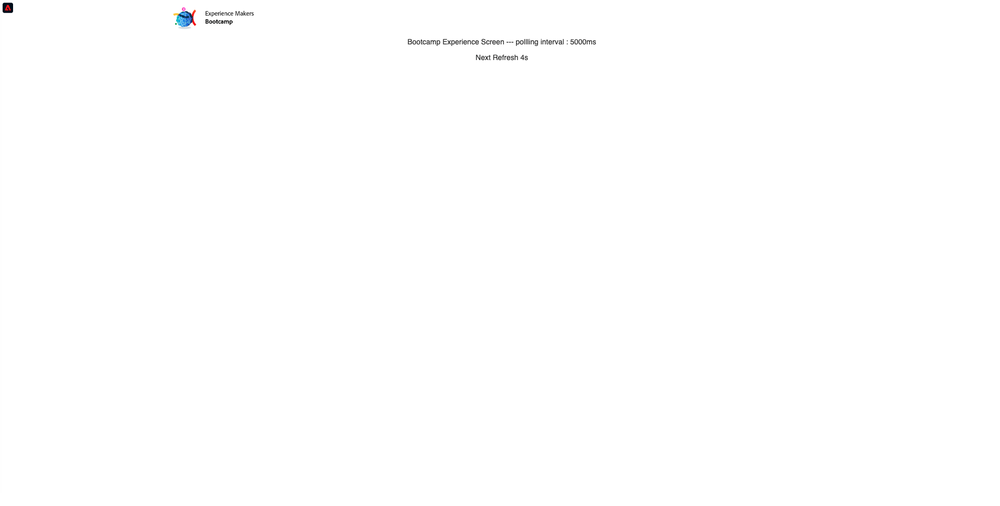

# 3.4 Test del percorso

Per testare il percorso, dovrai utilizzare l’ID evento dell’evento creato nell’esercizio 3.2, che si presenta così.

L’ID evento è ciò che deve essere inviato a Adobe Experience Platform per attivare il percorso. In questo esempio, eventID è:
`e76c0bf0c77c3517e5b6f4c457a0754ebaf5f1f6b9357d74e0d8e13ae517c3d5`.

Apri l’app mobile e vai alla home page. Fai clic su **Impostazioni** icona.

Incolla il tuo eventID nel campo **Beacon EventID** e fai clic su **Salva**.

Prima di continuare, aprire la pagina Web nel computer: [https://bootcamp.aepdemo.net/content/aep-bootcamp-experience/language-masters/en/screen.html](https://bootcamp.aepdemo.net/content/aep-bootcamp-experience/language-masters/en/screen.html)

A questo punto viene visualizzato quanto segue:

Quindi, torna alla home page. Fai clic su **beacon** icona.

Poi vedrai questo. Seleziona innanzitutto **Beacon schermo bootcamp** e quindi fare clic su **voce** pulsante. Questo consente di simulare una voce beacon.

Dai un&#39;occhiata allo schermo del negozio. Vedrai l’ultimo prodotto visualizzato lì entro 5 secondi.

Riceverai anche la notifica push.

Hai terminato questo esercizio.

[Torna a Flusso utente 3](./uc3.md)

[Torna a tutti i moduli](../../overview.md)
