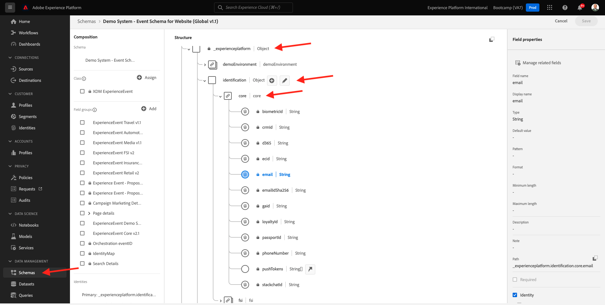

# 4.1 Customer Journey Analytics 101

## Obiettivi

- Comprendere il servizio applicazione CJA
- Scopri come posizionare CJA
- Comprendere il flusso di lavoro CJA: dalla connessione dati a insights

## 4.1.1 Cos&#39;è il Customer Journey Analytics?

Customer Journey Analytics (CJA) fornisce un toolkit ai team di business intelligence e data science per l’unione e l’analisi dei dati cross-channel (online e offline). Le funzionalità di CJA forniscono contesto e chiarezza al percorso di clienti multicanale complesso. Il contesto fornito offre informazioni utili per rimuovere i punti critici dal processo di conversione del cliente e per progettare e fornire esperienze eccezionali per i momenti più importanti.

CJA porta Analysis Workspace su Adobe Experience Platform. Adobe Experience Platform è il cervello per la comunicazione e l’orchestrazione e con CJA, i brand possono ora contestualizzare e visualizzare tutti i dati, in modo che i team Business e Insight possano imparare da essi analizzando il percorso di clienti online e offline completo.

I team aziendali e di Insight possono parlare con CJA, porre domande e ottenere al volo le risposte necessarie tramite l’interfaccia utente di Analysis Workspace con trascinamento della selezione, semplice e intuitiva.

## 4.1.2 Vantaggi chiave

I tre vantaggi principali per i clienti sono:

- Possibilità di rendere le informazioni disponibili a tutti (ad esempio, democratizzazione dell’accesso ai dati)
- Possibilità di visualizzare il cliente in un percorso contestuale (i dati possono essere visualizzati sequenzialmente, su più canali sia online che offline)
- La capacità di sfruttare la potenza dei dati senza la necessità di (ovvero, consente alle persone normali di utilizzare i dati per sbloccare approfondimenti profondi e analisi per l’attivazione del marketing)

## 4.1.3 Perché scegliere il Customer Journey Analytics?

CJA non è destinato a sostituire un’applicazione BI corrente come Power BI, Microsoft, Locker o Tableau. Queste applicazioni BI hanno lo scopo di visualizzare i dati per creare dashboard aziendali in modo che tutti gli utenti di un’organizzazione possano esaminare rapidamente metriche importanti.\
L’obiettivo di CJA è quello di fornire ai team di Marketing e Business poteri di analisi, rendendolo uno strumento di analisi &quot;must have&quot; per tali utenti.

Tradizionalmente, le applicazioni BI non sono state in grado di garantire una vera intelligenza dei clienti:

- Non possono eseguire l’attribuzione e non l’analisi del percorso cliente.
- Le applicazioni BI devono conoscere la domanda in anticipo
- Le query interattive sono limitate dalla struttura del database
- Sono necessarie le competenze SQL.
- Le applicazioni BI non ti danno la possibilità di chiedere perché è successo qualcosa.
- Le applicazioni BI non hanno una connessione diretta ai punti di contatto dei clienti.

A causa di quanto sopra, gli utenti e gli analisti aziendali hanno raggiunto un punto morto quasi immediatamente, rendendo l&#39;analisi costosa, lenta, inflessibile e disconnessa dai sistemi d&#39;azione.

Con CJA puoi avere una visualizzazione 360 del percorso del cliente, utilizzando dati offline e online, con gli strumenti giusti per ridurre il tempo a disposizione per le informazioni, rendendo gli utenti aziendali indipendenti nella comprensione di quanto accaduto e di come reagire.

## 4.1.4 Comprendere il flusso di lavoro del Customer Journey Analytics

Prima di iniziare gli esercizi successivi, è fondamentale comprendere quali passaggi sono necessari per inserire i dati di Adobe Experience Platform in CJA al fine di visualizzarli e ottenere informazioni approfondite. È quello che chiamiamo flusso di lavoro CJA. Diamo un&#39;occhiata:

Prima di iniziare i passaggi precedenti, non dimenticare il passaggio 0, che consiste nel comprendere i dati disponibili in Adobe Experience Platform.

**Spazzatura dentro, spazzatura fuori.** Ricordate? Devi avere un’idea chiara di quali dati sono disponibili e di come sono configurati gli schemi in Adobe Experience Platform. Comprendere i dati in Adobe Experience Platform semplificherà le operazioni, non solo sulla parte relativa alla connessione dati, ma anche durante la creazione di visualizzazioni e l’analisi.

## 4.1.5 Passaggio 0: Informazioni sugli schemi e i set di dati di Adobe Experience Platform

Accedi a Adobe Experience Platform andando a questo URL: [https://experience.adobe.com/platform](https://experience.adobe.com/platform).

Dopo aver effettuato l&#39;accesso, si aprirà la homepage di Adobe Experience Platform.

Prima di continuare, devi selezionare un **sandbox**. La sandbox da selezionare è denominata ``Bootcamp``. Per eseguire questa operazione, fai clic sul testo **[!UICONTROL Prod]** nell’angolo in alto a destra dello schermo. Dopo aver selezionato la sandbox appropriata, visualizzerai la modifica dello schermo e ora ti trovi nella sandbox dedicata.

Controlla questi schemi e set di dati in Adobe Experience Platform.

| Set di dati | Schema |
| ----------------- |-------------| 
| Sistema di demo - Set di dati evento per il sito web (Global v1.1) | Sistema demo - Schema evento per sito web (Global v1.1) |
| Sistema demo - Set di dati evento per Call Center (Global v1.1) | Sistema demo - Schema evento per Call Center (Global v1.1) |
| Sistema demo - Set di dati evento per assistenti vocali (Global v1.1) | Sistema demo - Schema eventi per assistenti vocali (versione globale 1.1) |

Assicurati almeno di aver controllato cose come:

- Identità: CRMID, phoneNumber, ECID, email. Quali sono gli identificatori principali, quali sono gli identificatori secondari?
È possibile trovare gli identificatori aprendo uno schema e guardando l&#39;oggetto `_experienceplatform.identification.core`. Osserva lo schema [Sistema demo - Schema evento per sito web (Global v1.1)](https://experience.adobe.com/platform/schema).

- Esplorare l’oggetto commerce all’interno dello schema [Sistema demo - Schema evento per sito web (Global v1.1)](https://experience.adobe.com/platform/schema).

- Visualizza in anteprima tutte le [set di dati](https://experience.adobe.com/platform/dataset/browse?limit=50&amp;page=1&amp;sortDescending=1&amp;sortField=created) e dai un&#39;occhiata ai dati

Ora puoi iniziare a utilizzare l’interfaccia utente del Customer Journey Analytics.

Passaggio successivo: [4.2 Connettere i set di dati Adobe Experience Platform in Customer Journey Analytics](./ex2.md)

[Torna al flusso utente 4](./uc4.md)

[Torna a tutti i moduli](../../overview.md)
