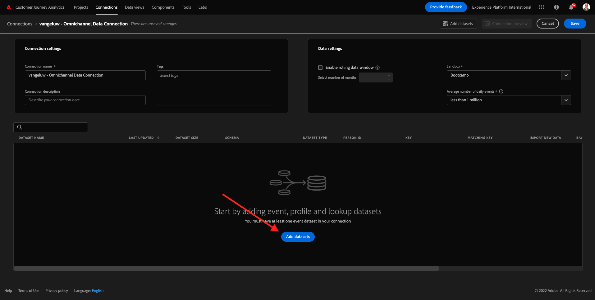

# 4.2 Collegare i set di dati di Adobe Experience Platform nel Customer Journey Analytics

## Obiettivi

- Interfaccia utente di Data Connection
- Inserire dati Adobe Experience Platform in CJA
- Comprendere l’unione di ID persona e dati
- Scopri il concetto di streaming dei dati nel Customer Journey Analytics

## 4.2.1 Connessione

Vai a [analytics.adobe.com](https://analytics.adobe.com) per accedere al Customer Journey Analytics.

Nella home page del Customer Journey Analytics, vai a **Connessioni**.

Qui puoi vedere tutte le diverse connessioni effettuate tra CJA e Platform. Queste connessioni hanno lo stesso obiettivo delle suite di rapporti in Adobe Analytics. Tuttavia, la raccolta dei dati è totalmente diversa. Tutti i dati provengono dai set di dati di Adobe Experience Platform.

Crea la prima connessione. Fare clic su **Crea nuova connessione**.

Verrà visualizzata l&#39;interfaccia utente **Crea connessione**.

Ora puoi assegnare un nome alla connessione.

Utilizzare questa convenzione di denominazione: `yourLastName – Omnichannel Data Connection`.

Esempio: `vangeluw - Omnichannel Data Connection`

È inoltre necessario selezionare la sandbox corretta da utilizzare. Nel menu sandbox, seleziona la sandbox, che dovrebbe essere `Bootcamp`. In questo esempio, la sandbox da utilizzare è **Bootcamp**. È inoltre necessario impostare il **numero medio di eventi giornalieri** su **meno di 1 milione**.

Dopo aver selezionato la sandbox, puoi iniziare ad aggiungere set di dati a questa connessione. Fare clic su **Aggiungi set di dati**.

## 4.2.2 Seleziona set di dati Adobe Experience Platform

Cercare il set di dati `Demo System - Event Dataset for Website (Global v1.1)`. Fai clic su **+** per aggiungere il set di dati a questa connessione.

Cerca e seleziona le caselle di controllo per `Demo System - Profile Dataset for Loyalty (Global v1.1)` e `Demo System - Event Dataset for Call Center (Global v1.1)`.

Allora avrai questo. Fai clic su **Avanti**.

## 4.2.3 ID persona e unione dei dati

### ID persona

L’obiettivo ora è unire questi set di dati. Per ogni set di dati selezionato, verrà visualizzato un campo denominato **ID persona**. Ogni set di dati ha il proprio campo ID persona.

Come puoi vedere, la maggior parte di loro ha l’ID persona selezionato automaticamente. Questo perché in ogni schema di Adobe Experience Platform viene selezionato un identificatore primario. Ad esempio, questo è lo schema per `Demo System - Event Schema for Call Center (Global v1.1)`, dove puoi vedere che l&#39;identificatore primario è impostato su `phoneNumber`.

Tuttavia, puoi ancora influenzare l’identificatore che verrà utilizzato per unire i set di dati per la connessione. Puoi utilizzare qualsiasi identificatore configurato nello schema collegato al set di dati. Fai clic sul menu a discesa per esplorare gli ID disponibili su ciascun set di dati.

Come accennato, puoi impostare ID persona diversi per ogni set di dati. Questo consente di unire in CJA diversi set di dati da più origini. Immagina di inserire in NPS o dati di sondaggi che sarebbero molto interessanti e utili per capire il contesto e perché è successo qualcosa.

Il nome del campo ID persona non è importante, purché il valore nei campi ID persona corrisponda. Ad esempio, se l’ID persona è `email` in un set di dati e `emailAddress` in un altro e `dnb-bootcamp@adobe.com` è lo stesso valore per il campo ID persona in entrambi i set di dati, CJA sarà in grado di unire i dati.

Al momento ci sono alcune altre limitazioni, come unire il comportamento anonimo a noto. Rivedi le domande frequenti qui: [FAQ](https://experienceleague.adobe.com/docs/analytics-platform/using/cja-overview/cja-faq.html).

### Unione dei dati utilizzando l’ID persona

Ora che conosci il concetto di unione dei set di dati utilizzando l&#39;ID persona, scegliamo `email` come ID persona per ogni set di dati.

Vai a ogni set di dati per aggiornare l’ID persona.

Compilare ora il campo ID persona scegliendo `email` nell&#39;elenco a discesa.

Una volta uniti i tre set di dati, siamo pronti a continuare.

| set di dati | ID persona |
| ----------------- |-------------| 
| Sistema di dimostrazione - Set di dati di eventi per il sito web (Global v1.1) | e-mail |
| Sistema di dimostrazione - Set di dati profilo per fedeltà (Global v1.1) | e-mail |
| Sistema demo - Set di dati evento per Call Center (Global v1.1) | e-mail |

Inoltre, assicurati che per ogni set di dati siano abilitate queste opzioni:

- Importa tutti i nuovi dati
- Recupera tutti i dati esistenti

Fare clic su **Aggiungi set di dati**.

Fai clic su **Salva** e passa all&#39;esercizio successivo.
Dopo aver creato la **connessione**, potrebbero essere necessarie alcune ore prima che i dati siano disponibili in CJA.

Passaggio successivo: [4.3 Creare una visualizzazione dati](./ex3.md)

[Torna a Flusso utente 4](./uc4.md)

[Torna a tutti i moduli](./../../overview.md)
