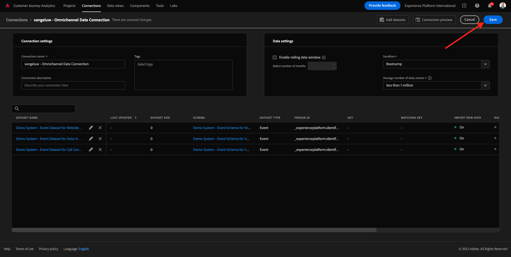

# 4.2 Connettere i set di dati Adobe Experience Platform in Customer Journey Analytics

## Obiettivi

- Interfaccia utente di connessione dati
- Inserire dati Adobe Experience Platform in CJA
- Comprendere ID persona e unione dati
- Scopri il concetto di streaming di dati in Customer Journey Analytics

## 4.2.1 Connessione

Vai a [analytics.adobe.com](https://analytics.adobe.com) per accedere al Customer Journey Analytics.

Nella homepage del Customer Journey Analytics, vai a **Connessioni**.

Qui puoi vedere tutte le diverse connessioni effettuate tra CJA e Platform. Queste connessioni hanno lo stesso obiettivo delle suite di rapporti in Adobe Analytics. Tuttavia, la raccolta dei dati è totalmente diversa. Tutti i dati provengono dai set di dati Adobe Experience Platform.

Creiamo la tua prima connessione. Fai clic su **Crea nuova connessione**.

Vedrai il **Crea connessione** Interfaccia utente.

È ora possibile assegnare un nome alla connessione.

Utilizza questa convenzione di denominazione: `yourLastName – Omnichannel Data Connection`.

Esempio: `vangeluw - Omnichannel Data Connection`

È inoltre necessario selezionare la sandbox corretta da utilizzare. Nel menu della sandbox, seleziona la sandbox, che dovrebbe essere `Bootcamp`. In questo esempio, la sandbox da utilizzare è **Bootcamp**. E devi anche impostare la **Numero medio di eventi giornalieri** a **meno di 1 milione**.

Dopo aver selezionato la sandbox, puoi iniziare ad aggiungere i set di dati a questa connessione. Fai clic su **Aggiungi set di dati**.

## 4.2.2 Selezionare i set di dati Adobe Experience Platform

Cercare il set di dati `Demo System - Event Dataset for Website (Global v1.1)`. Fai clic su **+** per aggiungere il set di dati a questa connessione.

Ora cerca e controlla le caselle di controllo per `Demo System - Profile Dataset for Loyalty (Global v1.1)` e `Demo System - Event Dataset for Call Center (Global v1.1)`.

Poi avrai questo. Fai clic su **Avanti**.

## 4.2.3 ID persona e unione dei dati

### ID persona

L&#39;obiettivo ora è quello di unire questi set di dati. Per ogni set di dati selezionato, viene visualizzato un campo denominato **ID persona**. Ogni set di dati ha un proprio campo ID persona.

Come puoi vedere, per la maggior parte di essi l’ID persona è selezionato automaticamente. Questo perché in ogni schema di Adobe Experience Platform viene selezionato un identificatore primario. Ad esempio, ecco lo schema per `Demo System - Event Schema for Call Center (Global v1.1)`, dove puoi vedere che l’identificatore principale è impostato su `phoneNumber`.

Tuttavia, puoi comunque influenzare quale identificatore verrà utilizzato per unire i set di dati per la connessione. Puoi utilizzare qualsiasi identificatore configurato nello schema collegato al set di dati. Fai clic sul menu a discesa per esplorare gli ID disponibili in ogni set di dati.

Come indicato, puoi impostare ID persona diversi per ogni set di dati. Questo consente di unire set di dati diversi da più origini in CJA. Immaginate di inserire dati NPS o di sondaggio che sarebbero molto interessanti e utili per capire il contesto e perché è successo qualcosa.

Il nome del campo ID persona non è importante, purché il valore nei campi ID persona corrisponda. Ad esempio, se l’ID persona è `email` in un unico set di dati e `emailAddress` in un altro e `dnb-bootcamp@adobe.com` è lo stesso valore del campo ID persona in entrambi i set di dati; CJA sarà in grado di unire i dati.

Al momento ci sono altre limitazioni, come ad esempio l&#39;unione del comportamento anonimo da conoscere. Consulta le Domande frequenti qui: [Domande frequenti](https://experienceleague.adobe.com/docs/analytics-platform/using/cja-overview/cja-faq.html?lang=it).

### Unione dei dati con l’ID persona

Ora che conosci il concetto di unione dei set di dati utilizzando l’ID persona, scegliamo `email` come ID persona per ogni set di dati.

Vai a ogni set di dati per aggiornare l’ID persona.

Ora compila il campo ID persona scegliendo il `email` nell’elenco a discesa .

Una volta uniti i tre set di dati, siamo pronti per continuare.

| Set di dati | ID persona |
| ----------------- |-------------| 
| Sistema di demo - Set di dati evento per il sito web (Global v1.1) | e-mail |
| Sistema demo - Set di dati profilo per fedeltà (Global v1.1) | e-mail |
| Sistema demo - Set di dati evento per Call Center (Global v1.1) | e-mail |

È inoltre necessario assicurarsi che per ogni set di dati queste opzioni siano abilitate:

- Importa tutti i nuovi dati
- Esegui il backfill di tutti i dati esistenti

Fai clic su **Aggiungi set di dati**.

Fai clic su **Salva** e vai all&#39;esercizio successivo.
Dopo aver creato il **Connessione** potrebbero essere necessarie alcune ore prima che i dati siano disponibili in CJA.

Passaggio successivo: [4.3 Creare una visualizzazione dati](./ex3.md)

[Torna al flusso utente 4](./uc4.md)

[Torna a tutti i moduli](./../../overview.md)
