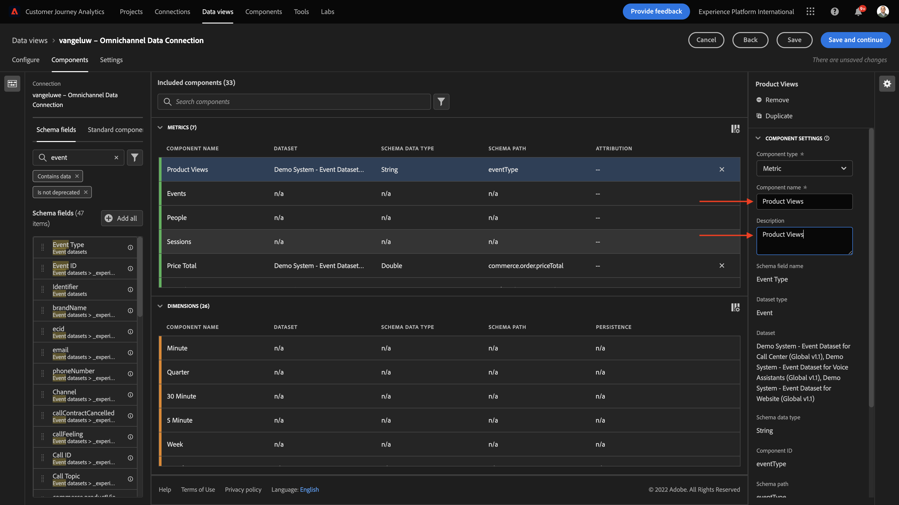
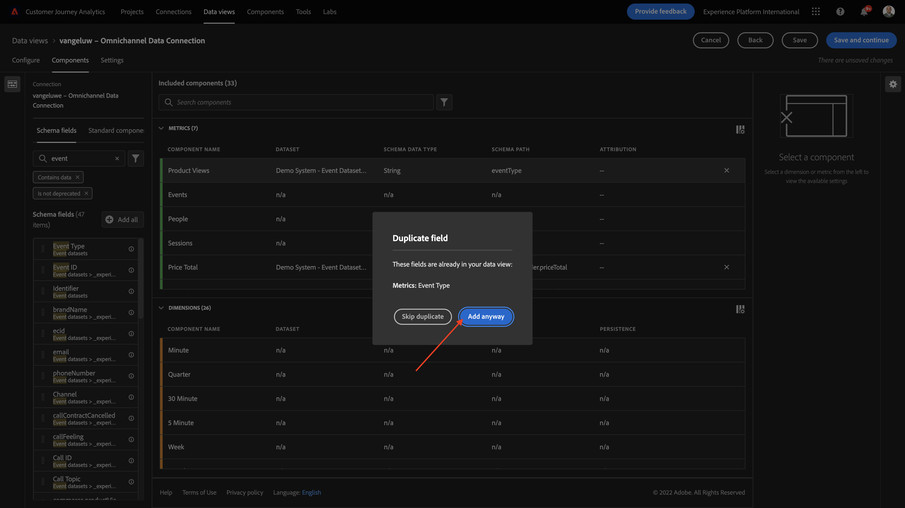
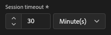

# 4.3 Creare una visualizzazione dati

## Obiettivi

- Comprendere l’interfaccia utente della visualizzazione dati
- Comprendere le impostazioni di base della definizione della visita
- Comprendere l’attribuzione e la persistenza all’interno di una visualizzazione dati

## 4.3.1 Visualizzazione dati

Una volta stabilita la connessione, ora puoi passare a influenzare la visualizzazione. Una differenza tra Adobe Analytics e CJA è che CJA necessita di una visualizzazione dati per pulire e preparare i dati prima della visualizzazione.

Una visualizzazione dati è simile al concetto di suite di rapporti virtuali in Adobe Analytics, in cui si definiscono le definizioni di visita in base al contesto, i filtri e anche il modo in cui vengono chiamati i componenti.

È necessaria almeno una visualizzazione dati per connessione. Tuttavia, per alcuni casi d’uso, è utile disporre di più visualizzazioni dati per la stessa connessione, con l’obiettivo di fornire informazioni diverse a team diversi.
Se desideri che la tua azienda diventi basata sui dati, devi adattare il modo in cui i dati vengono visualizzati in ogni team. Alcuni esempi:

- Metriche UX solo per il team di progettazione UX
- Per i KPI e le metriche per la Google Analytics utilizza gli stessi nomi utilizzati per il Customer Journey Analytics, in modo che il team di analisi digitale possa parlare una sola lingua.
- Visualizzazione dati filtrata per mostrare, ad esempio, i dati per un solo mercato, un marchio o solo per dispositivi mobili.

Il giorno **Connessioni** , seleziona la casella di controllo davanti alla connessione appena creata. Clic **Crea visualizzazione dati**.

Verrai reindirizzato al **Crea visualizzazione dati** flusso di lavoro.

## 4.3.2 Definizione della visualizzazione dati

Ora puoi configurare le definizioni di base per la visualizzazione dati.

Il **Connessione** hai creato nell’esercizio precedente ed è già selezionato. La connessione è denominata `yourLastName – Omnichannel Data Connection`.

Quindi, assegna alla visualizzazione dati un nome seguendo questa convenzione di denominazione: `yourLastName – Omnichannel Data View`.

Immettere lo stesso valore per la descrizione: `yourLastName – Omnichannel Data View`.

| Nome | Descrizione |
| ----------------- |-------------| 
| `yourLastName – Omnichannel Data View` | `yourLastName – Omnichannel Data View` |

Per **Fuso orario**, seleziona il fuso orario **Berlino, Stoccolma, Roma, Berna, Bruxelles, Vienna, Amsterdam GMT+01:00**. Si tratta di un contesto molto interessante in quanto alcune aziende operano in paesi e aree geografiche diversi. Assegnare il fuso orario giusto a ciascun paese eviterebbe di commettere errori tipici nei dati, come credere, ad esempio, che in Perù la maggior parte della gente compri magliette alle 4 del mattino.

Puoi anche modificare la denominazione delle metriche principali (persona, sessione ed evento). Non è necessario, ma ad alcuni clienti piace utilizzare Persone, Visite e Hit invece di Persona, Sessione ed Eventi (la convenzione di denominazione predefinita del Customer Journey Analytics).

Ora dovresti aver configurato le seguenti impostazioni:

Clic **Salva e continua**.

## 4.3.3 Componenti della visualizzazione dati

In questo esercizio configurerai i componenti necessari per analizzare i dati e visualizzarli utilizzando Analysis Workspace. In questa interfaccia utente sono disponibili tre aree principali:

- Lato sinistro: componenti disponibili dai set di dati selezionati
- In mezzo: componenti aggiunti alla visualizzazione dati
- Lato destro: Impostazioni dei componenti

>[!IMPORTANT]
>
>Se non riesci a trovare una metrica o dimensione specifica, verifica se il campo `Contains data` viene rimosso dalla visualizzazione dati. In caso contrario, eliminare il campo.
>
>

Ora devi trascinare e rilasciare i componenti necessari per l’analisi sul **Componenti aggiunti**. A questo scopo, devi selezionare i componenti nel menu a sinistra e trascinarli nell’area di lavoro al centro.

Iniziamo con il primo componente: **Nome (web.webPageDetails.name)**. Cerca questo componente, quindi trascinalo sull’area di lavoro.

Questo componente è il nome della pagina, come puoi derivare dalla lettura del campo schema `(web.webPageDetails.name)`.

Tuttavia, utilizzando **Nome** poiché il nome non è la migliore convenzione di denominazione per consentire a un utente aziendale di comprendere rapidamente questa dimensione.

Cambiiamo il nome in **Nome pagina**. Fai clic sul componente e rinominalo nella **Impostazioni dei componenti** area.

Qualcosa di veramente importante è **Impostazioni persistenza**. Il concetto di evar e prop non esiste in CJA, ma le impostazioni di persistenza consentono un comportamento simile.

Se non modifichi queste impostazioni, CJA interpreterà la dimensione come una **Prop** (livello hit). Inoltre, possiamo cambiare la Persistenza per rendere la dimensione un **eVar** (mantiene il valore in tutto il percorso).

Se non conosci eVar e proprietà, puoi [per ulteriori informazioni, consulta la documentazione](https://experienceleague.adobe.com/docs/analytics/landing/an-key-concepts.html).

Lasciamo Nome pagina come proprietà. Pertanto, non è necessario apportare alcuna modifica **Impostazioni persistenza**.

| Nome componente da cercare | Nuovo nome | Impostazioni persistenza |
| ----------------- |-------------| --------------------| 
| Nome (web.webPageDetails.name) | Nome pagina |          |

Quindi, scegliete la quota **phoneNumber** e rilascialo sull&#39;area di lavoro. Il nuovo nome deve essere **Numero di telefono**.

Infine, cambiamo le impostazioni di Persistenza, in quanto il numero mobile deve persistere a livello di utente.

Per modificare la persistenza, scorri verso il basso nel menu a destra e apri la **Persistenza** scheda:

Seleziona la casella di controllo per modificare le impostazioni di persistenza. Seleziona **Più recente** e **Persona (intervallo di reporting)** ambito, in quanto ci importa solo dell’ultimo numero di cellulare di quella persona. Se il cliente non compila il dispositivo mobile nelle visite future, vedrai comunque questo valore popolato.

| Nome componente da cercare | Nuovo nome | Impostazioni persistenza |
| ----------------- |-------------| --------------------| 
| phoneNumber | Numero di telefono | Più recente, persona (intervallo di reporting) |

Il componente successivo è `web.webPageDetails.pageViews.value`.

Nel menu a sinistra, cerca `web.webPageDetails.pageViews.value`. Trascina e rilascia questa metrica nell’area di lavoro.

Modifica il nome in **Visualizzazioni pagina** sotto **Impostazioni dei componenti**.

| Nome componente da cercare | Nuovo nome | Impostazioni di attribuzione |
| ----------------- |-------------| --------------------| 
| web.webPageDetails.pageViews.value | Page Views |         |

Per le impostazioni di attribuzione lasceremo vuoto questo campo.

Nota: le impostazioni di persistenza sulle metriche possono essere modificate anche in Analysis Workspace. In alcuni casi puoi scegliere di impostarlo qui per evitare che gli utenti aziendali debbano pensare qual è il modello di persistenza migliore.

Successivamente, dovrai configurare molti Dimension e metriche, come indicato nella tabella seguente.

### DIMENSION

| Nome componente da cercare | Nuovo nome | Impostazioni persistenza |
| ----------------- |-------------| --------------------| 
| brandName | Marchio | Più recente, sessione |
| sentimento di chiamata | Sentimento di chiamata |          |
| ID chiamata | Tipo di interazione chiamata |          |
| callTopic | Richiama argomento | Più recente, sessione |
| ecid | ECID | Più recente, persona (intervallo di reporting) |
| e-mail | ID e-mail | Più recente, persona (intervallo di reporting) |
| Tipo di pagamento | Tipo di pagamento |          |
| Metodo di aggiunta prodotto | Metodo di aggiunta prodotto | Più recente, sessione |
| Tipo evento | Tipo evento |         |
| Nome (productListItems.name) | Nome prodotto |         |
| SKU | SKU (sessione) | Più recente, sessione |
| ID transazione | ID transazione |         |
| URL (web.webPageDetails.URL) | URL |         |
| Agente utente | Agente utente | Più recente, sessione |
| livello | Livello di fedeltà |          |
| punti | Valore ciclo di vita cliente |          |

### METRICHE

| Nome componente da cercare | Nuovo nome | Impostazioni di attribuzione |
| ----------------- |-------------| --------------------| 
| Quantità | Quantità |          |
| commerce.order.priceTotal | Ricavi |         |

La configurazione dovrebbe quindi essere simile alla seguente:

Non dimenticare di **Salva** la visualizzazione dati. Quindi fai clic su **Salva** ora.

## 4.3.4 Metriche calcolate

Anche se abbiamo organizzato tutti i componenti nella visualizzazione dati, è ancora necessario adattarne alcuni, in modo che gli utenti aziendali siano pronti per iniziare l’analisi.

Se ricordi, non abbiamo introdotto specificamente nella visualizzazione dati metriche quali Aggiungi al carrello, Visualizzazione prodotto o Acquisti.
Tuttavia, disponiamo di una dimensione denominata: **Tipo di evento**. Quindi, deriviamo questi tipi di interazione creando 3 metriche calcolate.

Iniziamo con la prima metrica: **Visualizzazioni prodotto**.

Sul lato sinistro, eseguire la ricerca **Tipo di evento** e selezionare la quota. Quindi trascinalo nella sezione **Componenti inclusi** quadro.

Fai clic per selezionare la nuova metrica **Tipo di evento**.

Ora modifica il nome e la descrizione del componente con i seguenti valori:

| Nome componente | Descrizione componente |
| ----------------- |-------------| 
| Visualizzazioni prodotto | Visualizzazioni prodotto |

Ora conta solo **Visualizzazioni prodotto** eventi. Per farlo, scorri verso il basso sulla **Impostazioni dei componenti** fino a quando non vede **Includi valori di esclusione**. Assicurati di abilitare l’opzione **Impostare i valori di inclusione/esclusione**.

Come vogliamo solo contare **Visualizzazioni prodotto**, specificare **commerce.productViews** in base ai criteri.

La metrica calcolata è ora pronta.

Quindi, ripeti lo stesso processo per **Aggiungi al carrello** e **Acquisto** eventi.

### Aggiungi al carrello

Trascina e rilascia la stessa dimensione **Tipo di evento**.

Verrà visualizzato un avviso popup di un campo duplicato poiché si sta utilizzando la stessa variabile. Fai clic su **Aggiungi comunque**:

Ora, segui lo stesso processo che abbiamo fatto per la metrica Visualizzazioni prodotto:
- Modificare innanzitutto il nome e la descrizione.
- Aggiungi infine **commerce.productListAdds** come criteri per contare solo Aggiungi al carrello

| Nome | Descrizione | Criteri |
| ----------------- |-------------| -------------|
| Aggiungi al carrello | Aggiungi al carrello | commerce.productListAdds |

### Acquisti

Trascina e rilascia la stessa dimensione **Tipo di evento** come abbiamo fatto per entrambe le metriche precedenti.

Verrà visualizzato un avviso popup di un campo duplicato poiché si sta utilizzando la stessa variabile. Fai clic su **Aggiungi comunque**:

Ora, segui lo stesso processo che abbiamo fatto per le metriche Visualizzazioni prodotto e Aggiungi al carrello:
- Modificare innanzitutto il nome e la descrizione.
- Aggiungi infine **commerce.purchases** come criteri per conteggiare solo gli acquisti

| Nome | Descrizione | Criteri |
| ----------------- |-------------| -------------|
| Acquisti | Acquisti | commerce.purchases |

La configurazione finale dovrebbe quindi essere simile a questa. Clic **Salva e continua**.

## 4.3.5 Impostazioni della visualizzazione dati

Dovresti essere reindirizzato a questa schermata:

In questa scheda puoi modificare alcune impostazioni importanti per modificare la modalità di elaborazione dei dati. Iniziamo impostando il **Timeout sessione** a 30 min. Grazie alla marca temporale di ogni evento esperienza è possibile estendere il concetto di sessione su tutti i canali. Ad esempio, cosa succede se un cliente chiama il call center dopo aver visitato il sito web? Utilizzando i timeout di sessione personalizzati si dispone di molta flessibilità nel decidere cosa sia una sessione e come unirà i dati.

In questa scheda puoi modificare altri elementi, ad esempio filtrare i dati utilizzando un segmento o un filtro. Non è necessario eseguire questa operazione in questo esercizio.

Al termine, fai clic su **Salva e termina**.

>[!NOTE]
>
>Puoi tornare a questa visualizzazione dati in seguito e modificare le impostazioni e i componenti in qualsiasi momento. Le modifiche influiranno sulla visualizzazione dei dati storici.

Ora puoi continuare con la parte di visualizzazione e analisi.

Passaggio successivo: [4.4 Preparazione dei dati nel Customer Journey Analytics](./ex4.md)

[Torna a Flusso utente 4](./uc4.md)

[Torna a tutti i moduli](./../../overview.md)
