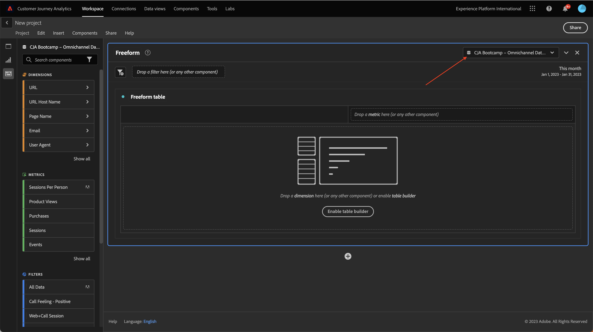
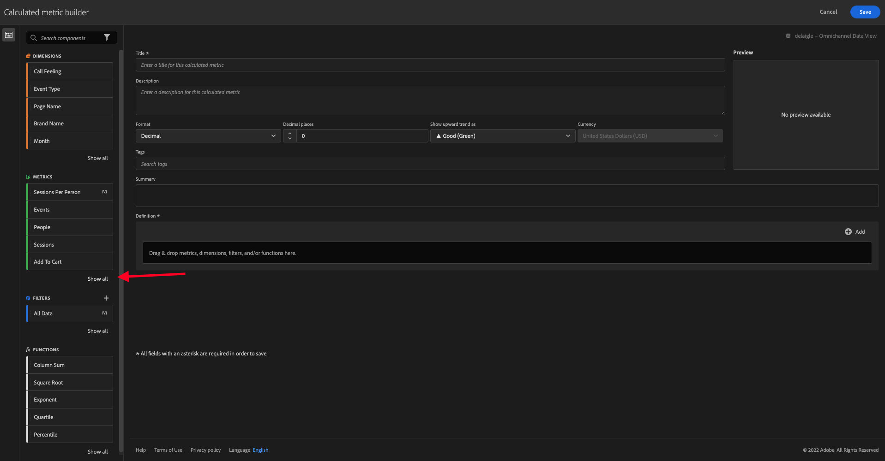

# 4.4 Preparazione dei dati in Analysis Workspace

## Obiettivi

- Comprendere l’interfaccia utente di Analysis Workspace in CJA
- Comprendere i concetti di preparazione dei dati in Analysis Workspace
- Scopri come eseguire i calcoli dei dati

## 4.4.1 Interfaccia utente Analysis Workspace in CJA

Analysis Workspace rimuove tutte le limitazioni tipiche di un singolo rapporto di Analytics. Fornisce un’area di lavoro solida e flessibile per la creazione di progetti di analisi personalizzati. Trascina un numero qualsiasi di tabelle di dati, visualizzazioni e componenti (dimensioni, metriche, segmenti e granularità temporali) in un progetto. Crea all’istante suddivisioni e segmenti, coorti per analisi, avvisi, confronti segmenti, esegue analisi di flusso e di abbandono, cura e pianifica rapporti da condividere con gli utenti della tua azienda.

Customer Journey Analytics porta questa soluzione ai dati di Platform. Si consiglia vivamente di guardare questo video di panoramica di quattro minuti:

>[!VIDEO](https://video.tv.adobe.com/v/35109?quality=12&learn=on)

Se non hai mai utilizzato Analysis Workspace prima, ti consigliamo vivamente di guardare questo video:

>[!VIDEO](https://video.tv.adobe.com/v/26266?quality=12&learn=on)

### Crea progetto

Ora è il momento di creare il tuo primo progetto CJA. Vai alla scheda progetti all’interno di CJA.
fai clic su **Crea nuova**.

Vedrete questo. Seleziona **Progetto vuoto** quindi fai clic su **Crea**.

Verrà quindi visualizzato un progetto vuoto.

Innanzitutto, accertati di selezionare la visualizzazione dati corretta nell’angolo in alto a destra dello schermo. In questo esempio, la visualizzazione dati da selezionare è `vangeluwe - Omnichannel Data View`.

Successivamente, salverai il progetto e gli assegnerai un nome. Puoi usare il seguente comando per salvare:

| Sistema operativo | Taglio corto |
| ----------------- |-------------| 
| Windows | Ctrl+S |
| Mac | Comando+S |

Verrà visualizzata questa finestra a comparsa:

Utilizza questa convenzione di denominazione:

| Nome | Descrizione |
| ----------------- |-------------| 
| `yourLastName - Omnichannel Analysis` | `yourLastName - Omnichannel Analysis` |

Quindi, fai clic su **Salva**.

## 4.4.2 Metriche calcolate

Anche se abbiamo organizzato tutti i componenti nella visualizzazione dati, è comunque necessario adattarli, in modo che gli utenti aziendali siano pronti per iniziare la loro analisi. Inoltre, durante qualsiasi analisi puoi creare una metrica calcolata per approfondire la ricerca di informazioni.

Ad esempio, creeremo un **Tasso di conversione** utilizzando **Acquisti** metrica/evento definito nella visualizzazione dati.

### Tasso di conversione

Iniziamo ad aprire il generatore di metriche calcolate. Fai clic sul pulsante **+** per creare la tua prima metrica calcolata in Analysis Workspace.

La **Generatore di metriche calcolate** verrà visualizzato:

Trova il **Acquisti** nell’elenco Metriche nel menu a sinistra. Sotto **Metriche** click **Mostra tutto**

Ora trascina una goccia **Acquisti** nella definizione della metrica calcolata.

In genere, il tasso di conversione significa **Conversioni/sessioni**. Facciamo lo stesso calcolo nell&#39;area di lavoro della definizione della metrica calcolata. Trova il **Sessioni** e trascinarlo nel generatore di definizioni, sotto **Acquisti** evento.

L’operatore di divisione viene selezionato automaticamente.

Il tasso di conversione è comunemente rappresentato in percentuale. Quindi, cambiamo il formato in percentuale e selezioniamo anche 2 decimali.

Infine, Modifica il nome e la descrizione della metrica calcolata:

| Title | Descrizione |
| ----------------- |-------------| 
| Tasso di conversione | Tasso di conversione |

Avrete qualcosa di simile sul vostro schermo:

Non dimenticarti di **Salva** la metrica calcolata.

## 4.4.3 Dimension calcolati: Filtri (segmentazione) e intervalli di date

### Filtri: Dimension calcolati

I calcoli non sono destinati solo alle metriche. Prima di iniziare qualsiasi analisi è anche interessante crearne alcuni **Dimension calcolati**. In sostanza intendeva **segmenti** di nuovo in Adobe Analytics. Al Customer Journey Analytics, questi segmenti sono denominati **Filtri**.

La creazione di filtri aiuterà gli utenti aziendali a iniziare l’analisi con alcune importanti dimensioni calcolate. In questo modo alcune attività verranno automatizzate e sarà possibile contribuire alla fase di adozione. Di seguito sono riportati alcuni esempi:

1. Mezzi propri, supporti a pagamento,
2. Visite nuove o di ritorno
3. Clienti con carrello abbandonato

Questi filtri possono essere creati prima o durante la parte di analisi (operazione che eseguirai nell’esercizio successivo).

### Intervalli di date: Dimension di tempo calcolati

I Dimension temporali sono un altro tipo di dimensioni calcolate. Alcuni sono già in fase di creazione, ma puoi anche creare Dimension di tempo personalizzati nella fase di preparazione dei dati.

Questi Dimension di tempo calcolato aiuteranno gli analisti e gli utenti aziendali a ricordare date importanti e utilizzarle per filtrare e modificare l’ora di reporting. Domande e dubbi tipici che ci vengono in mente quando facciamo analisi:

- Quand&#39;era il Black Friday l&#39;anno scorso? 21-29?
- Quando abbiamo lanciato la campagna TV a dicembre?
- Da quando a quando abbiamo fatto le vendite estive 2018? Voglio confrontarlo con il 2019. A proposito, conoscete i giorni esatti nel 2019?

Ora hai completato l’esercizio di preparazione dei dati utilizzando CJA Analysis Workspace.

Passaggio successivo: [4.5 Visualizzazione con Customer Journey Analytics](./ex5.md)

[Torna al flusso utente 4](./uc4.md)

[Torna a tutti i moduli](./../../overview.md)
