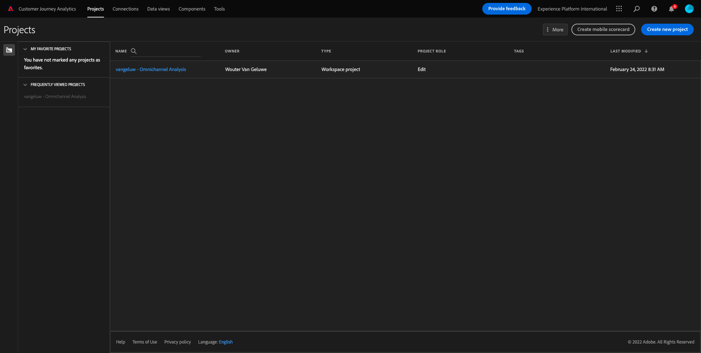
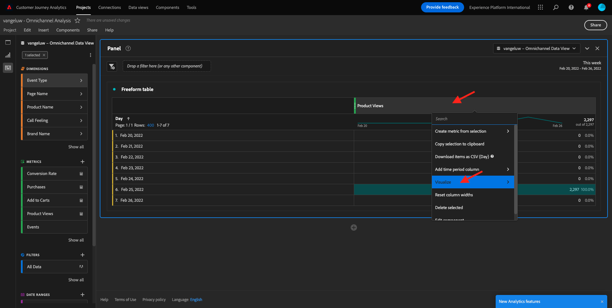
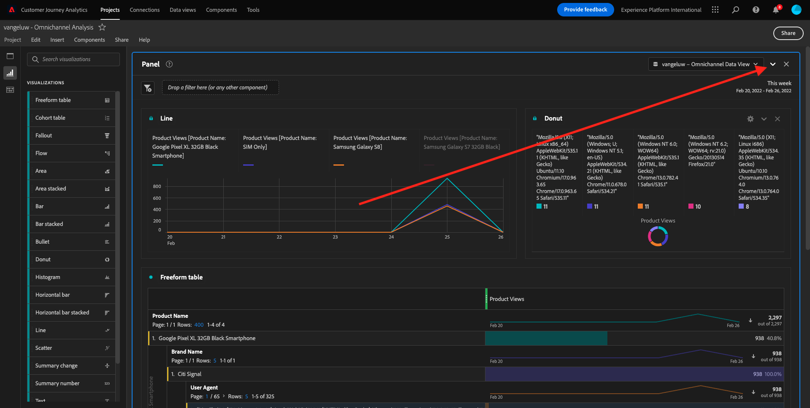
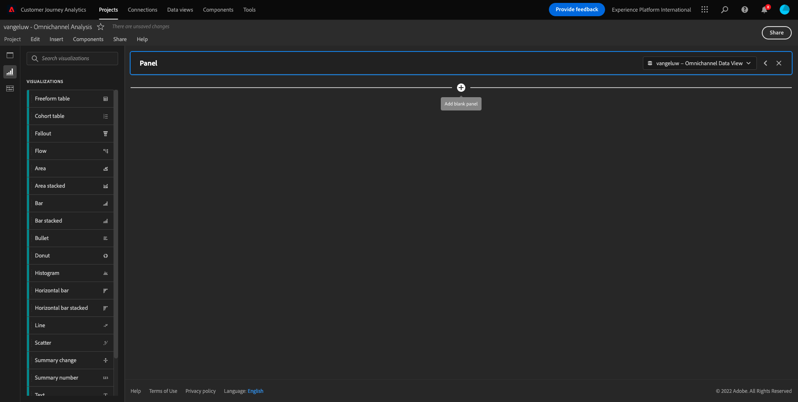
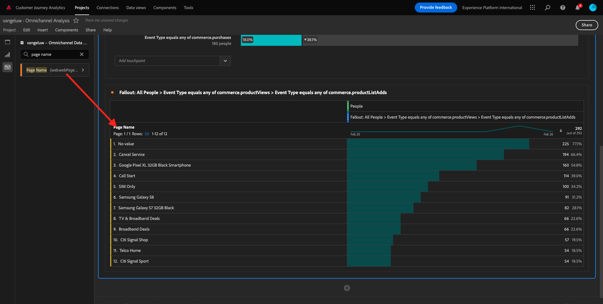
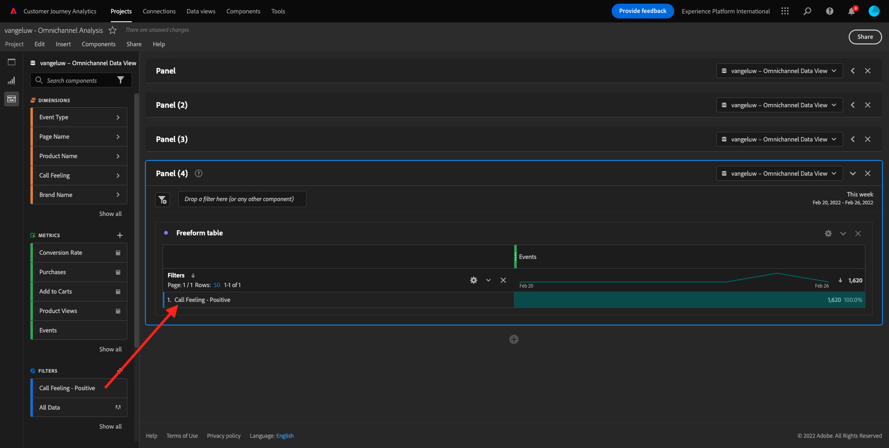

# 4.5 Visualizzazione con Customer Journey Analytics

## Obiettivi

- Interfaccia utente di Analysis Workspace
- Scopri alcune funzioni che rendono Analysis Workspace così diverso.
- Scopri come analizzare in CJA utilizzando Analysis Workspace

## Contesto

In questo esercizio utilizzerai Analysis Workspace all’interno di CJA per analizzare le visualizzazioni dei prodotti, i funnel dei prodotti, l’abbandono ecc.

Usiamo il progetto creato in [4.4 Preparazione dei dati in Analysis Workspace](./ex4.md)quindi vai a [https://analytics.adobe.com](https://analytics.adobe.com).

Apri il progetto `yourLastName - Omnichannel Analysis`.

Con il progetto aperto e la visualizzazione dati `yourLastName - Omnichannel Analysis` seleziona puoi iniziare a creare le tue prime visualizzazioni.

## Quante visualizzazioni di prodotto abbiamo quotidianamente?

Prima di tutto, dobbiamo selezionare le date giuste per analizzare i dati. Vai al menu a discesa Calendario sul lato destro dell’area di lavoro. Fai clic su di esso e seleziona l’intervallo di date applicabile.

>[!IMPORTANT]
>
>Seleziona un intervallo di date come **Questa settimana** o **Questo mese**. I dati più recenti disponibili sono stati acquisiti il 19 settembre 2022.

Nel menu a sinistra (area componenti), trova la metrica calcolata **Visualizzazioni prodotto**. Selezionala e trascinala nell’area di lavoro, in alto a destra all’interno della tabella a forma libera.

Automaticamente la dimensione **Giorno** verrà aggiunto per creare la prima tabella. Ora potete vedere la risposta immediata alla vostra domanda.

Fai clic con il pulsante destro del mouse sul riepilogo della metrica.

Fai clic su **Visualizza** quindi seleziona **Linea** come visualizzazione.

Visualizzerai le visualizzazioni dei tuoi prodotti per giorno.

Puoi cambiare l’ambito dell’ora in giorno facendo clic su **Impostazioni** all’interno della visualizzazione.

Fai clic sul punto accanto a **Linea** a **Gestione dell&#39;origine dati**.

Quindi, fai clic su **Blocca selezione** e seleziona **Elementi selezionati** per bloccare questa visualizzazione in modo che visualizzi sempre una timeline di Visualizzazioni prodotto .

## Primi 5 prodotti visualizzati

Quali sono i primi 5 prodotti visualizzati?

Ricorda di salvare il progetto ogni tanto.

| Sistema operativo | Taglio corto |
| ----------------- |-------------| 
| Windows | Ctrl+S |
| Mac | Comando+S |

Cominciamo a trovare i primi 5 prodotti visualizzati. Nel menu a sinistra, trova la **Nome del prodotto** - Dimension.

Ora trascina e rilascia **Nome del prodotto** per sostituire **Giorno** dimensione:

Questo sarà il risultato

Quindi, prova a suddividere uno dei prodotti in base al nome del marchio. Cerca **brandName** e trascinarlo sotto il nome del prodotto.

Quindi, eseguire un raggruppamento utilizzando l&#39;agente utente. Cerca **Agente utente** e trascinarlo sotto il nome del marchio.

Vedrai questo:

Infine puoi aggiungere altre visualizzazioni. Sul lato sinistro, in visualizzazioni, cerca `Donut`. Prendi `Donut`, trascinalo sull’area di lavoro sotto la **Linea** visualizzazione.

Quindi, nella tabella, selezionare il primo 5 **Agente utente**  righe dal raggruppamento che abbiamo fatto in **Smartphone nero Google Pixel XL da 32 GB** > **Segnale Citi**. Quando selezioni le 5 righe, tieni premuto il pulsante **CTRL** su Windows o **Comando** (su Mac).

Il grafico ad anello è stato modificato:

È anche possibile adattare il design per essere più leggibile, rendendo entrambi **Linea** grafico e **Anello** grafico un po&#39; più piccolo in modo che possano adattarsi l&#39;uno accanto all&#39;altro:

Fai clic sul punto accanto a **Anello** a **Gestione dell&#39;origine dati**.
Quindi, fai clic su **Blocca selezione** per bloccare questa visualizzazione in modo che visualizzi sempre una timeline di Visualizzazioni prodotto .

Puoi trovare ulteriori informazioni sulle visualizzazioni con Analysis Workspace qui:

- [https://experienceleague.adobe.com/docs/analytics/analyze/analysis-workspace/visualizations/freeform-analysis-visualizations.html?lang=it](https://experienceleague.adobe.com/docs/analytics/analyze/analysis-workspace/visualizations/freeform-analysis-visualizations.html?lang=it)
- [https://experienceleague.adobe.com/docs/analytics/analyze/analysis-workspace/visualizations/t-sync-visualization.html](https://experienceleague.adobe.com/docs/analytics/analyze/analysis-workspace/visualizations/t-sync-visualization.html)

## Funnel di interazione del prodotto, dalla visualizzazione all&#39;acquisto

Ci sono molti modi per risolvere questa domanda. Uno di questi è quello di utilizzare il tipo di interazione prodotto e utilizzarlo su una tabella a forma libera. Un altro modo è quello di utilizzare un **Visualizzazione Abbandono**. Usiamo l&#39;ultima come vogliamo visualizzare e analizzare contemporaneamente.

Per chiudere il pannello corrente, fai clic qui:

Ora aggiungi un nuovo pannello vuoto facendo clic su **+ Aggiungi pannello vuoto**.

Fai clic sulla visualizzazione **Abbandono**.

Seleziona lo stesso intervallo di date dell’esercizio precedente.

Vedrete questo.

Trova la dimensione **Tipo evento** sotto i componenti sul lato sinistro:

Fai clic sulla freccia per aprire la dimensione:

Verranno visualizzati tutti i tipi di evento disponibili.

Seleziona l’elemento **commerce.productViews** e trascinarlo nella **Aggiungi punto di contatto** all&#39;interno del campo **Visualizzazione Abbandono**.

Fai lo stesso con **commerce.productListAdd** e **commerce.purchase** e rilasciarli sul **Aggiungi punto di contatto** all&#39;interno del campo **Visualizzazione Abbandono**. La visualizzazione si presenterà così:

Puoi fare molte cose qui. Alcuni esempi: confronta nel tempo, confronta ogni passaggio per dispositivo o confronta per fedeltà. Tuttavia, se vogliamo analizzare cose interessanti come il motivo per cui i clienti non acquistano dopo aver aggiunto un articolo al carrello, possiamo utilizzare lo strumento migliore in CJA: fare clic con il pulsante destro del mouse.

Fai clic con il pulsante destro del mouse sul punto di contatto **commerce.productListAdd**. Quindi fai clic su **Abbandono suddiviso in questo punto di contatto**.

Verrà creata una nuova tabella a forma libera per analizzare ciò che le persone hanno fatto se non hanno acquistato.

Modificare la **Tipo evento** da **Nome pagina**, nella nuova tabella a forma libera, per vedere quali pagine stanno andando invece della pagina di conferma di acquisto .

## Cosa fanno le persone sul sito prima di raggiungere la pagina Annulla servizio?

Anche in questo caso, esistono molti modi per eseguire questa analisi. Usiamo l&#39;analisi di flusso per avviare la parte di individuazione.

Per chiudere il pannello corrente, fai clic qui:

Ora aggiungi un nuovo pannello vuoto facendo clic su **+ Aggiungi pannello vuoto**.

Fai clic sulla visualizzazione **Flusso**.

Vedrai questo:

Seleziona lo stesso intervallo di date dell’esercizio precedente.

Trova la dimensione **Nome pagina** sotto i componenti sul lato sinistro:

Fai clic sulla freccia per aprire la dimensione:

Troverete tutte le pagine visualizzate. Trova il nome della pagina: **Annulla servizio**.
Trascinamento della selezione **Annulla servizio** nella Visualizzazione Flusso nel campo centrale:

Vedrai questo:

Ora esaminiamo se i clienti che hanno visitato il **Annulla servizio** sul sito web ha anche chiamato il call center, e qual è stato il risultato.

Sotto le dimensioni, torna indietro e trova **Tipo di interazione chiamata**.
Trascinamento della selezione **Tipo di interazione chiamata** per sostituire la prima interazione a destra all’interno della **Visualizzazione Flusso**.

Ora visualizzi il ticket di supporto dei clienti che hanno chiamato il call center dopo aver visitato il **Annulla servizio** pagina.

Quindi, sotto le dimensioni, cerca **Sensazione di chiamata**.  Trascinala per sostituire la prima interazione a destra all’interno della **Visualizzazione Flusso**.

Vedrai questo:

Come puoi vedere, abbiamo eseguito un’analisi omnicanale utilizzando la visualizzazione Flusso. Grazie a questo abbiamo scoperto che alcuni clienti che stavano pensando di annullare il loro servizio, hanno avuto un sentimento positivo dopo aver chiamato il call center. Forse abbiamo cambiato idea con una promozione?

## Come si comportano i clienti con un contatto Callcenter positivo rispetto ai KPI principali?

Segmentiamo prima i dati per ottenere solo gli utenti con **positivo** chiamate. In CJA, i segmenti sono denominati Filtri. Vai ai filtri all’interno dell’area del componente (sul lato sinistro) e fai clic su **+**.

Nel Generatore di filtri, assegna un nome al filtro

| Nome | Descrizione |
| ----------------- |-------------| 
| Sensazione di chiamata - Positivo | Sensazione di chiamata - Positivo |

Sotto i componenti (nel Generatore di filtri), trova **Sensazione di chiamata** e trascinarlo nella definizione del Generatore di filtri.

Ora seleziona **positivo** come valore per il filtro.

Modificare l&#39;ambito da **Persona** livello.

Per terminare, fai clic su **Salva**.

Allora tornerai qui. Se non è ancora stato eseguito, chiudi il pannello precedente.

Ora aggiungi un nuovo pannello vuoto facendo clic su **+ Aggiungi pannello vuoto**.

Seleziona lo stesso intervallo di date dell’esercizio precedente.

Fai clic su **Tabella a forma libera**.

Ora trascina e rilascia il filtro appena creato.

È ora di aggiungere alcune metriche. Inizia con **Visualizzazioni prodotto**. Trascina nella tabella a forma libera. È inoltre possibile eliminare **Eventi** metrica.

Fai lo stesso con **Persone**,  **Aggiungi al carrello** e **Acquisti**. Finirete con un tavolo come questo.

Grazie alla prima analisi di flusso, mi è venuta in mente una nuova domanda. Così abbiamo deciso di creare questa tabella e controllare alcuni KPI rispetto a un segmento per rispondere a quella domanda. Come si può vedere, il tempo di analisi è molto più veloce rispetto all&#39;utilizzo di SQL o di altre soluzioni BI.

## Customer Journey Analytics e Analysis Workspace recap

Come hai imparato in questo laboratorio, Analysis Workspace unisce i dati di tutti i canali per analizzare l’intero percorso dei clienti. Inoltre, ricorda che è possibile inserire dati nella stessa area di lavoro che non è unita al percorso.
Può essere utile inserire dati disconnessi nell’analisi per fornire contesto al percorso. Alcuni esempi includono dati Server dei criteri di rete, sondaggi, eventi Facebook Ads o interazioni offline (non identificate).

Passaggio successivo: [4.6 Da informazioni all&#39;azione](./ex6.md)

[Torna al flusso utente 4](./uc4.md)

[Torna a tutti i moduli](./../../overview.md)
