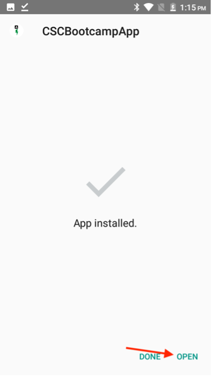
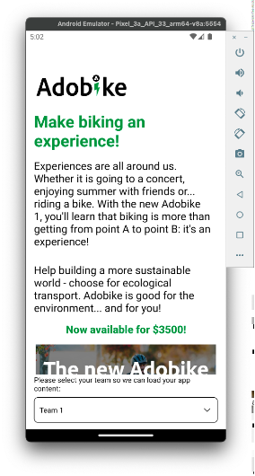

# Verificare l’app mobile

## Android

- Scarica l&#39;app mobile da [qui](https://tinyurl.com/CSCBootcampApp) sul tuo dispositivo Android. Puoi scaricarlo su un [emulatore Android](https://developer.android.com/studio/run/emulator) o sul tuo dispositivo Android fisico.

- Apri il file scaricato toccandolo.

- Nel pop-up, fare clic sul pulsante di installazione, quindi confermare facendo clic su &quot;Installa comunque&quot;.

- Una volta installata correttamente l’app, aprila facendo clic sul pulsante &quot;Apri&quot;.

## iOS

>[!WARNING]
>
> Verificare di essere connessi alla rete Wi-Fi Bootcamp. Questo è essenziale, in quanto l’app funzionerà solo se ti trovi sulla stessa rete Wi-Fi.

Poiché questa non è un’app distribuita ufficialmente, la configurazione di iOS è in qualche modo diversa da quella a cui sei abituato.

- Scarica l&#39;app Expo Go da [App Store](https://itunes.apple.com/app/apple-store/id982107779).

- Nell’app Fotocamera iPhone, esegui la scansione del codice QR che il team di Adobi proietterà al campo di avvio. Quando richiesto, fare clic sul pulsante visualizzato.

- Verrà caricata una pagina web che consente di aprire l’app sull’iPhone. Fai clic sul pulsante &quot;Expo Go&quot; per aprirlo nell’app appena scaricata.

- Nella finestra di dialogo visualizzata, seleziona &quot;Apri&quot; in modo che l’app Expo Go possa essere caricata con le informazioni corrette.

- Una volta aperta l&#39;app Expo Go, ti verrà richiesto di trovare i dispositivi sulla rete locale. Come accennato in precedenza, questo è necessario per poter scaricare l&#39;app dai nostri dispositivi Adobi al telefono. Fai clic su &quot;Consenti&quot; per caricarlo.

- All&#39;inizio potrebbe venire visualizzata una pagina di errore. Fai clic sul pulsante &quot;Riprova&quot; per caricare l’app sul dispositivo. La chiusura dell&#39;app Expo Go o la disconnessione del dispositivo dalla rete Wi-Fi causeranno la mancata risposta dell&#39;app.

## Navigazione nell’app

Nell’app, puoi selezionare il team dal menu a discesa. Questo verrà caricato dinamicamente nel contenuto creato in AEM. Se non sei soddisfatto del contenuto, puoi sempre aggiornarlo nel frammento di contenuto creato in precedenza, quindi ripubblicare il contenuto. Vedrai quindi le modifiche riportate nell’app.

Passaggio successivo: [Fase 3 - Consegna: crea pagina in AEM](./page-in-aem.md)

[Torna alla fase 2 - Produzione: creare contenuti per app mobili](../production/app.md)

[Torna a tutti i moduli](../../overview.md)
