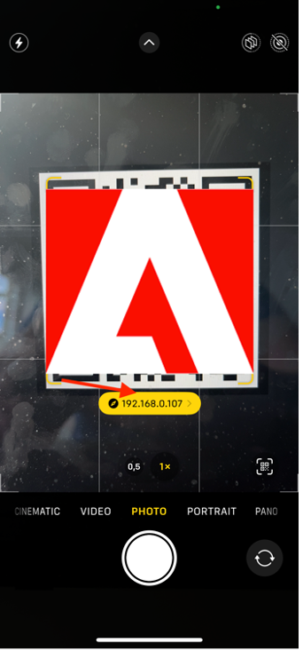

# Verificare l’app mobile

## Android

- Scarica l’app mobile da [qui](https://tinyurl.com/CSCBootcampApp) sul tuo dispositivo Android. Puoi scaricarlo su un [Emulatore Android](https://developer.android.com/studio/run/emulator) o il tuo dispositivo Android fisico.

- Apri il file scaricato toccandolo.

- Nella finestra a comparsa, fare clic sul pulsante di installazione, quindi confermare facendo clic su &quot;Installa comunque&quot;.

- Una volta che l&#39;app è stata installata correttamente, aprilo facendo clic sul pulsante &quot;Apri&quot;.

## iOS

>[!WARNING]
>
> Assicurati di essere connesso alla rete Wi-Fi Bootcamp. Questo è essenziale, in quanto l&#39;app funzionerà solo se ti trovi sulla stessa rete Wi-Fi.

Poiché non si tratta di un’app distribuita ufficialmente, la configurazione per iOS è in qualche modo diversa da quella utilizzata in precedenza.

- Scarica l’app Expo Go dalla pagina [App Store](https://itunes.apple.com/app/apple-store/id982107779).

- Nell&#39;app iPhone Camera, scansiona il codice QR che il team di Adobe proietterà al bootcamp. Quando richiesto, fare clic sul pulsante visualizzato.

- Viene caricata una pagina web che consente di aprire l’app sul tuo iPhone. Fai clic sul pulsante &quot;Expo Go&quot; per aprirlo nell’app appena scaricata.

- Nella finestra di dialogo visualizzata, seleziona &quot;Apri&quot; in modo che l’app Expo Go possa essere caricata con le informazioni corrette.

- Una volta aperta l’app Expo Go, verrà richiesto di trovare i dispositivi nella rete locale. Come accennato in precedenza, questo è necessario per poter scaricare l&#39;app dai nostri dispositivi Adobi al tuo telefono. Fai clic su &quot;Consenti&quot; per caricare questo.

- All&#39;inizio potresti ricevere una pagina di errore. Fai clic sul pulsante &quot;Riprova&quot; per caricare finalmente l’app sul tuo dispositivo. La chiusura dell’app Expo Go o la disconnessione del dispositivo dalla rete Wi-Fi causerà la mancata risposta dell’app.

## Navigazione nell’app

Nell’app, puoi selezionare il team dal menu a discesa . Questo verrà caricato in modo dinamico nel contenuto creato in AEM. Se il contenuto non è soddisfacente, puoi sempre aggiornarlo nel frammento di contenuto creato in precedenza, quindi ripubblicarlo. Verranno quindi visualizzate le modifiche riportate nell’app.

Passaggio successivo: [Fase 3 - Consegna: Crea pagina in AEM](./page-in-aem.md)

[Torna alla fase 2 - Produzione: Creare contenuti app per dispositivi mobili](../production/app.md)

[Torna a tutti i moduli](../../overview.md)
