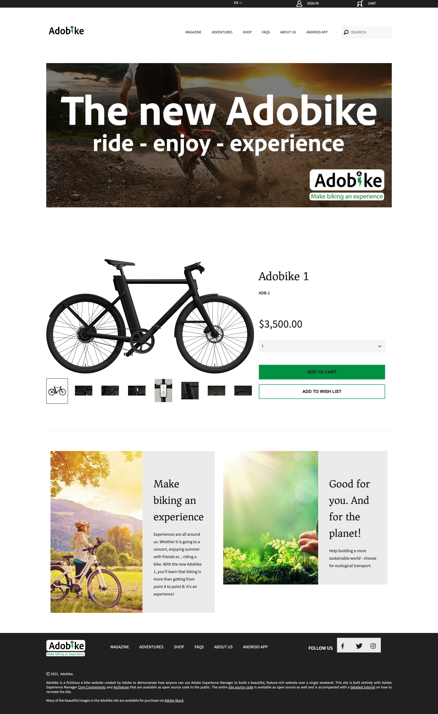

# Crea pagina in AEM

AEM offre due ambienti: ambiente di authoring e ambiente Publish. Questi interagiscono tra di loro e consentono di rendere i contenuti disponibili sul sito web, in modo che i visitatori possano accedervi.

L’ambiente di authoring fornisce i meccanismi per creare, aggiornare e rivedere questo contenuto prima di pubblicarlo:

- Un autore crea e rivede il contenuto (che può essere di diversi tipi; ad esempio pagine, risorse, pubblicazioni, ecc.)
- che, a un certo punto, sarà pubblicato sul tuo sito web.

In qualità di autore, dovrai organizzare il tuo sito web all’interno dell’AEM. Ciò comporta la creazione e la denominazione delle pagine di contenuto in modo che:

- Puoi trovarli facilmente nell’ambiente di authoring
- I visitatori del sito possono facilmente sfogliarli nell’ambiente di pubblicazione

La struttura di un sito web può essere considerata una struttura ad albero che racchiude le pagine dei contenuti. I nomi di queste pagine di contenuto vengono utilizzati per formare gli URL, mentre il titolo viene visualizzato quando viene visualizzato il contenuto della pagina. Nell’esempio seguente, l’URL accessibile per la pagina sarà /content/adobike/language-masters/en.html

Vediamo come aggiungere nuove pagine a un sito web esistente e come riutilizzare alcuni contenuti.

## Creazione della home page

Come spiegato nella sezione precedente, la gerarchia di pagine dell’AEM funziona come una struttura ad albero. Ciò significa che inizieremo con la pagina al livello più alto: la home page.

- Vai all&#39;autore AEM su [https://author-p71057-e991028.adobeaemcloud.com/](https://author-p71057-e991028.adobeaemcloud.com/) e accedi con le credenziali che abbiamo fornito.

- Dal menu Start dell&#39;AEM, selezionare Navigazione \> Sites

- Innanzitutto, spostiamoci nella struttura ad albero esistente fino alla posizione in cui vogliamo creare la nostra home page. Navigare nella struttura ad albero selezionando &quot;Adobike&quot; nella prima colonna, quindi &quot;Bootcamp&quot; nella seconda colonna. Quindi, per creare una pagina sotto questa pagina, fai clic sul pulsante &quot;Crea&quot; e seleziona &quot;Pagina&quot; nel menu che viene visualizzato.

- Viene visualizzata una nuova schermata durante la configurazione della nuova pagina. Innanzitutto, possiamo selezionare un modello di pagina. I modelli di pagina in AEM ti consentono di definire la struttura di una pagina e anche quale contenuto è possibile utilizzare in questa pagina. Poiché si desidera creare la home page, che è una pagina di destinazione, selezioneremo il modello della pagina di destinazione, quindi fai clic sul pulsante &quot;Successivo&quot; per continuare.

- Nella schermata successiva, potrai popolare la pagina con alcune informazioni iniziali. Le informazioni più importanti sono il titolo (proprietà obbligatoria, indicata con \* ), che consente di assegnare alla pagina un nome significativo. Se non immetti il &quot;Nome&quot;, AEM genererà automaticamente l’URL in cui la pagina sarà disponibile, seguendo le best practice SEO (Search Engine Optimization). In questo caso, puoi lasciare vuoto il campo. Alcune altre proprietà possono essere compilate, è possibile esplorare le altre schede, ma ai fini di questo campo di avvio non riempire altre proprietà al momento. Quando sei pronto per creare la pagina, fai clic sul pulsante &quot;Crea&quot;.

- L’AEM creerà ora la tua pagina. Al termine della procedura, verrà visualizzato un pop-up che consente di aprire la pagina appena creata facendo clic sul pulsante &quot;Apri&quot;.

- Ora arriverai nell’editor AEM. Questo è l’editor WYSIWYG (What You See Is What You Get), in cui puoi trascinare e rilasciare i componenti in una pagina per creare la pagina. Diamo un’occhiata alla navigazione:
  
   - Sul lato sinistro sono presenti il pannello laterale con le risorse che è possibile utilizzare nelle pagine, i componenti (o blocchi predefiniti) che è possibile utilizzare in questa pagina e una comoda struttura ad albero che mostra come è strutturata la pagina. Fare clic su una di queste icone per aprirne la visualizzazione.
   - Sul lato destro viene visualizzato il &quot;contenitore di layout&quot;. Si tratta di un’area in cui puoi rilasciare i componenti desiderati.
   - Compiliamo la pagina con del contenuto. Compilare la home page nel modo desiderato. Nell’esempio seguente abbiamo utilizzato un componente immagine che si collega alla pagina del prodotto, oltre a due componenti teaser.

## Riutilizzare le esperienze sfruttando i frammenti esperienza

Ora abbiamo creato la homepage, che è completamente pronta per il nostro lancio Adobike. Tuttavia, alcuni contenuti, ad esempio i punti di vendita unici della nostra moto, possono essere riutilizzati su più pagine.

Idealmente, vorremmo creare questa esperienza di punti vendita unica una sola volta in modo da poterla gestire centralmente e garantire un’esperienza personalizzata ma coerente. In AEM, possiamo farlo con &quot;Frammenti di esperienza&quot;. Un frammento di esperienza è un gruppo di uno o più componenti, inclusi il contenuto e il layout, a cui è possibile fare riferimento all’interno delle pagine. Possono contenere qualsiasi componente.

Mettiamo subito questo da usare:

- Vai all&#39;autore AEM su [https://author-p71057-e991028.adobeaemcloud.com/](https://author-p71057-e991028.adobeaemcloud.com/) e accedi con le credenziali che abbiamo fornito.

- Dal menu Start dell’AEM, seleziona Navigazione \> Frammenti esperienza

- Nella schermata seguente, creiamo una cartella che il team può utilizzare per archiviare le esperienze riutilizzabili. Nella vista a colonne, passa ad Adobike \> Bootcamp, quindi fai clic sui pulsanti Crea \> Cartella.

- Nella finestra modale, assegna alla cartella il nome del team. Puoi lasciare vuoto il campo del nome; AEM lo genererà automaticamente. Dopo aver assegnato un nome alla cartella, fai clic sul pulsante Crea per creare la cartella.

- Ora dovresti visualizzare la cartella a comparsa. Fai clic su di esso, quindi fai clic sui pulsanti Crea \> Frammento esperienza.

- Innanzitutto, selezioniamo un modello di frammento esperienza. Proprio come le pagine, i frammenti di esperienza possono essere basati su più modelli, ciascuno dei quali prevede un’esperienza predefinita. Nel nostro caso, poiché vogliamo riutilizzare il contenuto nel nostro sito web, scegliamo un &quot;Modello di variante web di frammento di esperienza&quot; selezionando la casella di controllo nella parte superiore sinistra, quindi facendo clic sul pulsante &quot;Successivo&quot;.

- Assegna al frammento di esperienza un titolo significativo, ad esempio &quot;USP adobike&quot;, quindi fai clic sul pulsante Crea.

- Una volta creato il frammento di esperienza, fai clic sul pulsante &quot;Apri&quot; nella finestra modale per aggiungere contenuto al frammento di esperienza.

- Proprio come quando si modifica una pagina, è possibile visualizzare un contenitore di layout in cui è possibile aggiungere alcuni contenuti.

- Copieremo i componenti dalla home page. In una nuova scheda, passa alla home page come descritto nel capitolo precedente, seleziona il componente da copiare, quindi fai clic sull’icona Copia.

- Quindi, torna al frammento di esperienza, fai clic sul contenitore di layout e sul pulsante Incolla.

>[!NOTE]
>
> Suggerimento: AEM consente di utilizzare la &quot;modalità di layout&quot; in qualsiasi pagina o frammento di esperienza. Questo consente di ridimensionare i componenti e di ottimizzare le esperienze per qualsiasi dispositivo.

- Dal menu principale, apri il menu a discesa e seleziona &quot;Layout&quot; per accedere alla modalità di layout.

- Quindi, puoi selezionare qualsiasi componente e ridimensionarlo semplicemente trascinando le maniglie su entrambi i lati del componente per eseguire lo snap alle colonne visibili sullo schermo.

- Per impostazione predefinita, si stanno modificando tutti i punti di interruzione. Tuttavia, se desideri modificare un punto di interruzione specifico, puoi selezionare un dispositivo corrispondente dalla barra degli strumenti nella parte superiore della pagina. Il punto di interruzione per il quale stai eseguendo l’authoring verrà quindi evidenziato.

- Come puoi vedere, un layout a due colonne su dispositivi mobili non ha un aspetto eccezionale. Creiamo un layout a una colonna su dispositivi mobili. Come puoi vedere sul desktop, la nostra esperienza rimane la stessa, ma su dispositivi mobili abbiamo ora un’esperienza migliore con una sola colonna di contenuti.

- Infine, ora possiamo riutilizzare questa esperienza sulla homepage. Trascina e rilascia il componente &quot;Frammento di esperienza&quot; nella pagina nel percorso in cui desideri visualizzare il contenuto. Puoi eliminare il contenuto copiato, poiché verrà utilizzato dal frammento di esperienza.

- Apri la finestra di dialogo di configurazione per il componente Frammento esperienza e utilizza il selettore percorsi per selezionare il percorso in cui hai creato il frammento esperienza.

 corretto

- E infine, l&#39;esperienza riutilizzabile sulla nostra pagina.

## Creazione della pagina del prodotto

Quando utilizzi Adobe Commerce integrato con AEM, puoi avere una pagina generica dei dettagli del prodotto che viene utilizzata quando navighi nel sito dalle panoramiche generate. Tuttavia, a volte vogliamo anche prevedere una pagina di ispirazione che combini contenuti specifici per prodotto con contenuti di ispirazione. Copiamoci nel negozio come prefatto da noi, poi creiamo una pagina di prodotto che ispiri.

- Vai all&#39;autore AEM su [https://author-p71057-e991028.adobeaemcloud.com/](https://author-p71057-e991028.adobeaemcloud.com/) e accedi con le credenziali che abbiamo fornito.

- Dal menu Start dell&#39;AEM, selezionare Navigazione \> Sites

- Nella colonna panoramica, vai al negozio dal sito Web predefinito: Adobike \> Language Masters \> Adobike \> Shop. Quindi, seleziona la pagina Acquista con la casella di controllo e fai clic su Crea \> Live Copy. Senza entrare in troppe specifiche, questo creerà una copia della pagina che puoi utilizzare nel tuo sito in modo da poter riutilizzare le pagine e i contenuti già esistenti, utilizzando il Gestore multisito dell’AEM.

- Nella schermata visualizzata, seleziona il sito dei team come destinazione selezionando la casella di controllo accanto al nome. Fare quindi clic sul pulsante Avanti.

- Poiché non stiamo andando a approfondire Multi Site Manager, puoi semplicemente assumere il controllo di questa configurazione.\
  Titolo: Negozio\
  Nome: negozio\
  Configurazioni di rollout: configurazione di rollout standard\
  Dopo aver configurato la Live Copy, fai clic sul pulsante Crea.

>[!NOTE]
>
> Vuoi saperne di più sulle Live Copy? Consulta [&quot;Creazione e sincronizzazione di Live Copy&quot;.](https://experienceleague.adobe.com/docs/experience-manager-cloud-service/content/sites/administering/reusing-content/msm/creating-live-copies.html?lang=en)

- Al termine, dovresti vedere il negozio disponibile sul tuo sito web. Selezionala, quindi fai clic su Crea \> Pagina per creare la nostra pagina di prodotto di ispirazione.

- Poiché vogliamo visualizzare le informazioni sul prodotto nella pagina, ora creiamo una pagina utilizzando il modello della pagina di prodotto. Selezionala, quindi fai clic sul pulsante Avanti.

- Compila i metadati della pagina, quindi fai clic sul pulsante Crea, come per la pagina home. Una volta creata, è possibile aprire la pagina facendo clic sul pulsante Apri. Come puoi vedere, è già compilato con un componente dettagli prodotto.

- Innanzitutto, aggiungeremo il frammento di esperienza creato in precedenza. A quel punto possiamo aggiungere alla pagina qualsiasi contenuto aggiuntivo desiderato. Infine, configureremo il componente Dettagli prodotto per mostrare il nostro prodotto Adobike selezionando il product finder nella finestra di dialogo di configurazione, quindi selezionando la categoria Adobike e la casella accanto al prodotto. Quindi, fai clic sul pulsante Aggiungi.

- Ora disponiamo di una pagina di ispirazione completa, che include contenuti gestiti a livello centrale e informazioni sui prodotti provenienti da Adobe Commerce.

Passaggio successivo: [Fase 3 - Consegna: campagna GO/NO-GO](./go-nogo.md)

[Torna alla fase 3 - Consegna: verificare l’app mobile](./app.md)

[Torna a tutti i moduli](../../overview.md)
