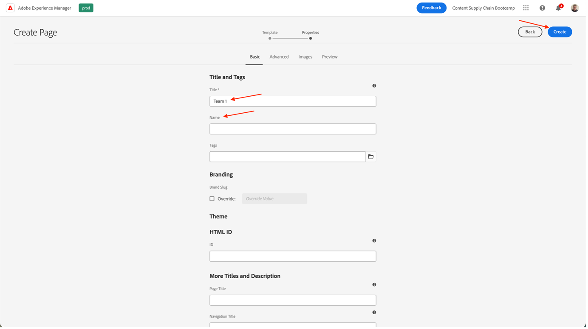
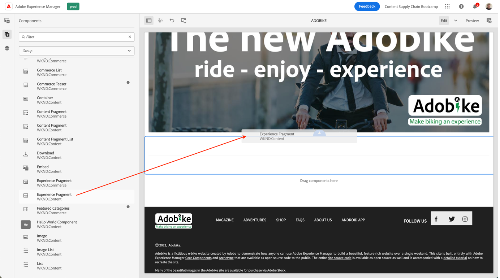

# Crea pagina in AEM

AEM offre due ambienti: Ambiente di authoring e ambiente di pubblicazione. Questi interagiscono tra di loro per consentire ai visitatori di rendere i contenuti disponibili sul sito web.

L’ambiente di authoring fornisce i meccanismi per creare, aggiornare e rivedere i contenuti prima di pubblicarli effettivamente:

- Un autore crea e rivede i contenuti (che possono essere di diversi tipi; ad esempio pagine, risorse, pubblicazioni, ecc.)
- che, a un certo punto, sarà pubblicato sul tuo sito web.

In qualità di autore dovrai organizzare il tuo sito web all’interno di AEM. Ciò comporta la creazione e la denominazione delle pagine di contenuto in modo che:

- siano facilmente reperibili nell’ambiente di authoring;
- i visitatori possano facilmente sfogliare le pagine nell’ambiente di pubblicazione.

La struttura di un sito web può essere pensata come una struttura ad albero che contiene le pagine dei contenuti. I nomi di queste pagine di contenuto vengono utilizzati per formare gli URL, mentre il titolo viene visualizzato quando viene visualizzato il contenuto della pagina. Nell’esempio seguente, l’URL accessibile per la pagina sarà /content/adobike/language-masters/en.html

Esaminiamo come aggiungere nuove pagine a un sito web esistente e come riutilizzare alcuni contenuti.

## Creazione della home page

Come spiegato nella sezione precedente, AEM gerarchia di pagine funziona come una struttura ad albero. Questo significa che inizieremo con la pagina al livello più alto: la home page.

- Vai all&#39;autore AEM su [https://author-p71057-e991028.adobeaemcloud.com/](https://author-p71057-e991028.adobeaemcloud.com/) e accedi con le credenziali fornite.

- Dal menu di avvio AEM, selezionare Navigazione \> Siti

- In primo luogo, spostiamo la struttura ad albero esistente nella posizione in cui vorremmo creare la nostra home page. Naviga nella struttura ad albero selezionando &quot;Adobe&quot; nella prima colonna, quindi &quot;Bootcamp&quot; nella seconda colonna. Quindi, per creare una pagina sotto questa pagina, fai clic sul pulsante &quot;Crea&quot; e seleziona &quot;Pagina&quot; nel menu che appare.

- Viene visualizzata una nuova schermata che consente di configurare la nuova pagina. Innanzitutto, selezioniamo un modello di pagina. I modelli di pagina in AEM consentono di definire la struttura di una pagina e di definire il contenuto da utilizzare in questa pagina. Per creare la home page, che è una pagina di destinazione, selezioneremo il modello di pagina di destinazione, quindi fai clic sul pulsante &quot;Successivo&quot; per continuare.

- Nella schermata successiva, sarà possibile compilare la pagina con alcune informazioni iniziali. L’informazione più importante è il titolo (una proprietà obbligatoria, indicata con un carattere \* ), che consente di assegnare alla pagina un nome significativo. Se non si compila il campo &quot;Nome&quot;, AEM genera automaticamente l’URL sul quale la pagina sarà disponibile, seguendo le best practice SEO (Search Engine Optimization). In questo caso, puoi lasciare vuoto questo campo. Alcune altre proprietà possono essere riempite anche, si può esplorare le altre schede, ma allo scopo di questo bootcamp non riempire altre proprietà appena. Quando sei pronto a creare la tua pagina, fai clic sul pulsante &quot;Crea&quot;.

- AEM ora creare la pagina. Al termine, riceverai un pop-up che ti consente di aprire la pagina appena creata facendo clic sul pulsante &quot;Apri&quot;.

- Ora arriverai nell’Editor AEM. Questo è un editor &quot;ciò che vedi è ciò che ottieni&quot; (o WYSIWYG), in cui puoi trascinare componenti su una pagina per creare la pagina. Diamo un&#39;occhiata alla navigazione:
   
   - Sul lato sinistro è disponibile il pannello laterale con le risorse utilizzabili nelle pagine, i componenti (o blocchi predefiniti) utilizzabili in questa pagina e una struttura ad albero che mostra la struttura della pagina. Fai clic su una di queste icone per aprirne la visualizzazione.
   - Sul lato destro viene visualizzato il &quot;Contenitore di layout&quot;. Si tratta di un’area in cui puoi rilasciare i componenti desiderati.
   - Compiliamo la nostra pagina con un po&#39; di contenuto. Puoi compilare la home page come ritieni opportuno. Nell’esempio seguente, abbiamo utilizzato un componente immagine per il collegamento alla pagina del prodotto, oltre a due componenti teaser.

## Riutilizzare le esperienze sfruttando i frammenti esperienza

Ora abbiamo creato la homepage, completamente pronta per il lancio di Adobe. Tuttavia, alcuni dei contenuti, ad esempio i punti di vendita unici della nostra bicicletta, possono essere riutilizzati su più pagine.

Idealmente, vorremmo creare questa esperienza unica di punti di vendita in modo da poterla gestire centralmente e garantire un&#39;esperienza personalizzata ma coerente. In AEM, possiamo farlo con &quot;Frammenti esperienza&quot;. Un frammento esperienza è un gruppo di uno o più componenti, compresi contenuto e layout, a cui è possibile fare riferimento all’interno delle pagine. Possono contenere qualsiasi componente.

Mettiamo questo da usare immediatamente:

- Vai all&#39;autore AEM su [https://author-p71057-e991028.adobeaemcloud.com/](https://author-p71057-e991028.adobeaemcloud.com/) e accedi con le credenziali fornite.

- Dal menu di avvio AEM, seleziona Navigazione \> Frammenti esperienza

- Nella schermata seguente, creiamo una cartella che il team può utilizzare per memorizzare le esperienze riutilizzabili. Nella vista a colonne, accedi ad Adobe \> Bootcamp, quindi fai clic sui pulsanti Crea \> Cartella .

- Nella finestra modale, assegna alla cartella il nome del tuo team. Puoi lasciare vuoto il campo del nome, AEM lo genererà automaticamente. Dopo aver assegnato un nome alla cartella, fai clic sul pulsante Crea per creare la cartella.

- Ora dovresti visualizzare la cartella a comparsa. Fai clic su di esso, quindi fai clic sui pulsanti Crea \> Frammento esperienza .

- Innanzitutto, seleziona un modello di frammento esperienza. Come per le pagine, i frammenti esperienza possono essere basati su più modelli, ciascuno dei quali prevede un’esperienza predefinita. Nel nostro caso, poiché vogliamo riutilizzare il contenuto del nostro sito web, scegliamo un &quot;Modello di variante web per frammento esperienza&quot; selezionando la casella di controllo in alto a sinistra, quindi facendo clic sul pulsante &quot;Successivo&quot;.

- Assegna al frammento esperienza un titolo significativo, ad esempio &quot;Adobe USPs&quot;, quindi fai clic sul pulsante crea .

- Una volta creato il frammento di esperienza, fai clic sul pulsante &quot;Apri&quot; nel modale per aggiungere del contenuto al frammento di esperienza.

- Proprio come quando modifichi una pagina, puoi vedere un contenitore di layout in cui puoi aggiungere del contenuto.

- Quello che faremo è copiare i componenti dalla home page. In una nuova scheda, passa alla home page come spiegato nel capitolo precedente, seleziona il componente su cui desideri copiare , quindi fai clic sull’icona Copia .

- Quindi, nel frammento esperienza, fai clic sul contenitore di layout e fai clic sul pulsante incolla.

>[!NOTE]
>
> Suggerimento: AEM consente di utilizzare la &quot;modalità layout&quot; in qualsiasi pagina o frammento di esperienza. Questo consente di ridimensionare i componenti e ottimizzare le esperienze per qualsiasi dispositivo.

- Dal menu principale, aprire il menu a discesa e selezionare &quot;Layout&quot; per entrare in modalità layout.

- Quindi, puoi selezionare qualsiasi componente e ridimensionarlo semplicemente trascinando le maniglie su entrambi i lati del componente per agganciare le colonne visibili sullo schermo.

- Per impostazione predefinita, stai modificando tutti i punti di interruzione. Tuttavia, se desideri modificare per un punto di interruzione specifico, puoi selezionare un dispositivo corrispondente dalla barra degli strumenti nella parte superiore della pagina. Il punto di interruzione per il quale stai creando viene evidenziato.

- Come puoi vedere, il layout a due colonne su dispositivi mobili non ha un aspetto ottimale. Creiamo un layout a una colonna su dispositivi mobili. Come puoi vedere sul desktop, la nostra esperienza rimane la stessa, ma su dispositivi mobili ora abbiamo un’esperienza migliore con una sola colonna di contenuti.

- Infine, possiamo riutilizzare questa esperienza sulla homepage. Trascina e rilascia un componente &quot;Frammento esperienza&quot; nella pagina nella posizione in cui desideri visualizzare il contenuto. È possibile eliminare il contenuto copiato, poiché lo utilizzeremo dal frammento di esperienza.

- Apri la finestra di dialogo di configurazione per il componente Frammento esperienza e utilizza il selettore del percorso per selezionare il percorso in cui hai creato il frammento esperienza.

- E infine, abbiamo la nostra esperienza riutilizzabile sulla nostra pagina.

## Creazione della pagina del prodotto

Quando si utilizza Adobe Commerce integrato con AEM, è possibile avere una pagina generica dei dettagli del prodotto che viene utilizzata quando si naviga nel sito dalle panoramiche generate. Tuttavia, a volte vogliamo anche prevedere una pagina di ispirazione che combini contenuti specifici per prodotto con contenuti di ispirazione. Copiiamo il negozio come da noi prefatto, quindi creiamo una pagina di prodotto ispiratrice.

- Vai all&#39;autore AEM su [https://author-p71057-e991028.adobeaemcloud.com/](https://author-p71057-e991028.adobeaemcloud.com/) e accedi con le credenziali fornite.

- Dal menu di avvio AEM, selezionare Navigazione \> Siti

- Nella panoramica della colonna , accedi al sito web prefabbricato e visita il negozio: Adobe \> Master per lingua \> Adobike \> Shop. Quindi, seleziona la pagina Negozio con la casella di controllo e fai clic su Crea \> Live Copy. Senza specificare troppe informazioni specifiche, verrà creata una copia della pagina da utilizzare nel sito in modo da poter riutilizzare le pagine e i contenuti già esistenti, utilizzando AEM Multi Site Manager.

- Nella schermata visualizzata, seleziona il sito dei team come destinazione selezionando la casella di controllo accanto al nome. Quindi, fai clic sul pulsante Avanti .

- Poiché non passeremo a Multi Site Manager, puoi semplicemente prendere il controllo di questa configurazione.\
   Titolo: Negozio\
   Nome: negozio\
   Configurazioni di rollout: Configurazione di rollout standard\
   Dopo aver configurato la Live Copy, fai clic sul pulsante Crea .

>[!NOTE]
>
> Curioso per ulteriori informazioni sulle Live Copy? Consulta [&quot;Creazione e sincronizzazione di Live Copy&quot;.](https://experienceleague.adobe.com/docs/experience-manager-cloud-service/content/sites/administering/reusing-content/msm/creating-live-copies.html?lang=en)

- Al termine, ora dovresti vedere lo store disponibile nel tuo sito web. Selezionala, quindi fai clic su Crea \> Pagina per creare la nostra pagina di prodotto ispiratrice.

- Poiché desideri mostrare le informazioni sui prodotti nella pagina, ora creiamo una pagina utilizzando il modello di pagina prodotto. Selezionala, quindi fai clic sul pulsante Avanti .

- Compila i metadati della pagina, quindi fai clic sul pulsante Crea , come per la home page. Una volta creata, puoi aprire la pagina facendo clic sul pulsante apri . Come puoi vedere, è già popolato con un componente per i dettagli del prodotto.

- Innanzitutto, aggiungeremo il frammento di esperienza creato in precedenza. Quindi possiamo aggiungere qualsiasi contenuto aggiuntivo desiderato sulla pagina. Infine, configureremo il componente dei dettagli del prodotto per mostrare il nostro prodotto Adobe selezionando il product finder nella finestra di dialogo di configurazione, quindi selezionando la nostra categoria Adobe e selezionando la casella accanto al prodotto. Quindi fare clic sul pulsante Aggiungi.

- Ora disponiamo di una pagina completa che include contenuti gestiti a livello centrale e informazioni sui prodotti provenienti da Adobe Commerce.

Passaggio successivo: [Fase 3 - Consegna: campagna GO/NO-GO](./go-nogo.md)

[Torna alla fase 3 - Consegna: Verificare l’app mobile](./app.md)

[Torna a tutti i moduli](../../overview.md)
