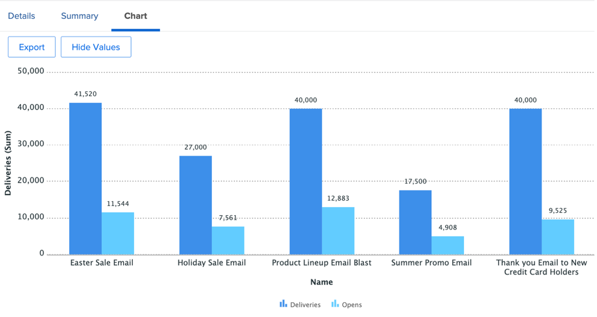

# Approfondimenti per un Marketing Manager

## Visualizzazione settimanale del responsabile del progetto

Nella colonna sinistra, fare clic su &#39;Visualizzazione settimanale di Project Leader&#39;:

Questo copre una vasta gamma di rapporti, sempre cliccabili/actionable per ulteriori dettagli:

- Le **attività in scadenza questa settimana per progetto**

- Le prossime attività cardine di **Project Management**:

- I **problemi aperti per priorità**

- Le **attività in ritardo per reparto**

- Le **attività in ritardo per singolo**

## Informazioni relative a SCRUM

Nella colonna sinistra, fare clic su &#39;Stato iterazione&#39;

Se i tuoi team utilizzano la metodologia SCRUM, si tratta di un interessante set di rapporti di gestione:

- **Velocità per iterazione**

- **Velocità media per team**

- **Totali ore iterazioni correnti completate per assegnatario**

- **Iterazioni per team**

## Reporting sull&#39;efficienza

Sempre nella colonna sinistra, fai clic su &quot;Efficienza&quot;.

- **Rapporto Pianificato/Non Pianificato** (del lavoro svolto)

- **Richieste completate per settimana**

## Informazioni sul progetto in volo

Sempre nella colonna sinistra, fai clic su &quot;Marketing - Progetti in corso&quot;

- **Stato dei progetti in volo**

- **Progetti per Condizione per Mese**

- Elenco, avanzamento e dettagli finanziari dei **progetti in-flight**

## Visualizza dipendenze (tra progetti)

Tornando alla riga &#39;PIN&#39;, fare clic su &#39;Vista Gant Portfolio&#39;:

Qui hai una **visualizzazione Diagramma di Gant di un gruppo di progetti** con possibili dipendenze (predecessori) tra progetti

## Informazioni sull’integrazione di terze parti

>[!NOTE]
>
> Esempio di integrazione con un software di terze parti. Si tratta di un’integrazione con Adobe Campaign a titolo illustrativo. Importa i risultati delle campagne completate in Adobe Campaigns.

Nella riga PIN, fare clic su Riepilogo campagna:

- **Riepilogo Adobe Campaign**

- **Adobe Campaign inviato ad Opens**

- **Adobe Campaign si apre ai clic**

Passaggio successivo: [Conclusione](../../conclusion.md)

[Torna alla Fase 4 - Approfondimenti per un Project Manager](./project-manager.md)

[Torna a tutti i moduli](../../overview.md)
