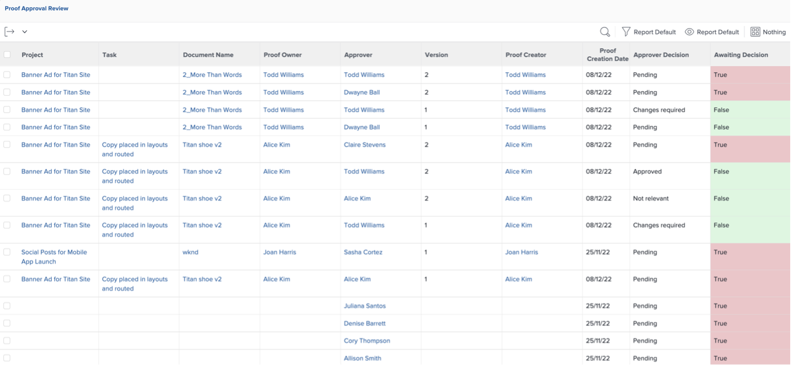

# Approfondimenti per un Project Manager

## Report interattivi sull&#39;avanzamento del progetto

Sulla riga &quot;PIN&quot;, fai clic su &quot;Consapevolezza app mobile&quot;, quindi su &quot;Metriche&quot;:

In questo caso, puoi avere una visualizzazione grafica dello stato di un singolo progetto/campagna.

>[!NOTE]
>
> Per ulteriori dettagli, è possibile fare clic su ogni area; questo è il caso della maggior parte delle informazioni in Workfront. Dacci un&#39;occhiata!

## Rapporti specifici per le campagne

Nella riga PIN, fare clic su Progetti:

Nella colonna di sinistra, fai clic su &quot;Stato campagna&quot;:

La parte superiore fornisce approfondimenti su 1 singola campagna relativa a 1/ **campagna pianificata vs. effettiva** ore trascorse e 2/ **condizione campagna** per ogni canale:

La parte inferiore fornisce informazioni sullo stato **Risultati finali della campagna**:

## Approfondimenti basati su più progetti

Sempre nella colonna sinistra, fai clic su &quot;Monitoraggio&quot;.

La parte superiore fornisce approfondimenti sullo stato di un gruppo di progetti, sia dal punto di vista dello **stato delle attività** che dal punto di vista della **condizione del progetto**:

La parte inferiore mostra tutte le **approvazioni a rischio** e sarà necessario inseguire:

## Dashboard dei contenuti

Sempre nella colonna sinistra, fai clic su &quot;DASHBOARD DEI CONTENUTI&quot;:

La parte superiore fornisce informazioni approfondite sullo stato di **approvazione della bozza** del documento (se è approvato, quante versioni sono necessarie, ecc.)

La parte inferiore è una **Revisione approvazione bozza** che fornisce un altro angolo di visualizzazione agli stati di approvazione della bozza:

Passaggio successivo: [Fase 4 - Informazioni per un Marketing Manager](./marketing-manager.md)

[Torna alla fase 4 - Informazioni: panoramica](./overview.md)

[Torna a tutti i moduli](../../overview.md)
