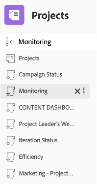

# Informazioni su un Project Manager

## Report sull&#39;avanzamento del progetto interattivo

Sulla linea &quot;PIN&quot;, fai clic su &quot;Consapevolezza app mobile&quot;, quindi fai clic su &quot;Metriche&quot;:

Qui puoi visualizzare uno stato grafico di un singolo progetto/campagna.

>[!NOTE]
>
> Per ulteriori dettagli, è possibile fare clic su ogni area, come avviene per la maggior parte delle informazioni in Workfront. Dai una mossa!

## Report specifici per la campagna

Sulla linea &quot;PIN&quot;, fai clic su &quot;Progetti:

Nella colonna a sinistra, fai clic su &quot;Stato campagna&quot;:

La parte superiore offre informazioni approfondite su una singola campagna su 1/Campaign **pianificato rispetto a effettivo** ore trascorse e 2/ **Condizione campagna** per ogni canale:

La parte in basso ti dà informazioni sul **Risultati finali delle campagne** stato:

## Informazioni basate su più progetti

Sempre a sinistra, clicca su &#39;Monitoraggio&#39;

La parte superiore fornisce informazioni sullo stato di un gruppo di progetti, sia dal **Stato delle attività** dal punto di vista e dal **Condizione del progetto** punto di vista:

La parte inferiore mostra tutti **all&#39;approvazione dei rischi** e dovrà seguire:

## Dashboard dei contenuti

Sempre a sinistra, fai clic su &#39;CONTENT DASHBOARD&#39;:

La parte superiore offre una buona comprensione su tutte le **approvazione della prova del documento** stato (è approvato, di quante versioni avevamo bisogno, ecc.)

La parte inferiore è un **Revisione dell&#39;approvazione della prova** che conferisce un altro angolo di visione agli stati di omologazione della prova:

Passaggio successivo: [Fase 4 - Informazioni su un Marketing Manager](./marketing-manager.md)

[Torna alla fase 4 - Approfondimenti: Panoramica](./overview.md)

[Torna a tutti i moduli](../../overview.md)
