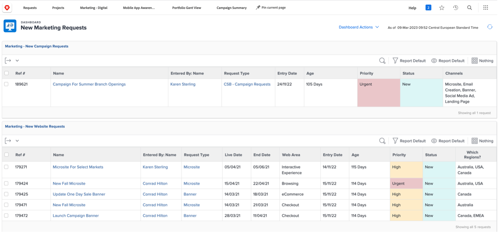
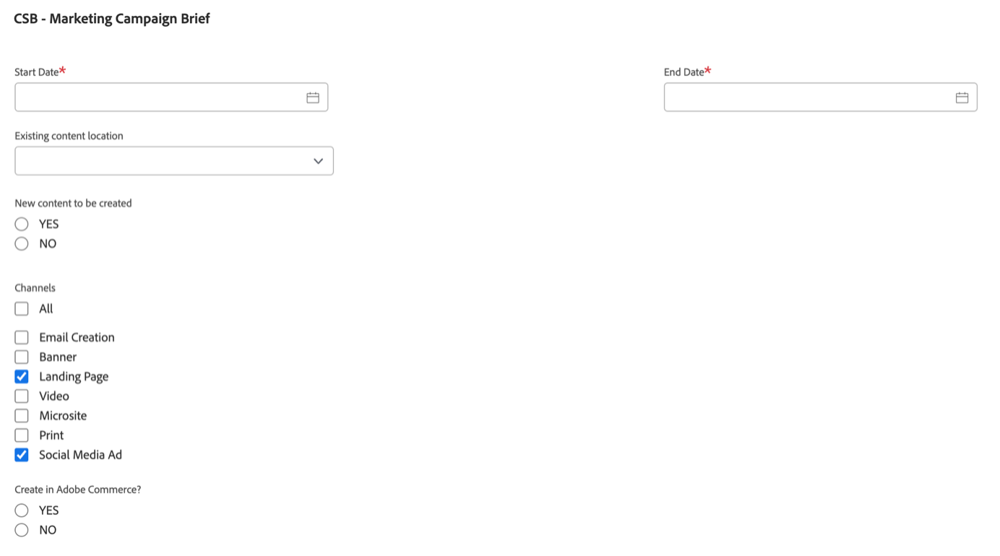
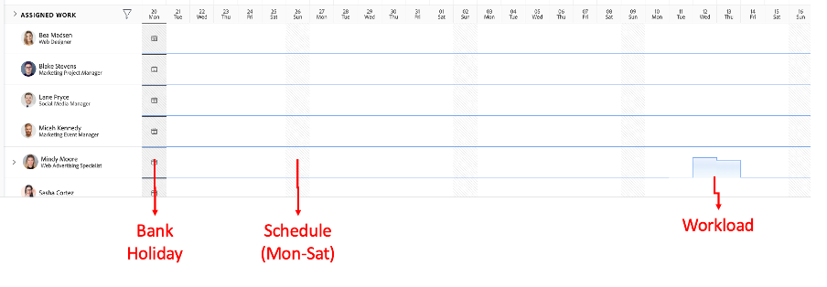

# Pianificazione

>[!NOTE]
>
> Durante il Bootcamp, indosserai diversi cappelli: Richiedente, Project Manager, Designer e Gestione superiore. Questo ti darà un&#39;occhiata dell&#39;esperienza utente di ogni profilo.

Diamo ora un&#39;occhiata alla piattaforma di gestione del lavoro, Adobe Workfront. Workfront rende gli obiettivi visibili all’intera organizzazione in modo che tutti possano assegnare priorità strategica al lavoro, monitorare l’avanzamento e misurare i risultati. E man mano che i tuoi obiettivi si evolvono, Workfront invia le informazioni ai team che eseguono i lavori sul campo. Il risultato? Maggiore allineamento, messa a fuoco e velocità per raggiungere il successo.

Accedi al tuo profilo Workfront navigando su [adobebootcampemea-02032301.testdrive.workfront.com](https://adobebootcampemea-02032301.testdrive.workfront.com) ed effettuare l&#39;accesso con le credenziali fornite dal team Adobe.

La pagina di accesso verrà visualizzata.  Accedi con il tuo indirizzo e-mail professionale che hai effettuato con il bootcamp come nome utente:

Dopo l&#39;accesso, dovrai affrontare questa home page:

## Preparazione di Workfront per l’utilizzo

Ora prepareremo la nostra home page come se stessimo utilizzando Workfront regolarmente.  Questo significa che andremo a prendere le pagine pertinenti per il nostro flusso di lavoro di più tardi e &#39;PIN&#39; loro sulla nostra home page.

Prima di tutto, andiamo a prendere la pagina del carico di lavoro del nostro TEAM.  Fai clic sulla waffle in alto a destra e seleziona &quot;Teams&quot;

Una volta che il nostro TEAM (Marketing - Digital) è sullo schermo, basta &#39;PIN&#39; sul nastro superiore:

La barra multifunzione superiore dovrebbe essere simile alla seguente:

Ora leggiamo un progetto che analizzeremo più da vicino in un secondo momento.  Fai clic sulla pagina Progetti PINNED e fai clic sul pulsante di ricerca.  Digita &quot;Campagna di sensibilizzazione delle app mobili&quot; e fai clic sul nome del progetto:

Una volta che il progetto è sul tuo schermo, PIN sul tuo nastro superiore come abbiamo fatto prima:

La barra multifunzione superiore dovrebbe essere simile alla seguente:

Infine, fai nuovamente clic sulla waffle in alto a destra e seleziona PORTFOLI.

Fare clic sul pulsante di ricerca e digitare &#39;TRANSFORM&#39;.  Fai clic sul Portfolio &quot;Trasforma l’esperienza del cliente&quot; per aprirla:

Una volta che il Portfolio è aperto, fissalo sulla barra multifunzione superiore:

La barra multifunzione superiore dovrebbe essere simile alla seguente:

Ora siamo pronti a iniziare il nostro flusso di lavoro con un&#39;interfaccia che ci mostri esattamente ciò di cui abbiamo bisogno regolarmente.

## Richiedente

Ora inizieremo il lavoro effettivo con il cappello del Richiedente. Richiedente, ad esempio un Product Manager, desideriamo formalizzare una richiesta per la nostra nuova campagna Adobe e fornire le informazioni della descrizione di marketing.

- In alto a sinistra, fai clic su Richieste:

- Quindi fai clic su &quot;Nuova richiesta&quot;:

- Come tipo di richiesta, seleziona &quot;Richieste di marketing&quot;, quindi &quot;CSB - Richieste di campagna&quot;:

- Inserisci l&#39;oggetto: &quot;Adobe Campaign - \*team\*&quot; (compila il numero del tuo team). Puoi aggiungere una descrizione e una priorità.

- Tutto ciò che si trova sotto l’intestazione &quot;CSB - Documento della campagna di marketing&quot; è completamente personalizzabile. In questo caso, si tratta di campi personalizzati che è possibile adattare alle proprie esigenze di reporting e analisi. Ecco i campi Breve che abbiamo creato per questo Bootcamp:

- Cominciamo a riempire il Brief:

   - Imposta la data di inizio su 06/01/2023 - Imposta la data di fine su 30/06/2023:

   

   - Seleziona AEM Assets, in quanto saranno disponibili alcune risorse da utilizzare in questa campagna:

   

   - In &quot;Nuovo contenuto&quot;, tieni presente che se fai clic su sì, viene visualizzato un campo aggiuntivo (condizionale) con un avviso a linee temporali:

   

   - Visto che abbiamo una scadenza ravvicinata, cambiamo la nostra scelta in &quot;NO&quot;:

   

   - Per impostazione predefinita, sui canali abbiamo scelto di selezionarne alcuni. E questi sono quelli di cui avremo bisogno per il prossimo passo, quindi non c&#39;è bisogno di cambiamento qui:

   

   - Adobe Commerce, seleziona sì:

   

- Infine, nella sezione documenti puoi aggiungere qualsiasi documentazione pertinente per la tua richiesta.  In questo caso, utilizzeremo il connettore AEM per mostrarti come ottenere il contenuto esistente dalla nostra istanza AEM Assets.

   - Fai clic su &quot;Aggiungi o collega file&quot; e seleziona Collega da &quot;experience-manager&quot;.

   

   - Ora ti trovi di fronte alle Cartelle AEM Assets e puoi sfogliarle (e/o utilizzare il motore di ricerca) per ottenere i documenti/risorse necessari per la tua richiesta:

   

   - Puoi allegare gratuitamente qualsiasi elemento di AEM Assets che ritieni pertinente a questo progetto, se presente. Al termine, fai clic su &quot;Collega&quot; per collegare le risorse, oppure su &quot;Chiudi&quot; se non stai collegando delle cartelle.

   

- Abbiamo completato la richiesta e siamo pronti a inviarla:

## Project Manager

Ora che abbiamo presentato la nostra richiesta come &#39;Richiedente&#39; (ad esempio, Product Manager) cambieremo cappelli e indosseremo quello di Project Manager.

- Fai clic sul logo &quot;Adobe&quot; e arriverai alla pagina &quot;Nuove richieste di marketing&quot; (questa è una tipica home page di &quot;Project Manager&quot;):

- Nella sezione &quot;Marketing - Nuove richieste di campagna&quot;, puoi trovare la tua nuova richiesta creata:

- Fai clic sul nome della richiesta:

- Fai clic su &quot;Dettagli richiesta&quot;:

- Scorri verso il basso fino alla sezione &quot;CSB - Documento della campagna di marketing&quot; ed espandila:

- Puoi visualizzare tutti i dettagli della descrizione del richiedente e con queste informazioni puoi avviare un piano di progetto basato su un modello.
   - Nella parte superiore, accanto al nome della richiesta, fai clic sui tre punti:

   

   - Fai clic su &quot;Converti in progetto da modello&quot;:

   

   - Seleziona &#39;CSB - Campagna di marketing, quindi fai clic su &#39;Usa modello&#39;:

   

   - Fai clic su &quot;Converti in progetto&quot; nella parte inferiore della pagina:

   

- Ora disponiamo del flusso di lavoro del progetto Campaign basato sul modello . Diamo un PIN al nostro progetto per un momento successivo. Fai clic su &quot;Aggiungi pagina corrente&quot;:

- Alcuni aspetti dell&#39;attenzione:

1. Nozione di Durata - È la finestra di opportunità per completare un&#39;attività.\
   Nozione di orario pianificato - è il tempo effettivo necessario per completare un&#39;attività.

1. Nozione di Predecessori (ovvero dipendenze): si tratta dei vincoli che le attività possono avere tra di loro (in genere, questa attività non può essere avviata prima del completamento dell&#39;altra). Questo ci permette di avere un grafico chiaro con il percorso critico per ogni progetto. Fare clic sull&#39;icona sottostante per visualizzare il grafico a gant:
   

1. Nozione di assegnazioni : al momento della creazione del progetto, le assegnazioni sono ancora generalistiche in quanto provengono da un modello. Vengono creati in Ruoli lavoro - rappresentati dall&#39;icona del martello (cioè un gruppo di persone che hanno le competenze per completare questo particolare compito) o in Team - rappresentati dall&#39;icona delle persone (cioè una definita dal gruppo di persone dell&#39;azienda). Ora è il momento di assegnare tali compiti a singoli individui.

- Oggi ci concentreremo sui compiti preassegnati ai team e su come assegnarli agli individui.

- Come puoi vedere, l&#39;attività 11 &quot;Produce annuncio social media&quot; è assegnata al team &quot;Marketing - Digital&quot;:
   

- Vediamo come questo riflette la pianificazione di questo team aprendo la sua pagina Gestione risorse. Fai clic sul PIN &quot;Marketing - Digital&quot; nella parte superiore della pagina:
   

- Ora hai questa vista di pianificazione dei team:

1. La parte superiore copre il lavoro non assegnato per quel particolare team. Elenca i progetti per i quali il Team dispone di assegnazioni in e cliccando sulla freccia qui, si ha la visibilità delle attività esatte che devono essere coperte dal progetto:
   

1. La parte inferiore riguarda il lavoro assegnato per gli individui del team, ma non solo: mostra infatti il carico di lavoro effettivo di ciascun membro della squadra, ma anche il loro programma (ad esempio, lun-ven o lun-sat), le loro vacanze, ecc.
   

- Per assegnare un&#39;attività a un singolo utente, è sufficiente trascinare l&#39;attività dalla parte superiore alla riga di un singolo utente nella parte inferiore - Vedere come il carico di lavoro di Bea è stato regolato e i dettagli delle assegnazioni dei task sono stati aggiunti:
   

Passaggio successivo: [Fase 1 - Pianificazione: Altri lavori preliminari](./prework.md)

[Torna alla presentazione creativa](../../creative-brief.md)

[Torna a tutti i moduli](../../overview.md)
