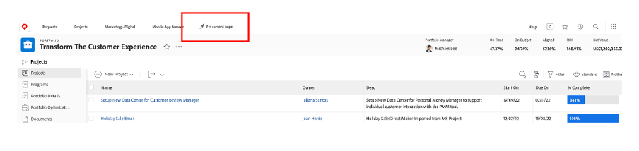

# Pianificazione

>[!NOTE]
>
> Durante il Bootcamp, indosserai diversi cappelli: richiedente, project manager, Designer e Upper Management. Questo ti darà un’occhiata all’esperienza utente di ogni profilo.

Dai un’occhiata alla piattaforma di gestione del lavoro Adobe Workfront. Workfront rende gli obiettivi visibili a tutta l’organizzazione in modo che tutti possano definire le priorità strategiche del lavoro, tenere traccia dello stato di avanzamento e misurare i risultati. Inoltre, man mano che i vostri obiettivi evolvono, Workfront fornisce informazioni a cascata ai team che eseguono il lavoro sul campo. Il risultato? Maggiore allineamento, messa a fuoco e velocità per raggiungere il successo.

Accedi al tuo profilo Workfront navigando su [adobebootcampemea-02032301.testdrive.workfront.com](https://adobebootcampemea-02032301.testdrive.workfront.com) e accedendo con le credenziali che il team di Adobi ti ha fornito.

Ti troverai di fronte a questa pagina di accesso.  Accedi con il tuo indirizzo e-mail professionale con cui ti sei iscritto al bootcamp come nome utente:

Dopo aver effettuato correttamente l’accesso, ti troverai di fronte a questa pagina home:

## Preparazione di Workfront per l&#39;utilizzo

Ora prepareremo la nostra home page come se usassimo regolarmente Workfront.  Ciò significa che andremo a prendere pagine rilevanti per il nostro flusso di lavoro di più tardi e &quot;PIN&quot; sulla nostra home-page.

Prima di tutto, andiamo a prendere la pagina del carico di lavoro del NOSTRO TEAM.  Fai clic sul waffle in alto a destra e seleziona &quot;Team&quot;

Quando il TEAM (Marketing - Digitale) è visualizzato sullo schermo, è sufficiente inserire l&#39;unità nel nastro superiore:

A questo punto la barra multifunzione superiore dovrebbe essere simile alla seguente:

Ora fissiamo un progetto che analizzeremo più da vicino in seguito.  Fai clic sulla pagina Progetti BLOCCATI e fai clic sul pulsante Cerca.  Digita &quot;Campagna di sensibilizzazione sulle app mobili&quot; e fai clic sul nome del progetto:

Una volta visualizzato il progetto, fissarlo alla barra multifunzione superiore come in precedenza:

A questo punto la barra multifunzione superiore dovrebbe essere simile alla seguente:

Infine, fai clic di nuovo sul waffle in alto a destra e seleziona PORTFOLI.

Fare clic sul pulsante di ricerca e digitare &#39;TRANSFORM&#39;.  Fai clic sul Portfolio &quot;Trasforma l’esperienza del cliente&quot; per aprirlo:

Una volta aperto il Portfolio, fissarlo alla barra multifunzione superiore:

A questo punto la barra multifunzione superiore dovrebbe essere simile alla seguente:

Ora siamo pronti ad avviare il flusso di lavoro con un&#39;interfaccia che ci mostri esattamente di cosa abbiamo bisogno regolarmente.

## Richiedente

Ora inizieremo l&#39;effettiva assunzione di lavoro con il cappello del richiedente. Un richiedente, ad esempio un Product Manager, desideriamo formalizzare una richiesta per la nostra nuova campagna Adobike e fornire le informazioni del rapporto di marketing.

- In alto a sinistra, fai clic su Richieste:

- Quindi, fai clic su &quot;Nuova richiesta&quot;:

- Come tipo di richiesta, seleziona &quot;Richieste di marketing&quot;, quindi &quot;CSB - Richieste campagna&quot;:

- Inserisci l’oggetto: &quot;Adobe Campaign - \*team\*&quot; (inserisci il numero del tuo team). È possibile aggiungere una descrizione e una priorità.

- Tutto ciò che si trova sotto l’intestazione &quot;CSB - Documento informativo sulla campagna di marketing&quot; è completamente personalizzabile. In questo caso, si tratta di campi personalizzati che puoi adattare in base alle tue esigenze di riepilogo di marketing. Di seguito sono riportati i campi Breve creati per questo campo di avvio:

- Iniziamo a compilare il resoconto:

   - Impostare la data di inizio su 01/06/2023 - Impostare la data di fine su 30/06/2023:

  

   - Seleziona AEM Assets, poiché saranno disponibili alcune risorse da utilizzare in questa campagna:

  

   - In &quot;Nuovo contenuto&quot;, si noti che se si fa clic su sì, viene visualizzato un campo aggiuntivo (condizionale) con un avviso relativo alla linea temporale:

  

   - Poiché abbiamo una scadenza ravvicinata, cambiamo la nostra scelta a &quot;NO&quot;:

  

   - Sui canali, abbiamo scelto di preselezionarne alcuni per impostazione predefinita. E questi sono quelli di cui avremo bisogno per il prossimo passo, quindi non è necessario alcun cambiamento qui:

  

   - Adobe Commerce, seleziona sì:

  

- Infine, nella sezione documenti, puoi aggiungere tutta la documentazione pertinente per la richiesta.  In questo caso, utilizzeremo il connettore AEM per mostrarti come ottenere contenuti esistenti dalla nostra istanza di AEM Assets.

   - Fai clic su &quot;Aggiungi o collega file&quot; e seleziona Collega da &quot;experience-manager&quot;.

  

   - Ora hai a che fare con le cartelle di AEM Assets e puoi sfogliarle (e/o utilizzare il motore di ricerca) per ottenere i documenti/le risorse necessari per la tua richiesta:

  

   - Puoi allegare qualsiasi elemento di AEM Assets che ritieni possa essere pertinente a questo progetto, se presente. Al termine, fai clic su &quot;Collega&quot; per collegare le risorse, oppure su &quot;Chiudi&quot; per non collegare alcuna cartella.

  

- La richiesta è stata completata ed è possibile inviarla:

## Project Manager

Dopo aver inviato la richiesta come &quot;Richiedente&quot; (ad esempio, Product Manager), cambieremo il cappello e indosseremo quello di Project Manager.

- Fai clic sul Logo &quot;Adobe&quot; per accedere alla pagina &quot;Nuove richieste di marketing&quot; (una tipica home page &quot;Project Manager&quot;):

- Nella sezione &quot;Marketing - Nuove richieste campagna&quot;, puoi trovare la richiesta appena creata:

- Fai clic sul nome della richiesta:

- Fai clic su &quot;Dettagli richiesta&quot;:

- Scorri verso il basso fino alla sezione &quot;CSB - Descrizione della campagna di marketing&quot; ed espandila:

- Puoi visualizzare tutti i dettagli del resoconto del richiedente e con queste informazioni puoi avviare un piano di progetto basato su un modello.
   - In alto, accanto al nome della richiesta, fai clic sui tre punti:

  

   - Fai clic su &quot;Converti in progetto da modello&quot;:

  

   - Seleziona &quot;CSB - Campagna di marketing&quot;, quindi fai clic su &quot;Usa modello&quot;:

  

   - Fai clic su &quot;Converti in progetto&quot; in fondo alla pagina:

  

- Ora abbiamo il flusso di lavoro del progetto Campaign basato sul modello. Fissiamo il nostro progetto per dopo. Fai clic su &quot;Fissa pagina corrente&quot;:

- Alcune aree di attenzione:

1. Nozione di durata: è la finestra di opportunità per completare un&#39;attività.\
   Nozione di ore pianificate: indica il tempo effettivo necessario per completare un&#39;attività.

1. Concetto di Predecessori (o dipendenze): si tratta dei vincoli che le attività possono avere tra di loro (in genere, questa attività non può essere avviata prima che l’altra sia completata). Questo ci permette di avere un diagramma di Gant chiaro con il percorso critico per ogni progetto. Fai clic sull’icona seguente per visualizzare il Diagramma di Gant:
   

1. Concetto di assegnazioni: al momento della creazione del progetto, le assegnazioni sono ancora generiche in quanto derivano da un modello. Vengono assegnati a Ruoli, rappresentati dall&#39;icona a forma di martello (un gruppo di persone con le competenze necessarie per completare questa particolare attività) o a Team, rappresentati dall&#39;icona Persone (un gruppo definito dal gruppo di persone della tua azienda). Adesso è il momento di assegnare queste attività a singoli individui.

- Oggi ci concentreremo sulle pre-assegnazioni dei Team e su come assegnarle a singoli utenti.

- Come vedi, l’attività 11 &quot;Produrre annunci per social media&quot; è assegnata al team &quot;Marketing - Digitale&quot;:
  

- Vediamo come ciò si riflette sulla pianificazione di questo team aprendo la relativa pagina Gestione risorse. Fai clic sul PIN &quot;Marketing - Digitale&quot; nella parte superiore della pagina:
  

- È ora disponibile la visualizzazione Pianificazione team:

1. La parte superiore include il lavoro non assegnato per quel particolare team. Elenca i progetti a cui il team ha assegnato le assegnazioni e facendo clic sulla freccia qui, puoi visualizzare esattamente le attività che devono essere coperte dal progetto:
   

1. La parte in basso illustra il lavoro assegnato ai singoli membri del team, ma non solo: mostra infatti il carico di lavoro effettivo di ciascun membro del team, ma anche la sua pianificazione (ad esempio, lunedì mattina o lunedì sera), le sue festività e così via.
   

- Per assegnare un&#39;attività a un utente, trascinare l&#39;attività dalla parte superiore alla riga di un utente nella parte inferiore. Vedere come il carico di lavoro di Bea è stato regolato e i dettagli delle assegnazioni delle attività sono stati aggiunti:
  

Passaggio successivo: [Fase 1 - Pianificazione: altra preparazione](./prework.md)

[Torna a Creative Brief](../../creative-brief.md)

[Torna a tutti i moduli](../../overview.md)
