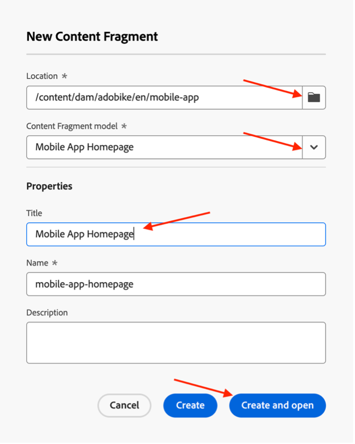

# Creare contenuti per app mobili

## Cos’è la distribuzione di contenuti headless?

Con un sistema di gestione dei contenuti headless, il back-end e il front-end sono ora separati. La parte headless è il back-end del contenuto, in quanto un CMS headless è un sistema di gestione dei contenuti solo back-end, progettato e creato esplicitamente come archivio dei contenuti che li rende accessibili tramite un’API per la visualizzazione su qualsiasi dispositivo.

Il front-end, sviluppato e gestito in modo indipendente, recupera il contenuto dal back-end headless tramite un’API di distribuzione dei contenuti, in genere in formato JSON. Ad esempio, potrebbe trattarsi di un’app web o, nel nostro caso, di un’app mobile.

Un back-end CMS headless richiede in genere la struttura del contenuto, in base a un modello o a uno schema. Questo facilita le applicazioni client che richiedono il contenuto giusto per il rendering di un’esperienza. Alcuni CMS, come l’AEM, possono esporre contenuti strutturati e non strutturati in formato JSON.

Una caratteristica chiave di questa topologia è che il contenuto fornito dal CMS headless in formato JSON è contenuto puro, senza informazioni di progettazione o layout. In un’implementazione CMS headless, tutta la formattazione e il layout vengono mantenuti dall’applicazione front-end separata.

Un vantaggio chiave di una topologia CMS headless è la capacità di riutilizzare i contenuti su più canali, che possono utilizzare diverse implementazioni front-end lato client. Ciò può rendere più efficiente il processo di sviluppo front-end. Ma significa anche che il processo di sviluppo delle esperienze front-end può diventare molto orientato al codice e all’IT, e che l’IT è il principale responsabile dell’esperienza.

## Come funziona la distribuzione di contenuti headless in AEM?

AEM as a Cloud Service è uno strumento flessibile per il modello di implementazione headless che offre tre potenti funzioni:

1. Modelli di contenuto
   - I modelli di contenuto sono rappresentazioni strutturate del contenuto.
   - I modelli di contenuto sono definiti dagli architetti di informazioni nell’editor di modelli per frammenti di contenuto dell’AEM.
   - I modelli di contenuto fungono da base per i frammenti di contenuto.
1. Frammenti di contenuto
   - I frammenti di contenuto vengono creati in base a un modello di contenuto.
   - Creato da autori di contenuti tramite l’editor di frammenti di contenuto AEM.
   - I frammenti di contenuto sono memorizzati in AEM Assets e gestiti nell’interfaccia di amministrazione di Assets.
1. API per la distribuzione dei contenuti
   - L’API GraphQL dell’AEM supporta la distribuzione di frammenti di contenuto.
   - L’API REST di AEM Assets supporta le operazioni CRUD relative ai frammenti di contenuto.
   - La distribuzione diretta dei contenuti è possibile anche con l&#39;esportazione [JSON del componente core Frammento di contenuto](https://experienceleague.adobe.com/docs/experience-manager-core-components/using/components/content-fragment-component.html?lang=it).

## Esercizio

Per questo campo di avvio, ci concentreremo sulla parte dei &quot;contenuti&quot; - dopotutto, è la catena di fornitura dei contenuti che stiamo cercando. Abbiamo già previsto un modello di contenuto, nonché le API di consegna necessarie, in modo da poterti concentrare su ciò che è importante.

Analizziamo prima il nostro modello di contenuto: è il &quot;contratto&quot; che abbiamo con il CMS headless, quindi sappiamo quale contenuto può arrivare e in quale formato.

- Vai all&#39;autore AEM su [https://author-p105462-e991028.adobeaemcloud.com/](https://author-p105462-e991028.adobeaemcloud.com/) e accedi con le credenziali che abbiamo fornito.

- Dal menu Start dell’AEM, seleziona Strumenti \> Generale \> Modelli per frammenti di contenuto

- Nella schermata successiva viene visualizzata una panoramica di tutti i siti che utilizzano contenuti headless. Questo consente di mantenere la governance su più siti headless, senza dover temere che interferiscano tra loro. Nel nostro caso, stiamo lavorando con il nostro sito Adobike, quindi selezionate quel modello.

- In questa cartella possiamo vedere alcuni contenuti tecnici headless che utilizziamo nel sito web di Adobike. Ti interessa saperne di più? Sentiti libero di metterti in contatto. Per il momento, concentriamoci sull’attività prima delle mani: l’app mobile. Passa il puntatore del mouse sulla scheda della homepage dell’app mobile e fai clic sull’icona a forma di matita per aprire il modello di contenuto.

- Nell’Editor modello per frammenti di contenuto è possibile visualizzare i dettagli di un determinato modello di contenuto. Nel nostro caso, possiamo vedere la homepage della nostra app mobile esiste del logo Adobike, un titolo, un testo libero opzionale e un prodotto opzionale in primo piano. Tutti questi elementi sono facili da configurare e aggiornare; pertanto, se il modello di contenuto necessita di elementi aggiuntivi, ciò può essere fatto senza interferenze da parte degli sviluppatori sul lato CMS.

>[!WARNING]
>
> **La modifica del modello di contenuto ha implicazioni più a valle**, in quanto l&#39;app mobile si basa sulla ricezione di determinate informazioni per poter visualizzare gli elementi corretti. Presta particolare attenzione quando aggiorni o rimuovi campi; l’aggiunta di campi non dovrebbe avere alcun impatto.

Ora che abbiamo un’idea di cosa dovrebbero esistere i nostri contenuti, possiamo creare il nostro frammento di contenuto.

- Fai clic sul Logo AEM nell’angolo in alto a sinistra per aprire la navigazione, quindi passa a Navigazione \> Frammenti di contenuto.

- Nell’interfaccia seguente viene mostrata una panoramica di tutti i contenuti esistenti all’interno dell’AEM. I filtri a sinistra possono essere utilizzati per restringere la ricerca di un frammento di contenuto specifico. Per creare un nuovo frammento di contenuto, fai clic sul pulsante &quot;Crea&quot; in alto a destra.

- Nella finestra modale visualizzata, alcuni campi non sono ancora modificabili. Questo è logico: in base a dove creiamo il frammento, saranno disponibili diversi modelli.
  
   - Innanzitutto, seleziona il punto in cui creeremo il frammento facendo clic sull’icona della cartella accanto al campo &quot;Posizione&quot;. Espandi la struttura del contenuto facendo clic sulle cartelle &quot;adobike&quot; \> &quot;en&quot; \> &quot;mobile-app&quot;, quindi conferma la selezione facendo clic sul pulsante &quot;Scegli&quot;.

     
   - Il campo &quot;Modello per frammento di contenuto&quot; è ora modificabile. Fai clic sulla freccia accanto al campo per aprire il menu a discesa e selezionare il modello di contenuto visualizzato in precedenza: &quot;Pagina iniziale app mobile&quot;.
   - Quindi, assegna al frammento di contenuto un titolo significativo (suggerimento: includi il numero del team per trovare facilmente il contenuto). Noterai che il campo &quot;Name&quot; (Nome) si popola automaticamente, per semplificare la tua vita: è il nome che il sistema utilizza per identificare il frammento e che non deve essere toccato.
   - Infine, fai clic sul pulsante &quot;Crea e apri&quot;, che, come indica il nome, creerà il frammento di contenuto e lo aprirà per consentirti di modificarlo immediatamente.

- Qui, il tuo team può decidere quali contenuti mostrare nell’app mobile. 
   - Assicurati di selezionare il numero del tuo team, in modo da poter controllare i contenuti in un secondo momento nell’app mobile.
   - Per selezionare le risorse immagine, fai clic sull’icona della cartella per cercare l’immagine corretta in AEM Assets.
   - Per il prodotto in primo piano, fai clic sull’icona di ricerca del prodotto in modo da poter selezionare facilmente il prodotto Commerce &quot;Adobike 1&quot;, in modo che i dettagli relativi al e-commerce vengano caricati nell’app.
   - Al termine, fai clic sul pulsante Salva per salvare tutti i contenuti creati e pubblicare le modifiche.

     

Ora che abbiamo previsto l’app mobile con alcuni contenuti, siamo pronti a distribuire la nostra campagna.

Passaggio successivo: [Fase 3 - Consegna: verifica app mobile](../delivery/app.md)

[Torna alla Fase 2 - Produzione: Creare annunci per social media](./social.md)

[Torna a tutti i moduli](../../overview.md)
