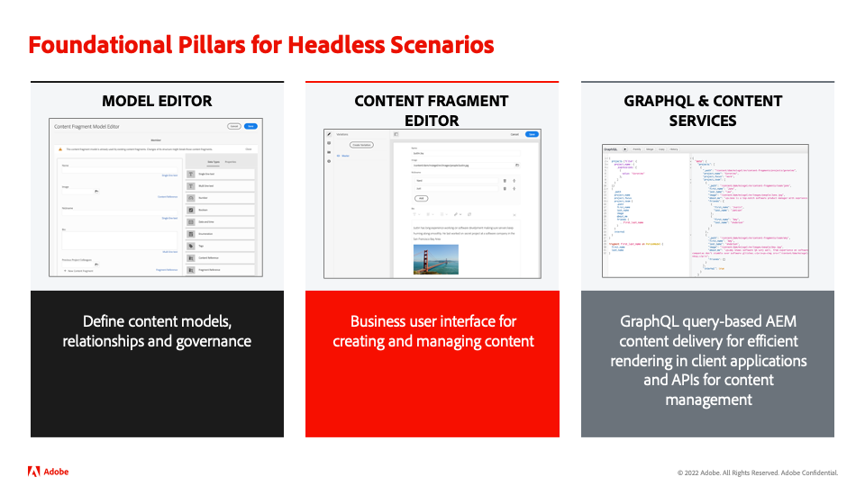
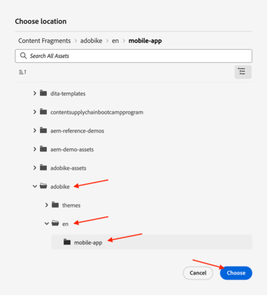

# Creare contenuti app per dispositivi mobili

## Che cos’è la distribuzione headless di contenuti?

Con un sistema di gestione dei contenuti headless, il back-end e il front-end sono ora disaccoppiati. La parte headless è il backend dei contenuti, in quanto un CMS headless è un sistema di gestione dei contenuti back-end, progettato e creato esplicitamente come archivio dei contenuti che rende i contenuti accessibili tramite un’API, per la visualizzazione su qualsiasi dispositivo.

Il front-end, sviluppato e gestito in modo indipendente, recupera il contenuto dal back-end headless tramite un’API di distribuzione dei contenuti, in genere in formato JSON. Ad esempio, potrebbe essere come app web o nel nostro caso come app mobile.

Un back-end CMS headless richiede in genere la struttura del contenuto, in base a un modello o a uno schema. Questo facilita le applicazioni client che richiedono il contenuto giusto per il rendering di un’esperienza. Alcuni CMS, come AEM, possono esporre contenuti strutturati e non strutturati in formato JSON.

Una caratteristica chiave di questa topologia è che il contenuto fornito dal CMS headless in formato JSON è contenuto puro, senza informazioni di progettazione o layout. In un&#39;implementazione CMS headless, tutta la formattazione e il layout vengono mantenuti dall&#39;applicazione front-end disaccoppiata.

Un vantaggio chiave di una topologia CMS headless è la possibilità di riutilizzare i contenuti su più canali, che possono utilizzare implementazioni front-end lato client diverse. Ciò può rendere il processo di sviluppo del front-end più efficiente. Ma significa anche che il processo di sviluppo delle esperienze front-end può diventare molto orientato al codice e all’IT, a tal punto che sarà l’IT a gestire l’esperienza.

## Come funziona la distribuzione di contenuti headless in AEM?

AEM as a Cloud Service è uno strumento flessibile per il modello di implementazione headless che offre tre potenti caratteristiche:

1. Modelli di contenuto
   - I modelli di contenuto sono rappresentazioni strutturate di contenuti.
   - I modelli di contenuto sono definiti dagli architetti di dati nell’editor di modelli per frammenti di contenuto di AEM.
   - I modelli di contenuto fungono da base per i frammenti di contenuto.
1. Frammenti di contenuto
   - I frammenti di contenuto vengono creati in base a un modello di contenuto.
   - Vengono creati dagli autori di contenuti tramite l’editor di frammenti di contenuto di AEM.
   - I frammenti di contenuto sono memorizzati in AEM Assets e gestiti nell’interfaccia di amministrazione di Assets.
1. API per la distribuzione dei contenuti
   - L’API GraphQL di AEM supporta la distribuzione di frammenti di contenuto.
   - L’API REST di AEM Assets supporta le operazioni CRUD relative ai frammenti di contenuto.
   - La distribuzione diretta dei contenuti è possibile anche mediante l’[esportazione JSON del componente core Frammento di contenuto](https://experienceleague.adobe.com/docs/experience-manager-core-components/using/components/content-fragment-component.html?lang=en).

## Esercizio

Per questo bootcamp ci concentreremo sulla parte &quot;content&quot; - dopotutto, è la catena di fornitura dei contenuti che vogliamo. Abbiamo già previsto un modello di contenuto e le API di consegna necessarie, in modo che tu possa concentrarsi su ciò che è importante.

Analizziamo prima il nostro modello di contenuti: è il &quot;contratto&quot; che abbiamo con il CMS headless, così sappiamo a che cosa arriva il contenuto e in quale formato.

- Vai all&#39;autore AEM su [https://author-p105462-e991028.adobeaemcloud.com/](https://author-p105462-e991028.adobeaemcloud.com/) e accedi con le credenziali fornite.

- Dal menu di avvio AEM, selezionare Strumenti \> Generale \> Modelli per frammenti di contenuto

- Nella schermata successiva verrà visualizzata una panoramica di tutti i siti che utilizzano contenuti headless. Questo consente di mantenere la governance su più siti headless, senza dover temere che interferiscano tra loro. Nel nostro caso, stiamo lavorando con il nostro sito Adobe, quindi seleziona quel modello.

- In questa cartella sono disponibili alcuni contenuti tecnici headless utilizzati nel sito web Adobe. Ti interessa saperne di più? Sentiti libero di allungarti. Per il momento, concentriamoci sul compito prima delle mani: l’app mobile. Passa il puntatore del mouse sulla scheda Home page dell’app mobile e fai clic sull’icona a forma di matita per aprire il modello di contenuto.

- Nell’Editor modello frammento di contenuto è possibile visualizzare i dettagli di un determinato modello di contenuto. Nel nostro caso, possiamo vedere la home page della nostra app mobile esiste del logo Adobe, un’intestazione, un testo gratuito opzionale e un prodotto in primo piano opzionale. Tutti questi elementi sono facili da configurare e aggiornare, in modo che se il modello di contenuto richiede elementi aggiuntivi, questo può essere fatto senza interferenze da parte degli sviluppatori sul lato CMS.

>[!WARNING]
>
> **Si prega di notare che la modifica del modello di contenuto ha implicazioni più in basso**, poiché l’app mobile si basa sulla ricezione di determinate informazioni per poter visualizzare gli elementi corretti. Presta particolare attenzione durante l’aggiornamento o la rimozione dei campi, l’aggiunta di campi non dovrebbe avere alcun impatto.

Ora che abbiamo un&#39;idea di cosa dovrebbe esistere il nostro contenuto, possiamo creare un frammento di contenuto.

- Fai clic sul Logo AEM nell’angolo in alto a sinistra per aprire la navigazione, quindi passa a Navigazione \> Frammenti di contenuto.

- Nell’interfaccia seguente viene visualizzata una panoramica di tutti i contenuti esistenti all’interno di AEM. I filtri a sinistra possono essere utilizzati per limitare l’ambito se stai cercando un frammento di contenuto specifico. Per creare un nuovo frammento di contenuto, fai clic sul pulsante &quot;Crea&quot; in alto a destra.

- Nel modale che si apre, alcuni campi non sono ancora modificabili. Questo è logico: in base a dove creiamo il frammento, saranno disponibili modelli diversi.
   
   - Innanzitutto, seleziona la posizione in cui creeremo il frammento facendo clic sull’icona della cartella accanto al campo &quot;Posizione&quot;. Espandi la struttura del contenuto facendo clic sulle cartelle &quot;adobike&quot; \> &quot;en&quot; \> &quot;mobile-app&quot;, quindi conferma la selezione facendo clic sul pulsante &quot;Choose&quot;.
      
   - Il campo &quot;Modello frammento di contenuto&quot; è ora modificabile. Fai clic sulla freccia accanto al campo per aprire il menu a discesa e selezionare il modello di contenuto visualizzato in precedenza: &quot;Home page app mobile&quot;.
   - Quindi, assegna un titolo significativo al frammento di contenuto (suggerimento: includere il numero del team per reperire facilmente i contenuti). Noterai che il campo &quot;Nome&quot; viene compilato automaticamente, in modo da semplificare la tua vita: è il nome utilizzato dal sistema per identificare il frammento e non deve essere toccato.
   - Infine, fai clic sul pulsante &quot;Crea e apri&quot;, che verrà visualizzato come nome indica la creazione del frammento di contenuto e lo aprirà in modo da poterlo modificare immediatamente.

- In questo caso, il team può decidere quale contenuto visualizzare nell’app mobile. 
   - Assicurati di selezionare il numero del team, in modo da poter controllare il contenuto in un secondo momento nell&#39;app mobile.
   - Per selezionare le risorse immagine, fai clic sull’icona della cartella per cercare l’immagine corretta in AEM Assets.
   - Per il prodotto in questione, fai clic sull’icona di ricerca del prodotto per selezionare facilmente il nostro prodotto Commerce &quot;Adobe 1&quot;, in modo che i dettagli relativi all’e-commerce vengano caricati nell’app.
   - Assicurati di fare clic sul pulsante &quot;Salva&quot; quando hai finito per salvare tutti i contenuti creati e pubblicare le modifiche.
      

Ora che abbiamo previsto l’app mobile con alcuni contenuti, siamo pronti a distribuire la nostra campagna.

Passaggio successivo: [Fase 3 - Consegna: Verificare l’app mobile](../delivery/app.md)

[Torna alla fase 2 - Produzione: Crea annuncio social media](./social.md)

[Torna a tutti i moduli](../../overview.md)
