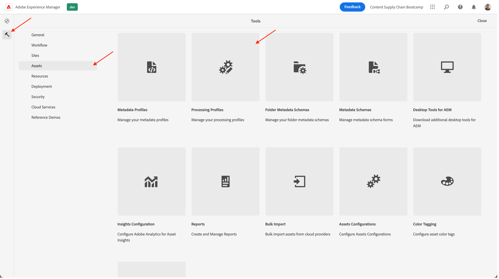
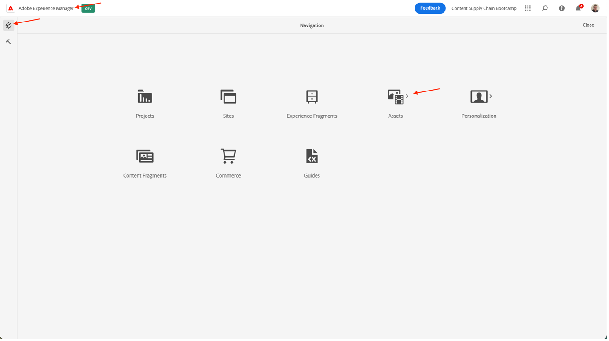

# Creare il banner della homepage del prodotto

## Produzione del banner

L’automazione dei contenuti porta la potenza di Adobe Creative Cloud a Experience Manager Assets, offrendo agli addetti al marketing la possibilità di automatizzare la produzione delle risorse su larga scala, velocizzando notevolmente la creazione delle varianti. Usiamo queste funzionalità per generare un banner da utilizzare sulla homepage!

- Vai all&#39;autore AEM su [https://author-p105462-e991028.adobeaemcloud.com/](https://author-p105462-e991028.adobeaemcloud.com/) e accedi con le credenziali fornite.

- Dalla home page, passa a Strumenti \> Risorse \> Profili elaborazione.

- Nell’interfaccia di vengono visualizzati tutti i profili di elaborazione esistenti. Questi possono essere utilizzati per abilitare determinate automazioni.

- I seguenti sono di tuo interesse:
   - Banner Adobe scuro: crea un banner Adobe con sovrapposizione scura, in base alla risorsa selezionata
      
   - Luce banner Adobe: crea un banner Adobe con una sovrapposizione leggera, in base alla risorsa selezionata
      
   - Verde banner Adobe: crea un banner Adobe con una sovrapposizione verde, in base alla risorsa selezionata
      

- Dopo aver scelto il tipo di banner che si desidera creare, selezionare il profilo di elaborazione, quindi selezionare &quot;Applica profilo alle cartelle&quot;.

- Nella schermata successiva, individua la cartella del team in AEM Assets. Quindi, dall&#39;alto a sinistra, seleziona il pulsante &quot;Crea&quot; per creare una nuova cartella e assegnargli un nome significativo, ad esempio &quot;Crea banner scuro&quot;.

- Dopo aver creato la cartella, selezionare la casella accanto al suo nome, quindi fare clic sul pulsante &quot;Applica&quot; in alto a destra.

Ora che abbiamo fatto la configurazione necessaria, generiamo il nostro banner.

- Fai clic sul Logo AEM nell’angolo in alto a sinistra per aprire la navigazione, quindi vai a Navigazione \> Risorse \> File.

- Individua la cartella &quot;Risorse Adobe generate&quot; e aprila facendo clic sulla scheda . Qui vengono visualizzati i banner generati.

- Apri una nuova scheda e passa di nuovo a AEM Assets. Quindi, accedi alla cartella a cui è stato applicato il profilo di elaborazione.

- Nella cartella , carica l’immagine per la quale vuoi creare un banner trascinandola e rilasciandola sul browser oppure facendo clic su Crea file nell’angolo in alto a destra dell’interfaccia.

- Attendi un minuto per l’elaborazione della risorsa, quindi ricarica lo schermo. Se trovi la risorsa nello stato &quot;Nuovo&quot;, sai che è stata elaborata.

- Torna alla scheda precedente e ricarica la schermata anche qui. Dovresti notare una nuova risorsa nello stato &quot;Nuovo&quot;. Questo è il nostro banner generato, tutto dal DAM! Non la vedi ancora? Attendi un altro minuto, quindi ricarica lo schermo.

>[!NOTE]
>
> Non sei soddisfatto del risultato? Puoi applicare un altro profilo di elaborazione alla cartella e ricaricare la risorsa per generare un banner diverso (o ovviamente caricare un’altra risorsa). Durante il ricaricamento, il sistema ti chiederà cosa vuoi fare con la risorsa esistente, seleziona &quot;Sostituisci&quot;.
> 

Ora disponiamo del banner generato che possiamo utilizzare in seguito durante la distribuzione della campagna. Assicurati di pubblicare il banner selezionandolo, quindi cliccando sul pulsante &quot;Pubblicazione rapida&quot; sulla barra multifunzione.

## Follow-up in Workfront

Se hai bisogno di un processo formale e verificabile di revisione e approvazione delle tue risorse, Workfront è il posto giusto per essere.

>[!NOTE]
>
> Anche se lo menzioniamo esplicitamente qui, è l&#39;intenzione di aggiornare le attività in Workfront dopo averle completate. Devi sempre cercare un flusso Crea > Rivedi > Approva .

- Torniamo al nostro progetto ed espandiamo il pannello &#39;Go/No Go Banner Review&#39; per aprire l&#39;attività facendo clic su di esso:

- Fai clic sulla sezione documenti dell&#39;attività (colonna a sinistra), quindi fai clic sulla cartella collegata AEM Assets &quot;Finale&quot;. Seleziona la risorsa facendo clic sulla relativa zona e fai clic su &quot;Crea bozza&quot;. Una prova è la capacità di controllare il contenuto, ad esempio immagine, testo, video, sito web, ecc., in modo strutturato e collaborativo, dove vengono raccolti commenti, correzioni, modifiche dei soggetti interessati, versioni e risultati possono essere confrontati e approvati definitivamente con un solo clic.

- Poiché vogliamo un processo di approvazione elaborato, seleziona &quot;Proof avanzato&quot;.

>[!NOTE]
>
> Decideremo manualmente chi esaminerà e/o approverà le nostre prove in questo bootcamp. Nella maggior parte dei casi d’uso reali, utilizzeremmo un modello predefinito di flusso di approvazione già definito per ciascun tipo di prova.

- Per impostazione predefinita, siamo in un tipo di flusso di lavoro &quot;base&quot; e sceglieremo il tuo Workfront Bootcamp Specialist come revisore e approvatore. Digita il nome del tuo Specialist Workfront Bootcamp dove c&#39;è scritto &#39;Digita il nome del contatto o l&#39;indirizzo e-mail per aggiungere un destinatario:

- Imposta come &#39;Revisore e approvatore&#39;:

- Fai clic su &quot;Crea prova&quot;. Workfront impiegherà alcuni minuti per generare la bozza:

- I Workfront Specialist avranno ricevuto una nuova notifica per informarli di disporre di una prova per la revisione e/o l&#39;approvazione:

- Dopo aver fatto clic sulla notifica, verranno mostrate le tue prove e saranno in grado di commentare e/o approvare questa bozza.

   - Possono fare clic su &quot;Aggiungi commento&quot; nella parte superiore dello schermo se hanno osservazioni:

   

   - Potranno quindi non solo aggiungere commenti, ma anche utilizzare la piccola barra degli strumenti puntatori per definire chiaramente quale area deve essere modificata.

   

   - Aggiungendo il commento, è possibile comunicare che è necessario eseguire un ulteriore lavoro su una nuova versione della bozza. Aggiorna la scheda Workfront e avrai una nuova notifica che ti informa esattamente di questo. Una volta che sai quali modifiche devi apportare, apporta le modifiche in AEM e quindi vieni a caricare la nuova versione qui:

   

   - Seleziona la risorsa aggiornata (se non sono necessarie modifiche nello scenario di bootcamp, carica di nuovo la stessa risorsa) e fai clic su &quot;Collega&quot;:

   

   - Quindi, fai clic su &quot;crea bozza&quot; sul lato destro.

   

   - Una volta generata la prova (che può richiedere alcuni minuti), il tuo Workfront Specialist riceverà una notifica e sarà in grado di rivedere e, si spera, approvare questa nuova versione.  Ad esempio, utilizzando il pulsante di confronto delle prove, è possibile vedere un confronto affiancato tra V1 e V2 e tutti i commenti effettuati.

   

   

   

Ora abbiamo un&#39;approvazione formale per l&#39;uso del nostro banner. È facile seguire dove siamo nel processo, e gli aggiornamenti che si fanno attivare automaticamente le notifiche, in modo da poter lavorare nel modo più efficiente possibile.

Passaggio successivo: [Fase 2 - Produzione: Crea annuncio social media](./social.md)

[Torna alla fase 1 - Pianificazione: Altri lavori preliminari](../planning/prework.md)

[Torna a tutti i moduli](../../overview.md)
