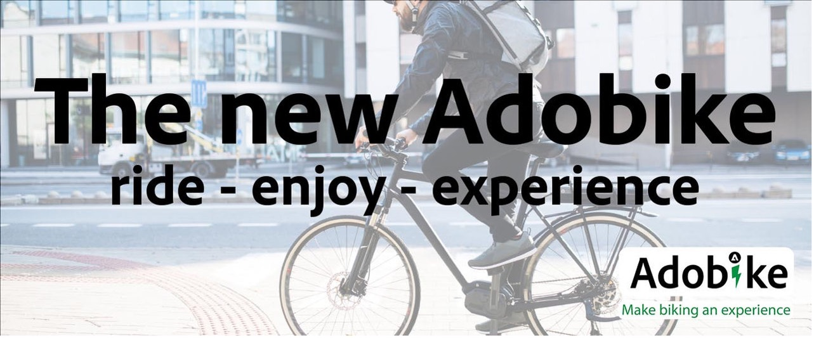
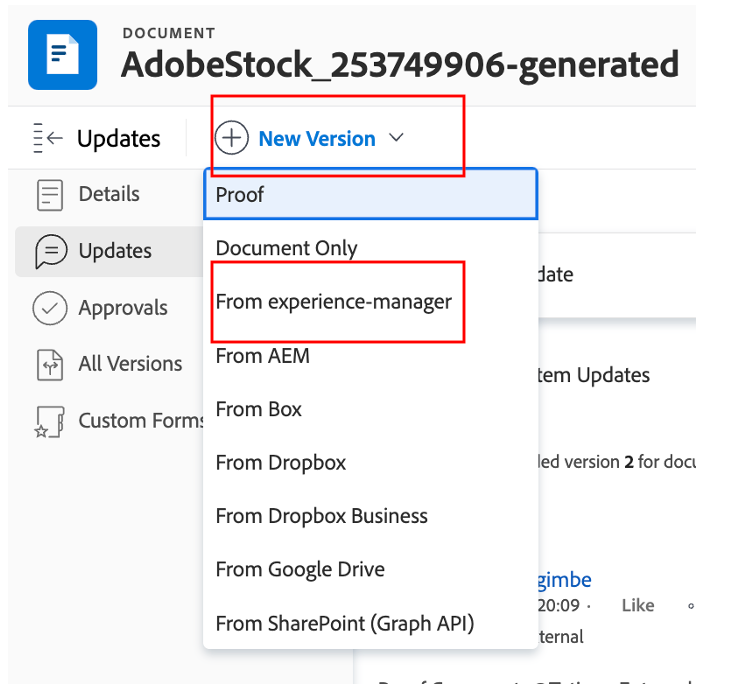

# Banner per creare la home page del prodotto

## Produzione del banner

L’automazione dei contenuti porta la potenza di Adobe Creative Cloud a Experience Manager Assets, consentendo agli addetti al marketing di automatizzare la produzione delle risorse su larga scala, velocizzando notevolmente la creazione di varianti. Usiamo queste funzionalità per generare un banner da utilizzare nella home page.

- Vai all&#39;autore AEM su [https://author-p105462-e991028.adobeaemcloud.com/](https://author-p105462-e991028.adobeaemcloud.com/) e accedi con le credenziali che abbiamo fornito.

- Dalla home page, passa a Strumenti \> Assets \> Profili di elaborazione.

- Nell’interfaccia vengono visualizzati tutti i profili di elaborazione esistenti. Questi possono essere utilizzati fino a per abilitare determinate automazioni.

- Di seguito sono elencate le opzioni più interessanti:
   - Adobike Banner Dark: crea un banner Adobike con una sovrapposizione scura, basato sulla risorsa selezionata

     
   - Adobike Banner Light: crea un banner Adobike con una sovrapposizione leggera, in base alla risorsa selezionata

     
   - Adobike Banner Green: crea un banner Adobike con una sovrapposizione verde, in base alla risorsa selezionata

     

- Dopo aver scelto il tipo di banner da creare, seleziona il profilo di elaborazione, quindi seleziona &quot;Applica profilo a cartelle&quot;.

- Nella schermata successiva, individua la cartella del team in AEM Assets. Quindi, dalla parte superiore sinistra, seleziona il pulsante &quot;Crea&quot; per creare una nuova cartella e assegnargli un nome significativo, ad esempio &quot;Crea banner scuro&quot;.

- Dopo aver creato la cartella, seleziona la casella accanto al nome, quindi fai clic sul pulsante &quot;Applica&quot; a destra in alto.

Ora che abbiamo fatto la configurazione necessaria, generiamo il nostro banner.

- Fai clic sul Logo AEM nell’angolo in alto a sinistra per aprire la navigazione, quindi passa a Navigazione \> Assets \> File.

- Individua la cartella &quot;Generated Adobike Assets&quot; e aprila facendo clic sulla scheda. Qui verranno visualizzati i banner generati.

- Apri una nuova scheda e passa di nuovo ad AEM Assets. Quindi, passa alla cartella in cui è stato applicato il profilo di elaborazione.

- Nella cartella, carica l’immagine per la quale vuoi creare un banner trascinandola e rilasciandola sul browser o facendo clic su Crea \> File nell’angolo in alto a destra dell’interfaccia.

- Attendi un minuto per l’elaborazione della risorsa, quindi ricarica lo schermo. Se la risorsa è nello stato &quot;Nuovo&quot;, l’elaborazione è completata.

- Torna alla scheda precedente e ricarica la schermata qui. Dovresti notare una nuova risorsa che si trova nello stato &quot;Nuovo&quot;. Questo è il nostro banner generato, tutto dal DAM! Non lo vedi ancora? Attendi un altro minuto, quindi ricarica lo schermo.

>[!NOTE]
>
> Non sei soddisfatto del risultato? Puoi applicare un altro profilo di elaborazione alla cartella e ricaricare la risorsa per generare un banner diverso (o ovviamente caricare un’altra risorsa). Durante il ricaricamento, il sistema ti chiederà cosa vuoi fare con la risorsa esistente e seleziona &quot;Sostituisci&quot;.
> 

Ora abbiamo il banner generato che possiamo utilizzare in un secondo momento durante la consegna della nostra campagna. Assicurarsi di pubblicare il banner selezionandolo, quindi facendo clic sul pulsante &quot;Publish rapido&quot; sulla barra multifunzione.

## Follow-up in Workfront

Se hai bisogno di un processo di revisione e approvazione formale e verificabile del tuo Assets, Workfront è il posto giusto.

>[!NOTE]
>
> Anche se qui viene menzionato esplicitamente, si tratta dell’intenzione di aggiornare le attività in Workfront dopo averle completate. Devi sempre cercare un flusso Crea > Revisione > Approva.

- Torniamo al nostro progetto ed espandiamo il pannello a soffietto &#39;Go/No Go Banner Review&#39; per aprire tale attività facendo clic su di essa:

- Fai clic sulla sezione documenti dell’attività (colonna a sinistra), quindi fai clic sulla cartella collegata AEM Assets &quot;Final&quot;. Seleziona la nostra risorsa facendo clic sulla sua zona e fai clic su &quot;Crea bozza&quot;. Una bozza è la capacità di correggere in modo strutturato e collaborativo i contenuti, ad esempio immagini, testo, video, siti web ecc., in cui si raccolgono i commenti, le correzioni, le modifiche delle parti interessate coinvolte, si possono confrontare le versioni e i risultati e si può procedere all’approvazione finale con un solo clic.

- Poiché si desidera un processo di approvazione elaborato, selezionare &quot;Advanced Proof&quot; (Bozza avanzata).

>[!NOTE]
>
> Decideremo manualmente chi rivedrà e/o approverà la bozza in questo campo di avvio. Nella maggior parte dei casi d’uso reali, utilizzeremmo un modello predefinito di flussi di approvazione già definiti per ogni tipo di bozza.

- Per impostazione predefinita, il flusso di lavoro è di tipo &quot;base&quot; e sceglieremo il tuo specialista di bootcamp Workfront come revisore e approvatore. Digitare il nome dello specialista di Workfront Bootcamp in cui è indicato &#39;Digitare il nome del contatto o l&#39;indirizzo di posta elettronica per aggiungere un destinatario:

- Impostale come &quot;Revisore e Approvatore&quot;:

- Fai clic su &quot;Crea bozza&quot;. La generazione della bozza in Workfront richiede alcuni minuti:

- Ora i Workfront Specialist Dealer ricevono una nuova notifica con la quale si informano della disponibilità di una bozza da rivedere e/o approvare:

- Dopo aver fatto clic sulla notifica, l’utente verrà inserito nella bozza e potrà inserire alcuni commenti e/o approvare la bozza.

   - Se hanno delle osservazioni, possono fare clic su &quot;Aggiungi commento&quot; nella parte superiore dello schermo:

  

   - Potranno quindi non solo aggiungere commenti, ma anche utilizzare la piccola barra degli strumenti dei puntatori per definire chiaramente quale area deve essere modificata.

  

   - Aggiungendo il commento, si può sapere che è necessario fare qualche lavoro extra su una nuova versione della bozza. Aggiorna la scheda Workfront e riceverai una nuova notifica che ti informa esattamente di questo. Una volta comprese le modifiche da apportare, effettuate le modifiche in AEM e caricate la nuova versione qui:

  

   - Seleziona la risorsa aggiornata (se non sono necessarie modifiche nello scenario di bootcamp, carica nuovamente la stessa risorsa) e fai clic su &quot;Collegamento&quot;:

  

   - Quindi, fai clic su &quot;crea bozza&quot; sul lato destro.

  

   - Una volta generata la bozza (l&#39;operazione può richiedere alcuni minuti), il tuo Workfront Specialist riceverà una notifica e potrà rivedere e, si spera, approvare questa nuova versione.  Ad esempio, utilizzando il pulsante per il confronto delle bozze, è possibile visualizzare un confronto affiancato di V1 e V2 con tutti i commenti inseriti.

  

  

  

Ora disponiamo di un&#39;approvazione formale per l&#39;utilizzo del banner. È facile seguire la nostra posizione nel processo e gli aggiornamenti che effettui attivano automaticamente le notifiche, in modo da poter lavorare nel modo più efficiente possibile.

Passaggio successivo: [Fase 2 - Produzione: creare annunci per social media](./social.md)

[Torna alla Fase 1 - Pianificazione: altre attività preliminari](../planning/prework.md)

[Torna a tutti i moduli](../../overview.md)
