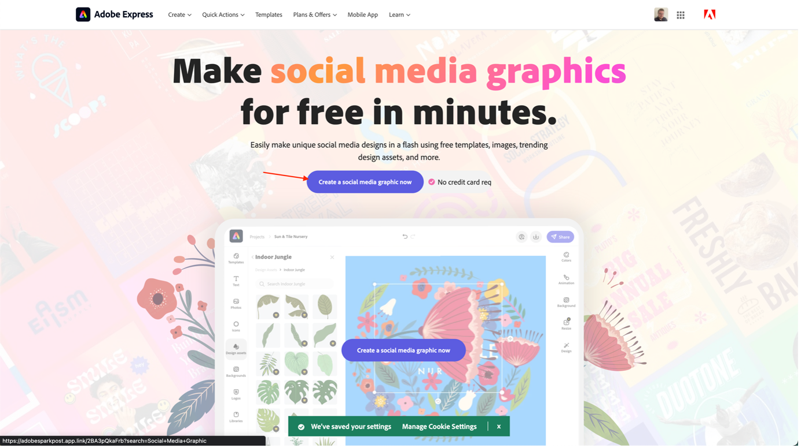

# Crea annuncio social media

Sia che tu sia un&#39;azienda che cerca di raggiungere il tuo pubblico target o solo un individuo che condivide il tuo video, l&#39;Adobe Express può aiutarti a creare incredibili immagini sui social media per qualsiasi piattaforma. Se ti trovi a corto di idee, esplora la libreria dei modelli per avviare la tua creatività. L&#39;Adobe Express viene caricato con migliaia di grafici per social media professionali come gli esempi qui sotto, insieme a immagini, icone e grafici gratuiti che puoi trascinare e rilasciare direttamente sul tuo design.

- Passa a [Adobe Express](https://www.adobe.com/express/create/social-media-graphic) e fai clic sul pulsante &quot;Crea un elemento grafico per social media ora&quot; per iniziare.

- Se questa è la prima volta che utilizzi l’Adobe Express, fai clic sul pulsante &quot;Accetto di continuare&quot; nel modale che compare per iniziare.

- Dalla barra laterale a sinistra, seleziona la casella &quot;Gratis&quot; per ottenere una panoramica dei modelli gratuiti di Adobe Express, quindi seleziona il tipo di grafico che hai deciso con il tuo team. Nel nostro caso, pubblicheremo un post su Instagram; fai clic semplicemente sul modello da caricare nell’editor.

- Una volta che sei soddisfatto del tuo post, fai clic sul pulsante &quot;Scarica&quot; in alto a destra per scaricare il tuo post sui social media nel tuo formato preferito. Tenetela in un posto sicuro, ne avremo bisogno più tardi!

>[!NOTE]
>
>**Lo sapevi?**\
>L&#39;Adobe Express si evolve sempre, così come tutti i nostri prodotti all&#39;Adobe. Ecco perché siamo entusiasti di annunciare la nostra prossima integrazione tra Adobe Express e AEM Assets. In questo modo potrai utilizzare le risorse del tuo marchio in Adobe Express e salvare direttamente il risultato in Adobe Express.

Passaggio successivo: [Fase 2 - Produzione: Creare contenuti app per dispositivi mobili](./app.md)

[Torna alla fase 2 - Produzione: Creare il banner della homepage del prodotto](./banner.md)

[Torna a tutti i moduli](../../overview.md)
