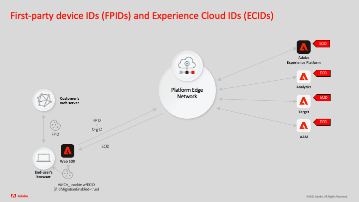

# Generare gli D dispositivo di prime parti

Le applicazioni Adobe Experience Cloud hanno generato cookie per memorizzare gli ID dei dispositivi utilizzando diverse tecnologie, tra cui:

1. Cookie di terze parti
1. Cookie di prime parti impostati da un server Adobe utilizzando la configurazione CNAME di un nome di dominio
1. Cookie di prime parti impostati da JavaScript

Le recenti modifiche apportate al browser limitano la durata di questi tipi di cookie. I cookie di prime parti sono più efficaci quando vengono impostati utilizzando un server di proprietà del cliente che utilizza un record A/AAAA DNS anziché un CNAME DNS. La funzionalità FPID (Device ID) di prime parti consente ai clienti che implementano Adobe Experience Platform Web SDK di utilizzare gli ID dispositivo nei cookie dei server che utilizzano record A/AAAA DNS. Questi ID possono quindi essere inviati ad Adobe e utilizzati come semi per generare ID Experience Cloud (ECID), che rimane l’identificatore principale nelle applicazioni Adobe Experience Cloud.

Ecco un rapido esempio di come funziona la funzionalità:



1. Il browser di un utente finale richiede una pagina web dal server web o dalla rete CDN di un cliente.
1. Il cliente genera un ID dispositivo (FPID) sul proprio server web o CDN (il server web deve essere associato al record A/AAAA del nome di dominio).
1. Il cliente imposta un cookie di prime parti per memorizzare il FPID nel browser dell’utente finale.
1. L’implementazione Adobe Experience Platform Web SDK del cliente invia una richiesta a Platform Edge Network, incluso il FPID nella mappa identità.
1. Experience Platform Edge Network riceve il FPID e lo utilizza per generare un ID Experience Cloud (ECID).
1. La risposta dell’SDK per web di Platform invia nuovamente l’ECID al browser dell’utente finale.
1. Se la `idMigrationEnabled=true`, l’SDK per web di Platform utilizza JavaScript per memorizzare l’ECID come `AMCV_` nel browser dell’utente finale.
1. In caso di `AMCV_` il cookie scade, il processo si ripete. Se è disponibile lo stesso ID dispositivo di prima parte, viene visualizzato un nuovo `AMCV_` viene creato con lo stesso valore ECID di prima.

>[!NOTE]
>
>La `idMigrationEnabled` non deve essere impostato su `true` per utilizzare FPID. Con `idMigrationEnabled=false` potresti non visualizzare un `AMCV_` cookie, tuttavia, e dovrà cercare il valore ECID nella risposta di rete.


Per questa esercitazione, viene utilizzato un esempio specifico che utilizza il linguaggio di script PHP per mostrare come:

* Generare un UUIDv4
* Scrivi il valore UUIDv4 in un cookie
* Includi il valore del cookie nella mappa di identità
* Convalidare la generazione ECID

Per ulteriori informazioni sugli ID dispositivo di prime parti, consulta la documentazione del prodotto.

## Generare un UUIDv4

PHP non dispone di una libreria nativa per la generazione UID, quindi questi esempi di codice sono più estesi di quanto sarebbe probabilmente necessario se venisse utilizzato un altro linguaggio di programmazione. PHP è stato scelto per questo esempio perché è una lingua ampiamente supportata lato server.


Quando viene chiamata la seguente funzione, genera una versione UUID casuale-4:

```
<?php
    
    function guidv4($data)
    {
        $data = $data ?? random_bytes(16);

        $data[6] = chr(ord($data[6]) & 0x0f | 0x40); // set version to 0100
        $data[8] = chr(ord($data[8]) & 0x3f | 0x80); // set bits 6-7 to 10

        return vsprintf('%s%s-%s-%s-%s-%s%s%s', str_split(bin2hex($data), 4));
    }

?>
```

## Scrivi il valore UUIDv4 in un cookie

Il codice seguente invia una richiesta alla funzione di cui sopra per generare un UUID. Quindi imposta i flag di cookie decisi dalla tua organizzazione. Se un cookie è già stato generato, la scadenza viene estesa.

```
<?php

    if(!isset($_COOKIE['FPID'])) {
        $cookie_value = guidv4(openssl_random_pseudo_bytes(16));        
        $arr_cookie_options = array (
        'expires' => time() + 60*60*24*30*13,
        'path' => '/',
        'domain' => 'mysiteurl.com',
        'secure' => true,
        'httponly' => true,
        'samesite' => 'lax'
        );
        setcookie($cookie_name, $cookie_value, $arr_cookie_options);
        $_COOKIE[$cookie_name] = $cookie_value;
    }
    else {
        $cookie_value = $_COOKIE[$cookie_name];
        $arr_cookie_options = array (
        'expires' => time() + 60*60*24*30*13,
        'path' => '/',
        'domain' => 'mysiteurl.com',
        'secure' => true,
        'httponly' => true,
        'samesite' => 'lax'
        );
        setcookie($cookie_name, $cookie_value, $arr_cookie_options);
    }

?>
```

>[!NOTE]
>
>Il cookie che contiene l’ID dispositivo di prima parte può avere qualsiasi nome.

## Includere il valore del cookie nella mappa identità

Il passaggio finale è quello di utilizzare PHP per echeggiare il valore del cookie nella mappa di identità.


```
{
    "identityMap": {
        "FPID": [
                    {
                        "id": "<? echo $_COOKIE[$cookie_name] ?>",
                        "authenticatedState": "ambiguous",
                        "primary": true
                    }
                ]
        }
}
```

>[!IMPORTANT]
>
>Il simbolo dello spazio dei nomi di identità utilizzato nella mappa di identità deve essere chiamato `FPID`.
>
> `FPID` è uno spazio dei nomi di identità riservato che non è visibile negli elenchi di nomi di identità dell’interfaccia.


## Convalidare la generazione ECID

Convalida l’implementazione verificando che lo stesso ECID sia generato dal tuo ID dispositivo di prima parte:

1. Genera un cookie FPID.
1. Invia una richiesta a Platform Edge Network utilizzando Platform Web SDK.
1. Un cookie con il formato `AMCV_<IMSORGID@AdobeOrg>` viene generato. Questo cookie contiene l&#39;ECID.
1. Prendi nota del valore del cookie generato e quindi elimina tutti i cookie per il tuo sito tranne `FPID` cookie.
1. Invia un’altra richiesta a Platform Edge Network.
1. Conferma il valore nella `AMCV_<IMSORGID@AdobeOrg>` il cookie è lo stesso `ECID` come in `AMCV_` cookie eliminato. Se il valore del cookie è lo stesso per un FPID specifico, il processo di seeding per l’ECID ha avuto esito positivo.

Per ulteriori informazioni su questa funzione, consulta [la documentazione](https://experienceleague.adobe.com/docs/experience-platform/edge/identity/first-party-device-ids.html).
