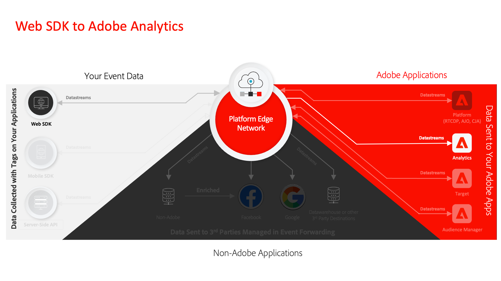

# Tutorial su Raccolta dati

Data Collection è la soluzione Adobe di nuova generazione per la gestione di tag per siti web e SDK per dispositivi mobili. La raccolta dati offre ai clienti un modo semplice di implementare e gestire le soluzioni di analisi, marketing e annunci pubblicitari necessarie per fornire ai clienti esperienze personalizzate. Segui questi video e tutorial per imparare a usare questa tecnologia fondamentale.

## Guide all&#39;implementazione

<table>
<tr>
  <td>
    
    

      <a href="https://experienceleague.adobe.com/it/docs/platform-learn/implement-web-sdk/overview" target="_blank">
    <strong>Implementare Experience Cloud con Web SDK</strong>
    </a>
    

    

    <em>Utilizza i tag per implementare Platform Web SDK</em>
    

  </td>
  <td>
    
    

      <a href="https://experienceleague.adobe.com/it/docs/platform-learn/implement-mobile-sdk/overview" target="_blank">
    <strong>Implementare Experience Cloud nelle app per dispositivi mobili</strong>
    </a>
    

    

    <em>Utilizza i tag per implementare Platform Mobile SDK</em>
    

  </td>
  <td>
    
    

      <a href="https://experienceleague.adobe.com/it/docs/platform-learn/migrate-target-to-websdk/introduction" target="_blank">
    <strong>Implementa librerie legacy con tag</strong>
    </a>
    

    

    <em>Utilizza i tag per implementare le librerie legacy di Analytics, Target e Audience Manager</em>
    

  </td>
</tr>
</table>

## Guide alla migrazione

<table>
<tr>
  <td>
    
    

      <a href="https://experienceleague.adobe.com/it/docs/platform-learn/migrate-target-to-websdk/introduction" target="_blank">
    <strong>Migrazione da Adobe Target a Web SDK</strong>
    </a>
    

    

    <em>Sostituisci at.js con Web SDK</em>
    

  </td>
  <td>
    
    

      <a href="https://experienceleague.adobe.com/it/docs/platform-learn/migrate-analytics-to-websdk/migration-to-websdk-overview" target="_blank">
    <strong>Eseguire la migrazione da Adobe Analytics a Web SDK nei tag</strong>
    </a>
    

    

    <em>Sostituisci AppMeasurement.js con Web SDK con i tag</em>
    

  </td>
  <td>
      
    </a>
    

      <strong>Migrazione da Adobe Audience Manager a Web SDK</strong>
    

    

    <em>Sostituisci <a href="https://experienceleague.adobe.com/it/docs/audience-manager/user-guide/migrate-to-web-sdk/dil-extension-to-web-sdk" target="_blank">dil.js</a> o <a href="https://experienceleague.adobe.com/it/docs/audience-manager/user-guide/migrate-to-web-sdk/appmeasurement-to-web-sdk" target="_blank">aggiorna inoltro lato server</a></em>
    

  </td>
</tr>
<tr>
  <td>
    
    

      <a href="https://experienceleague.adobe.com/it/docs/platform-learn/migrate-target-to-mobile-sdk-decisioning/overview" target="_blank">
    <strong>Migrazione da Adobe Target a Mobile SDK su Edge Network</strong>
    </a>
    

    

    <em>Sostituisci l'estensione Target con l'estensione Offer Decisioning e Target</em>
    

  </td>
  <td>
  </td>
  <td>
  </td>
  </tr>
</table>

*Apple, il logo Apple, iPad, iPhone, iPod e iPod touch sono marchi registrati di Apple Inc., registrati negli Stati Uniti e in altri paesi. Swift e il logo Swift sono marchi di Apple Inc.*
