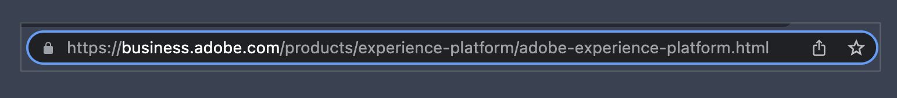

# API 101: introduzione di base alle API

API sta per Application Programming Interface (Interfaccia di programmazione delle applicazioni). Significa proprio quello che dice—ci sono interfacce tra i programmi e queste interfacce permettono a quei programmi di comunicare. Quando i programmatori sviluppano applicazioni software, spesso hanno bisogno del loro software per comunicare con altri software o hardware. L’API definisce cosa, come, quando, dove e perché per tali comunicazioni e interazioni.

Le API sono un modo per risolvere le sfide aziendali con il software. Nella maggior parte delle aziende, si tratta di uno sforzo collaborativo. La collaborazione è sempre più semplice grazie a una comprensione condivisa di termini, concetti e passaggi chiave.

Se pensi di fare clic su un collegamento in una pagina web, il browser utilizza un certo numero di API quando fai clic sul collegamento. Il browser riconosce il clic, effettua la richiesta per la pagina che desideri visitare, recupera la pagina su Internet e quindi la visualizza sullo schermo. Ci sono molti passaggi più piccoli nel mezzo, ma il tuo browser è un software che comunica e interagisce con una varietà di API solo per mostrarti una pagina web. In questo articolo verranno evidenziati termini, concetti e passaggi importanti durante l’utilizzo o la discussione delle API.

Entro la fine di questo articolo è necessario avere una chiara comprensione di questi termini fondamentali, concetti e passaggi. La documentazione API può essere ampia e le discussioni sull’utilizzo delle API per affrontare casi d’uso specifici possono diventare molto dettagliate. Navigare nella documentazione e discutere delle API è più semplice e produttivo con nozioni di base chiare e una comprensione condivisa.

>[!NOTE]
>
> Anche se sono presenti molte API, qui l’attenzione sarà concentrata sulle API Web e del browser: in sostanza, quando un’applicazione software interagisce con un’altra tramite Internet.

## Termini e concetti dell’API

Cosa significa una parola o frase, e come posso pensarci in modo semplice e semplice? In un’API, la parte &quot;application&quot; indica un’applicazione software o un programma. La parte &quot;interfaccia di programmazione&quot; si riferisce a come e dove un&#39;applicazione interagisce con un&#39;altra applicazione per determinati scopi. Nell’esempio della nostra pagina web, quando fai clic su un collegamento, il browser invia una richiesta a un server per la pagina web.


In questa schermata il cursore del mouse passa sopra il collegamento Adobe Experience Platform. In basso è la barra di stato del browser web che mostra &quot;l&#39;indirizzo&quot; della pagina che il browser otterrà. In altre parole, facendo clic sul collegamento Adobe Experience Platform si comunica al browser di &quot;ottenere la pagina per me in modo che io possa visualizzarla qui sullo schermo&quot;.

Quando si fa clic su un collegamento, il browser invia una richiesta al server per ottenere una pagina. Questa è una richiesta `GET`, uno dei metodi di richiesta comunemente utilizzati con le API web. Una cosa che il browser deve soddisfare la richiesta è la pagina &quot;indirizzo&quot; - dove si trova sul web?

### Parti di un URL



La maggior parte dei browser dispone di una &quot;barra degli indirizzi&quot; che mostra tutto o parte dell’&quot;indirizzo&quot; di una pagina web. Quando il browser &quot;ottiene&quot; la pagina del collegamento su cui abbiamo fatto clic, visualizza l’&quot;indirizzo&quot; della pagina in questa barra degli indirizzi. Quindi qual è l&#39;&quot;indirizzo&quot; di una pagina web?

`https://business.adobe.com/products/experience-platform/adobe-experience-platform.html` è l&#39;indirizzo di una pagina sul Web ed è denominato URL o Uniform Resource Locator. Gli URL possono fare riferimento a una pagina come questa, a un file di immagine, a un video o ad altri tipi di file.


Questo indirizzo, l’URL, contiene parti specifiche che sono molto rilevanti per le API web e browser.

**Schema**

`scheme` è anche denominato `protocol` con API Web e in genere è `http` o `https`. Protocollo di trasferimento HTTP o HyperText indica il modo in cui le risorse, come le pagine Web, vengono trasferite da un server Web a un browser. HTTPS è la versione protetta, in cui il trasferimento avviene tramite Internet utilizzando la protezione per evitare interferenze con la risorsa trasferita. È comune visualizzare una piccola icona di blocco nella barra degli indirizzi del browser quando si visualizza una pagina tramite HTTPS.

Per le API web, i trasferimenti di queste risorse avvengono tramite richieste HTTP, in altre parole richieste tramite HTTP.

**Host e domini**

`business.adobe.com` è l&#39;host della risorsa richiesta. Quando fai clic sul collegamento di esempio, il browser utilizza questa parte dell’URL per trovare il server in cui è ospitata la pagina. Non è sempre esattamente lo stesso del server web, ma a livello di base possiamo considerarlo come il server in cui il browser otterrà la pagina che abbiamo richiesto.

I nomi di dominio fanno parte del sistema dei nomi di dominio, meglio noto come DNS. La maggior parte delle persone considera `adobe.com` o `example.com` come un &quot;nome di dominio&quot;, ma sono presenti parti rilevanti per le API. `www.adobe.com` e `business.adobe.com` possono essere chiamati nomi di dominio, ma le parti `www.` e `business.` sono denominati sottodomini. Le API spesso interagiscono con un URL che include un sottodominio come `api.example.com` o `sub.www.example.com`.

È molto comune vedere il termine _host_ fare riferimento a un nome di dominio completo che include qualsiasi sottodominio come `business.adobe.com`. È inoltre comune visualizzare i termini _dominio_ o _nome dominio_ quando si fa riferimento a un host senza il sottodominio come `adobe.com`. Memorizzare i termini specifici per ogni parte e variante di un host non è importante qui. Tuttavia, è importante essere consapevoli del fatto che questi termini vengono comunemente utilizzati, in modo da poter chiarire tutte le specifiche pertinenti per la tua attività e le discussioni.

**Origin**

L’origine è un altro termine a cui fare riferimento, strettamente correlato alle parti di un URL. A livello di base, un&#39;origine è approssimativamente `scheme` più `host` più `domain` come `https://business.adobe.com`. Valori diversi spesso rappresentano origini diverse, come `https://business.adobe.com` e `http://business.adobe.com`, non sono la stessa origine perché hanno schemi diversi. Anche `https://www.adobe.com` e `https://business.adobe.com` non sono la stessa origine in molti utilizzi a causa dei diversi sottodomini.

**Percorso**

L&#39;ultimo bit nell&#39;esempio dell&#39;URL precedente è `path` per la risorsa, la pagina nel nostro esempio. La parte `/products/experience-platform/` rappresenta in genere cartelle o directory sul server Web. Proprio come abbiamo cartelle o directory sui nostri computer per documenti e foto, abbiamo anche cartelle sui server web per organizzare i contenuti. Infine, la parte `/adobe-experience-platform.html` è il nome del file, ovvero la pagina Web.

Nella parte successiva di questa serie verranno evidenziate altre parti più dettagliate di un URL.

### API di terze parti

Le API web sono talvolta denominate API di terze parti. Pensa a questo come alle parti coinvolte in una transazione. Nel nostro esempio di collegamento, tu, o più specificamente il tuo browser, sei la prima parte nella richiesta della pagina. Il server web è di seconda parte. Allora, dov&#39;è il terzo?

In genere, una pagina web include contenuti o risorse provenienti da altri host o origini. In questi casi, quando il browser inizia a visualizzare la pagina, invia un altro set di richieste agli altri host, o &quot;terze parti&quot;, che ospitano tali risorse. Questo è molto comune, soprattutto per contenuti multimediali come video o immagini, ma anche per dati che devono essere aggiornati al momento in cui vengono visualizzati o utilizzati. Ottenere l’ora corrente del giorno, il meteo corrente o un messaggio di benvenuto personalizzato per una persona specifica sono tutti esempi in cui un’API di terze parti può fornire la risorsa giusta al momento giusto. Tali richieste spesso provengono da queste API di terze parti.

## Utilizzi comuni delle API web

A parte l’ora del giorno, il meteo o i contenuti personalizzati, ci sono molti utilizzi per le API web. Le piattaforme di social media come Twitter, TikTok, Facebook, LinkedIn, Snapchat, Pinterest e altri hanno una varietà di API che i programmatori possono utilizzare con le loro applicazioni. E naturalmente, Adobe ha anche [un&#39;ampia varietà di API](https://developer.adobe.com/apis) che i programmatori utilizzano in modo che il loro software possa interagire con i prodotti e i servizi Adobe. I prodotti e i servizi software accedono ad altri prodotti e servizi software tramite queste API.

## Esempio di API

Le API del browser consentono ai programmatori di interagire direttamente con le funzioni del browser. L&#39;API Battery consente al software di controllare lo stato della batteria di un dispositivo in modo che possa avvisarti se necessario. L’API per gli Appunti consente di copiare o incollare il software con gli Appunti del dispositivo. L’API a schermo intero consente al software di presentare l’opzione per espandere la visualizzazione allo schermo intero del dispositivo, come YouTube.

Adobe Experience Platform Data Access API è un’API web che consente ai programmatori di accedere e scaricare file di set di dati da Adobe Experience Platform in modo che possano utilizzare i dati del profilo del cliente nei propri programmi. È molto comune che API come questa facciano parte di un processo di automazione software in cui il software è programmato per eseguire una sequenza di passaggi utilizzando diverse API in combinazione. Spesso si tratta di un notevole risparmio sui costi rispetto all&#39;esecuzione manuale degli stessi passaggi.

## Endpoint API

Quando i programmatori &quot;utilizzano&quot; un browser o un’API web nei loro programmi, generalmente formulano richieste per inviare o ricevere risorse, come il nostro browser di esempio che richiede una pagina web. Nella documentazione API sono spesso elencati gli &quot;endpoint&quot; per tali richieste, ad esempio: `https://platform.adobe.io/data/foundation/export/files/{dataSetFileId}`. Questo è il pattern specifico o &quot;endpoint&quot; dell’API di accesso ai dati di Platform che un programmatore utilizzerà per ottenere un file di set di dati.

Il `{dataSetFileId}` racchiuso tra queste parentesi graffe rappresenta un valore che il programmatore deve inviare nella richiesta. L&#39;URL nella richiesta API effettiva sarà simile a `https://platform.adobe.io/data/foundation/export/files/xyz123brb`, dove `xyz123brb` deve essere un ID valido del file del set di dati che il programmatore desidera ricevere.

In altre parole, proprio come il browser ottiene una pagina a un URL specifico, le richieste API ottengono risorse da, o inviano risorse a, un endpoint specifico come questo esempio di set di dati.

## Metodi di richiesta HTTP

A questo punto, dovrebbe essere chiaro che le API web richiedono risorse come pagine web o set di dati. Come la maggior parte dei concetti software, queste richieste HTTP seguono modelli ripetibili. Viene inviata una richiesta da un’applicazione software a un’altra applicazione software che valuta la richiesta e quindi risponde: il browser richiede una pagina da un server web e risponde con il contenuto della pagina.

L’intero processo, dalla richiesta alla risposta, prevede molti passaggi più piccoli e molto dettagliati, ma i metodi di richiesta sono semplici. I metodi di richiesta definiscono l&#39;operazione richiesta.

**`GET`**

Il metodo di richiesta `GET` viene utilizzato quando si richiede una risposta che fornisce una risorsa, come la nostra pagina web e gli esempi di set di dati. Quando si fa clic su un collegamento in un browser o si tocca un collegamento su un dispositivo mobile, si effettua una richiesta `GET` dietro le quinte.

**`POST`**

Il metodo `POST` invia i dati con la richiesta. Può sembrare strano che una &quot;richiesta&quot; invii dati, ma l&#39;idea è che fare la richiesta API richiede all&#39;endpoint, il software ricevente, di accettare la richiesta e, nel caso di `POST`, di accettare anche i dati inviati. I dati inviati vengono generalmente scritti in un archivio dati come un database o un file, in modo da poterli salvare.

**`PUT`**

Il metodo di richiesta `PUT` è simile a `POST` poiché invia dati, ma se i dati da inviare esistono già nell&#39;endpoint, `PUT` aggiornerà i dati esistenti sostituendoli. `POST` non si aggiorna, ma invia semplicemente, quindi più richieste di `POST` possono creare più record dei dati inviati, invece di aggiornare qualsiasi record esistente.

**`PATCH`**

Il metodo di richiesta `PATCH` viene utilizzato per inviare dati che aggiornano parte di un record esistente, ad esempio quando si modifica l&#39;indirizzo aggiornando il profilo dell&#39;account. Con una richiesta `POST` è possibile creare un profilo aggiuntivo e con un `PUT` è possibile sostituire il profilo esistente, ma utilizzando il metodo `PATCH` si aggiorna semplicemente la parte pertinente del record esistente, come il nostro indirizzo.

**`DELETE`**

Il metodo di richiesta `DELETE` rimuove una risorsa specificata nella richiesta, come se facessimo clic su un collegamento per eliminare completamente il nostro profilo account.

Ce ne sono diversi altri, ma questo è un elenco dei metodi più comuni quando si lavora con le API.

### Esempio di richiesta

Ora che disponi dei termini, dei concetti e dei passaggi di base necessari per le API, possiamo consultare un esempio di richiesta API nella pratica.

La pagina dell&#39;esempio del browser ha un URL di `https://business.adobe.com/products/experience-platform/adobe-experience-platform.html`. Quando si fa clic sul collegamento Adobe Experience Platform, il browser invia una richiesta `GET` per questa pagina. Dal momento che abbiamo il browser per fare il lavoro per noi, tutto quello che dobbiamo fare è fare clic, ma se un programmatore vuole che la richiesta avvenga in un&#39;applicazione software, deve fornire tutti i dettagli necessari affinché la richiesta API sia soddisfatta correttamente.

Ecco come potrebbe apparire nel codice:

```js
fetch(
  "https://business.adobe.com/products/experience-platform/adobe-experience-platform.html",
  {
    headers: {
      accept:
        "text/html,application/xhtml+xml,application/xml;q=0.9,image/webp,image/apng,*/*;q=0.8,application/signed-exchange;v=b3;q=0.9",
      "accept-language": "en-US,en;q=0.9",
      "sec-ch-ua":
        '" Not A;Brand";v="99", "Chromium";v="101", "Microsoft Edge";v="101"',
      "sec-fetch-dest": "document",
      "sec-fetch-mode": "navigate",
      "sec-fetch-site": "none",
      "sec-fetch-user": "?1",
      "upgrade-insecure-requests": "1",
    },
    referrerPolicy: "strict-origin-when-cross-origin",
    body: null,
    method: "GET",
    mode: "cors",
    credentials: "include",
  }
);
```

Nel codice qui sopra, puoi vedere `URL` che il browser sta richiedendo, e in basso, vicino al fondo, è il metodo di richiesta `method: "GET"`. Anche le altre righe di codice fanno parte della richiesta, ma esulano dall’ambito di questo articolo.


*[API]: Interfaccia di programmazione dell&#39;applicazione
*[URL]: Uniform Resource Locator
*[HTTP]: Protocollo di trasferimento HyperText
*[DNS]: sistema dei nomi di dominio
