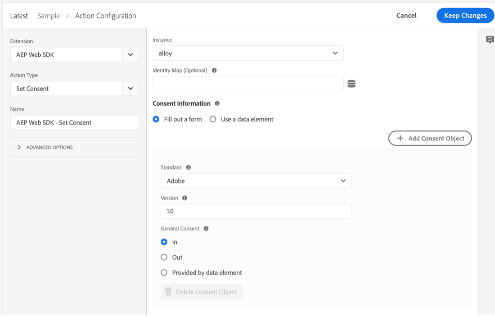
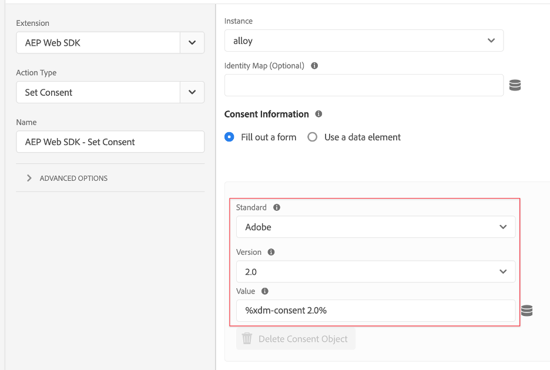

# Implementare il consenso con una piattaforma di gestione del consenso (CMP) utilizzando l’estensione Platform Web SDK

Molte normative legali sulla privacy hanno introdotto requisiti per il consenso attivo e specifico in materia di raccolta dati, personalizzazione e altri casi d’uso di marketing. Al fine di soddisfare questi requisiti, Adobe Experience Platform consente di acquisire informazioni sul consenso nei profili dei singoli clienti e di utilizzare tali preferenze come fattore determinante nel modo in cui i dati di ciascun cliente vengono utilizzati nei flussi di lavoro della piattaforma a valle.

>[!NOTE]
>
>Adobe Experience Platform Launch viene integrato in Adobe Experience Platform come suite di tecnologie per la raccolta dati. Nell’interfaccia sono state introdotte diverse modifiche terminologiche di cui tenere conto quando si utilizza questo contenuto:
>
> * Il platform launch (lato client) è ora **[[!DNL tags]](https://experienceleague.adobe.com/docs/experience-platform/tags/home.html?lang=it)**
> * Platform Launch Server Side è ora **[[!DNL event forwarding]](https://experienceleague.adobe.com/docs/experience-platform/tags/event-forwarding/overview.html?lang=it)**
> * Le configurazioni di Edge sono ora **[[!DNL datastreams]](https://experienceleague.adobe.com/docs/experience-platform/edge/fundamentals/datastreams.html?lang=it)**

Questa esercitazione illustra come implementare e attivare i dati sul consenso ottenuti da una piattaforma di gestione dei consensi (CMP, Consent Management Platform) tramite l’estensione Platform Web SDK in Data Collection. A tal fine, utilizzeremo sia gli standard Adobe che lo standard di consenso IAB TCF 2.0, con OneTrust o Sourcepoint come CMP di esempio.

Questa esercitazione utilizza l’estensione Platform Web SDK per inviare i dati sul consenso a Platform. Per una panoramica dell&#39;SDK Web, vedere [questa pagina](https://experienceleague.adobe.com/docs/experience-platform/edge/home.html?lang=it).

## Prerequisiti

I prerequisiti per l&#39;utilizzo di Web SDK sono elencati [qui](https://experienceleague.adobe.com/docs/experience-platform/edge/fundamentals/prerequisite.html?lang=it#fundamentals).

In tale pagina, è necessario un &quot;Set di dati evento&quot; e, proprio come sembra, si tratta di un set di dati che contiene i dati dell’evento esperienza. Per inviare le informazioni sul consenso con gli eventi, è necessario aggiungere il gruppo di campi [Dettagli consenso IAB TCF 2.0](https://experienceleague.adobe.com/docs/experience-platform/landing/governance-privacy-security/consent/iab/dataset.html?lang=it) allo schema Experience Event:


Per Platform consent standard v2.0, dovremo anche accedere a Adobe Experience Platform per creare uno schema e un set di dati XDM per profilo individuale. Per un&#39;esercitazione sulla creazione dello schema, vedere [Creare uno schema utilizzando l&#39;Editor di schema](https://experienceleague.adobe.com/docs/experience-platform/xdm/tutorials/create-schema-ui.html?lang=it#tutorials) e per il gruppo di campi Dettagli di consenso e preferenze richiesto vedere [Configurare un set di dati per acquisire i dati di consenso e preferenze](https://experienceleague.adobe.com/docs/experience-platform/landing/governance-privacy-security/consent/adobe/dataset.html?lang=it).

Questo tutorial presuppone che tu abbia accesso a Data Collection e che tu abbia creato una proprietà Tag lato client con l’estensione Web SDK installata e una libreria di lavoro creata e generata per lo sviluppo. Questi argomenti sono descritti e illustrati in questi documenti:

* [Creare o configurare una proprietà](https://experienceleague.adobe.com/docs/experience-platform/tags/admin/companies-and-properties.html?lang=it#create-or-configure-a-property)
* [Panoramica delle librerie](https://experienceleague.adobe.com/docs/experience-platform/tags/publish/libraries.html?lang=it)
* [Panoramica sulla pubblicazione](https://experienceleague.adobe.com/docs/experience-platform/tags/publish/overview.html?lang=it)

Verrà inoltre utilizzata l&#39;estensione Chrome [Platform Debugger](https://chrome.google.com/webstore/detail/adobe-experience-platform/bfnnokhpnncpkdmbokanobigaccjkpob) per verificare e convalidare l&#39;implementazione.

Per implementare l’esempio IAB TCF con una CMP sul tuo sito, dovrai accedere a una CMP come OneTrust o Sourcepoint per generare i dati che ti forniscono, oppure puoi semplicemente seguire qui e visualizzare i risultati di seguito.

## Utilizzo di Web SDK con Adobe Consent Standard (v1.0 o v2.0)

>[!NOTE]
>
>Lo standard 1.0 verrà gradualmente eliminato a favore di v2.0. Lo standard 2.0 ti consente di aggiungere ulteriori dati sul consenso che possono essere utilizzati per applicare manualmente le preferenze di consenso. Le schermate seguenti dell&#39;estensione Platform Web SDK provengono dalla versione [2.4.0](https://experienceleague.adobe.com/docs/experience-platform/edge/release-notes.html?lang=it#version-2.4.0) dell&#39;estensione compatibile con la versione v1.0 o v2.0 di Adobe Consent Standard.

Per ulteriori informazioni su questi standard, consulta [Preferenze di supporto del consenso del cliente](https://experienceleague.adobe.com/docs/experience-platform/edge/consent/supporting-consent.html?lang=it).

### Passaggio 1: configurare il consenso nell’estensione Web SDK

Dopo aver installato l’estensione Platform Web SDK in una proprietà Tags, possiamo configurare le opzioni per indirizzare i dati del consenso nella schermata di configurazione dell’estensione:


La sezione &quot;Privacy&quot; imposta il livello di consenso per l’SDK se l’utente non ha fornito in precedenza le preferenze di consenso. Questo imposta lo stato predefinito per la raccolta dei dati di consenso ed evento nell’SDK. L’impostazione scelta risponde alla domanda &quot;cosa deve fare l’SDK se l’utente non ha ancora fornito preferenze di consenso esplicito?&quot;

* In: raccoglie gli eventi che si verificano prima che l’utente fornisca le preferenze di consenso.
* Out: rilascia gli eventi che si verificano prima che l’utente fornisca le preferenze di consenso.
* In sospeso: mette in coda eventi che si verificano prima che l’utente fornisca le preferenze di consenso.
* Fornito dall’elemento dati

Se l&#39;impostazione di consenso predefinita è &quot;In&quot;, questo comunica all&#39;SDK che non deve attendere il consenso esplicito e che deve raccogliere gli eventi che si verificano prima che l&#39;utente fornisca le preferenze di consenso. Queste preferenze vengono generalmente gestite e memorizzate in una CMP.

Se l&#39;impostazione di consenso predefinita è &quot;Out&quot;, indica all&#39;SDK che non deve raccogliere eventi che si verificano prima che le preferenze di consenso dell&#39;utente siano impostate. L’attività del visitatore che si verifica prima dell’impostazione della preferenza di consenso non verrà inclusa in alcun dato inviato dall’SDK dopo l’impostazione del consenso. Ad esempio, se scorri e visualizzi una pagina web prima di selezionare il banner di consenso e utilizzi questa impostazione &quot;Out&quot;, l’attività di scorrimento e l’ora di visualizzazione non vengono inviate se l’utente fornisce in seguito il consenso esplicito per la raccolta dei dati.

Se l’impostazione di consenso predefinita è &quot;In sospeso&quot;, l’SDK mette in coda tutti gli eventi che si verificano prima che l’utente fornisca le preferenze di consenso, quindi gli eventi possono essere inviati dopo che le preferenze di consenso sono state impostate e dopo che l’SDK è stato configurato inizialmente durante una visita.

Con questa impostazione &quot;In sospeso&quot;, se si tenta di eseguire comandi che richiedono preferenze di consenso dell’utente (ad esempio, il comando evento), il comando verrà messo in coda all’interno dell’SDK. Questi comandi vengono elaborati solo dopo aver comunicato le preferenze di consenso dell&#39;utente all&#39;SDK.

Una volta che una CMP raccoglie le preferenze dell’utente, possiamo comunicare tali preferenze all’SDK. In una sezione successiva verrà illustrato come ottenere i dati di consenso e utilizzarli con l’estensione Web SDK.

&quot;Fornito da un elemento dati&quot; ci consente di accedere a un elemento dati contenente qualsiasi dato relativo alle preferenze di consenso acquisito da un codice personalizzato o da una CMP sul tuo sito o nel tuo livello dati. Un elemento dati utilizzato a questo scopo deve risolversi in &quot;in&quot;, &quot;out&quot; o &quot;pending&quot;.

Nota: questa impostazione di configurazione per l’SDK non viene mantenuta nei profili degli utenti, ma è specifica per l’impostazione del comportamento dell’SDK prima che il visitatore fornisca le preferenze del consenso esplicito.

Per ulteriori informazioni sulla configurazione dell&#39;estensione Web SDK, consulta la [Panoramica dell&#39;estensione Platform Web SDK](https://experienceleague.adobe.com/docs/experience-platform/edge/extension/web-sdk-extension-configuration.html?lang=it#configure-the-extension) e [Preferenze di supporto del consenso dei clienti](https://experienceleague.adobe.com/docs/experience-platform/edge/consent/supporting-consent.html?lang=it).

Per questo esempio, scegliamo l&#39;opzione &quot;In sospeso&quot; e selezioniamo **Salva** per salvare le impostazioni di configurazione.

### Passaggio 2: comunicazione delle preferenze di consenso

Ora che abbiamo impostato il comportamento predefinito dell’SDK, possiamo utilizzare i tag per inviare le preferenze di consenso esplicito di un visitatore a Platform. L&#39;invio dei dati del consenso tramite lo standard Adobe 1.0 o 2.0 è facilmente implementabile tramite l&#39;azione `setConsent` dell&#39;SDK Web nelle regole dei tag.

#### Impostazione del consenso con Platform Consent Standard 1.0

Creiamo una regola per dimostrarlo. Nella proprietà tag Platform, seleziona Regole, quindi fai clic sul pulsante blu Aggiungi regole. Chiamiamo la regola &quot;setAdobeConsent&quot; e selezioniamo per aggiungere un evento. Per Tipo evento, scegli &quot;Window Loaded&quot; (Finestra caricata) che attiverà questa regola ogni volta che una pagina viene caricata sul nostro sito web. Quindi, in &quot;Azioni&quot;, seleziona &quot;Aggiungi&quot; per aprire la schermata di configurazione dell’azione. In questo caso verranno impostati i dati del consenso. Seleziona il menu a discesa &quot;Estensione&quot; e seleziona &quot;Platform Web SDK&quot;, quindi seleziona &quot;Tipo azione&quot; e seleziona &quot;Imposta consenso&quot;.

In &quot;Informazioni sul consenso&quot;, scegli &quot;Compila un modulo&quot;. In questa azione della regola utilizzeremo l’SDK per web per impostare il consenso per lo standard di consenso Adobe 1.0 compilando il modulo visualizzato:



Possiamo scegliere di passare &quot;In&quot;, &quot;Out&quot; o &quot;Fornito da elemento dati&quot; con questa azione Imposta consenso. Un elemento dati qui dovrebbe risolvere come &quot;in&quot; o &quot;out&quot;.

In questo esempio, selezioneremo &quot;In&quot; per indicare che il visitatore ha acconsentito a consentire all’SDK web di inviare dati a Platform. Seleziona il pulsante blu &quot;Mantieni modifiche&quot; per salvare questa azione, quindi &quot;Salva&quot; per salvare questa regola.

Nota: una volta che un visitatore del sito web ha rinunciato, l’SDK non ti consentirà di impostare il consenso degli utenti su in.

Le regole di tag possono essere attivate da diversi [eventi](https://experienceleague.adobe.com/docs/experience-platform/tags/extensions/adobe/core/overview.html?lang=it) incorporati o personalizzati che possono essere utilizzati per trasmettere questi dati di consenso al momento opportuno durante una sessione del visitatore. Nell’esempio precedente, abbiamo utilizzato l’evento window loaded per attivare la regola. In una sezione successiva utilizzeremo un evento di preferenza del consenso da una CMP per attivare un’azione Imposta consenso. È possibile utilizzare un’azione Imposta consenso in una regola attivata da qualsiasi evento desiderato che indichi un’impostazione di preferenza di consenso.

#### Impostazione del consenso con Platform Consent Standard 2.0

La versione 2.0 dello standard di consenso di Platform funziona con i dati [XDM](https://experienceleague.adobe.com/docs/platform-learn/tutorials/schemas/schemas-and-experience-data-model.html?lang=it). Richiede anche l’aggiunta del gruppo di campi Consenso e Dettagli delle preferenze allo schema del profilo in Platform. Consulta [Elaborazione del consenso in Platform](https://experienceleague.adobe.com/docs/experience-platform/landing/governance-privacy-security/consent/adobe/overview.html?lang=it) per ulteriori informazioni sulla versione 2.0 dello standard Adobe e su questo gruppo di campi.

Creeremo un elemento dati con codice personalizzato per trasmettere dati alle proprietà di raccolta e metadati dell&#39;oggetto consensi mostrato nello schema seguente:


Questo gruppo di campi Consensi e Dettagli preferenze contiene campi per il tipo di dati XDM [Consensi e preferenze](https://experienceleague.adobe.com/docs/experience-platform/xdm/data-types/consents.html?lang=it#prerequisites) che conterrà i dati delle preferenze del consenso inviati a Platform con l&#39;estensione Platform Web SDK nell&#39;azione della regola. Attualmente, le uniche proprietà necessarie per implementare Platform Consent Standard 2.0 sono il valore di raccolta (val) e il valore temporale dei metadati, evidenziati sopra in rosso.

Creiamo un elemento dati per questi dati. Seleziona Elementi dati e il pulsante blu Aggiungi elemento dati. Chiamiamolo &quot;xdm-consent 2.0&quot; e utilizzando l’estensione Core, selezioneremo un tipo di codice personalizzato. È possibile immettere o copiare e incollare i dati seguenti nella finestra dell&#39;editor di codice personalizzato:

```js
var dateString = new Date().toISOString();

return {
  collect: {
    val: "y"
  },
  metadata: {
    time: dateString
  }
}
```

Il campo dell’ora deve specificare quando l’utente ha aggiornato per l’ultima volta le preferenze di consenso. Stiamo creando un timestamp qui come esempio utilizzando un metodo standard sull’oggetto JavaScript Date. Seleziona Salva per salvare il codice personalizzato, quindi seleziona nuovamente Salva per salvare l’elemento dati.

Quindi, selezioniamo Regole, quindi il pulsante blu Aggiungi regola e inserisci il nome &quot;setConsent onLoad - Consent 2.0&quot;. Scegli l’evento Window Loaded come attivatore della regola, quindi seleziona Aggiungi in Azioni. Scegli l’estensione Platform Web SDK e, per Tipo di azione, scegli Imposta consenso. Lo Standard deve essere Adobe e la Versione deve essere 2.0. Per Valore, utilizzeremo l’elemento dati appena creato che contiene i valori di raccolta e ora da inviare a Platform:



Per rivedere questa azione di esempio, stiamo chiamando Set Consent dall’estensione Platform Web SDK e passando lo Standard e la Versione dal modulo, mentre trasmettiamo i valori per collect e time dall’elemento dati creato in precedenza.

Seleziona il pulsante blu Salva e di nuovo per salvare la regola.

Ora disponiamo di due regole, una per ciascuno degli standard di consenso di Platform. In pratica, probabilmente sceglierai uno standard tra i tuoi siti. Ora creeremo un esempio utilizzando lo standard di consenso IAB TCF 2.0.

## Utilizzo di Web SDK con lo standard di consenso IAB TCF 2.0

Per ulteriori informazioni sulla versione 2.0 di IAB Transparency and Consent Framework, visita il sito web [IAB Europe](https://iabeurope.eu/transparency-consent-framework/).

Per impostare i dati delle preferenze del consenso utilizzando questo standard, è necessario aggiungere il gruppo di campi dello schema Dettagli consenso IAB TCF 2.0 allo schema Experience Event in Platform:


Questo gruppo di campi contiene i campi di preferenza del consenso richiesti dallo standard IAB TCF 2.0. Per ulteriori informazioni sugli schemi e sui gruppi di campi, consulta la [Panoramica del sistema XDM](https://experienceleague.adobe.com/docs/experience-platform/xdm/home.html?lang=it).

### Passaggio 1: creare un elemento dati di consenso

Per inviare i dati dell’evento di consenso dai tag utilizzando lo standard di consenso IAB TCF 2.0, abbiamo prima configurato un elemento dati xdm con i campi di consenso richiesti:


Nella proprietà lato client dei tag, seleziona Elementi dati e il pulsante blu &quot;Aggiungi elemento dati&quot;. Per questo esempio questo elemento dati verrà denominato &quot;xdm-consentStrings&quot;. Questi campi xdm conterranno i dati del consenso utente richiesti per lo standard IAB TCF 2.0.

Nel menu a discesa Estensione, scegli &quot;Platform Web SDK&quot; e per Tipo di elemento dati, scegli &quot;Oggetto XDM&quot;. Dovrebbe apparire il mappatore xdm, che consente di selezionare ed espandere l’elemento &quot;consentStrings&quot; come mostrato nella schermata precedente.

Imposta ciascuna delle stringhe di consenso come segue:

* **`consentStandard`**: `IAB TCF`
* **`consentStandardVersion`**: `2.0`
* **`consentStringValue`**: `%IAB TCF Consent String%`
* **`containsPersonalData`**: `False` (scelto dal pulsante Seleziona valore)
* **`gdprApplies`**: `%IAB TCF Consent GDPR%`

I campi `consentStandard` e `consentStandardVersion` sono entrambi stringhe di testo per lo standard in uso, ovvero IAB TCF versione 2.0. `consentStringValue` fa riferimento a un elemento dati denominato &quot;IAB TCF Consent String&quot;. I segni di percentuale intorno al testo indicano il nome di un elemento dati, che vedremo tra un attimo. Il campo `containsPersonalData` indica se la stringa di consenso IAB TCF 2.0 contiene dati personali con &quot;True&quot; o &quot;False&quot;. Il campo `gdprApplies` indica &quot;true&quot; per le applicazioni RGPD, &quot;false&quot; per le applicazioni RGPD o &quot;undefined&quot; per le applicazioni RGPD. Attualmente, l’SDK per web tratterà &quot;indefinito&quot; come &quot;true&quot;, pertanto i dati di consenso inviati con &quot;gdprApplies: undefined&quot; verranno trattati come se il visitatore si trovasse in un’area in cui si applica il RGPD.

Per ulteriori informazioni su queste proprietà e su IAB TCF 2.0 nei tag, consulta la [documentazione sul consenso](https://experienceleague.adobe.com/docs/experience-platform/edge/consent/iab-tcf/with-launch.html?lang=it#getting-started).

### Passaggio 2: creare una regola per impostare il consenso con lo standard IAB TCF 2.0

Quindi, creiamo una regola per impostare il consenso con Web SDK quando i dati del consenso per questo standard vengono impostati o modificati da un visitatore di un sito web. In questa regola verrà inoltre illustrato come acquisire i segnali di modifica del consenso da una CMP come [OneTrust](https://www.onetrust.com/products/cookie-consent/) o [Sourcepoint](https://www.sourcepoint.com/cmp/).

#### Aggiungere un evento regola

Seleziona la sezione Regole nella proprietà tag Platform, quindi fai clic sul pulsante blu Aggiungi regola. Denomina la regola setConsent - IAB e seleziona Aggiungi in Eventi. Assegniamo un nome a questo evento tcfapi addEventListener e selezioniamo Apri editor per aprire l’editor di codice personalizzato.

Copia e incolla il seguente codice nella finestra dell&#39;editor:

```js
// Wait for window.__tcfapi to be defined, then trigger when the customer has completed their consent and preferences.
function addEventListener() {
  if (window.__tcfapi) {
    window.__tcfapi("addEventListener", 2, function (tcData, success) {
      if (success && (tcData.eventStatus === "useractioncomplete" || tcData.eventStatus === "tcloaded")) {
        // save the tcData.tcString properties in data elements
        _satellite.setVar("IAB TCF Consent String", tcData.tcString);
        _satellite.setVar("IAB TCF Consent GDPR", tcData.gdprApplies);
        trigger();
      }
    });
  } else {
    // window.__tcfapi wasn't defined. Check again in 100 milliseconds
    setTimeout(addEventListener, 100);
  }
}
addEventListener();
```

Questo codice crea ed esegue semplicemente una funzione denominata `addEventListener`. La funzione controlla se l&#39;oggetto `window.__tcfapi` esiste e, in caso affermativo, aggiunge un listener di eventi in base alle specifiche dell&#39;API. Ulteriori informazioni su queste specifiche sono disponibili nel [repository IAB](https://github.com/InteractiveAdvertisingBureau/GDPR-Transparency-and-Consent-Framework) su GitHub. Se questo listener di eventi viene aggiunto correttamente e il visitatore del sito Web ha completato le scelte di consenso e preferenze, il codice imposta le variabili personalizzate dei tag per `tcData.tcString` e l&#39;indicatore per le aree RGPD. Di nuovo, per ulteriori informazioni su IAB TCF, consulta il [sito Web](https://iabeurope.eu/transparency-consent-framework/) e il [archivio GitHub](https://github.com/InteractiveAdvertisingBureau/GDPR-Transparency-and-Consent-Framework) di IAB per informazioni tecniche. Dopo aver impostato tali valori, il codice esegue la funzione trigger che attiva l&#39;esecuzione della regola.

Se l&#39;oggetto `window.__tcfapi` non esisteva alla prima esecuzione della funzione, la funzione lo verificherà nuovamente ogni 100 millisecondi, quindi è possibile aggiungere il listener di eventi. L&#39;ultima riga di codice esegue semplicemente la funzione `addEventListener` definita nelle righe di codice al di sopra di essa.

In sintesi, abbiamo creato una funzione per verificare lo stato del consenso impostato da un visitatore del sito web utilizzando un banner di consenso CMP (o personalizzato). Quando questa preferenza di consenso è impostata, questo codice crea due variabili personalizzate (elementi dati di codice personalizzato) che possiamo utilizzare nell’azione della regola. Dopo aver incollato il codice riportato sopra nella finestra dell’editor di codice personalizzato del nostro evento, seleziona il pulsante blu Salva per salvare l’evento regola.

Ora impostiamo l’azione Imposta regola di consenso per utilizzare questi valori e inviarli a Platform.

#### Aggiungi un&#39;azione regola

Seleziona Aggiungi nella sezione Azioni. In Estensione, scegli Platform Web SDK dal menu a discesa. In Tipo azione, scegli Imposta consenso. Denominiamo questa azione setConsent.

Nella configurazione dell’azione in Informazioni sul consenso, scegli Compila un modulo. Per Standard, scegliere IAB TCF e per Versione immettere 2.0. Per Valore, utilizzeremo la variabile personalizzata del nostro evento e immetteremo `%IAB TCF Consent String%` proveniente da [tcData](https://github.com/InteractiveAdvertisingBureau/GDPR-Transparency-and-Consent-Framework/blob/master/TCFv2/IAB%20Tech%20Lab%20-%20CMP%20API%20v2.md#tcdata) acquisito nella funzione personalizzata dell&#39;evento regola precedente.

In Applicazione RGPD utilizzeremo l&#39;altra variabile personalizzata del nostro evento e immetteremo `%IAB TCF Consent GDPR%` che proviene anche da `tcData` acquisito nella funzione personalizzata dell&#39;evento regola di cui sopra. Se sai che il RGPD sarà o non sarà applicabile per i visitatori di questo sito web, puoi selezionare Sì o No, a seconda dei casi, invece di utilizzare la scelta della variabile personalizzata (elemento dati). Puoi anche utilizzare la logica condizionale in un elemento dati per verificare se il RGPD è applicabile e restituire il valore appropriato.

Alla voce GDPR Contains Personal Data (Contiene dati personali), seleziona l’opzione per indicare se i dati di questo utente contengono o meno dati personali. Un elemento dati deve restituire true o false.


Seleziona il pulsante blu Salva per salvare l’azione e il pulsante blu Salva (o Salva nella libreria) per salvare la regola. A questo punto hai implementato correttamente l’elemento dati e la regola nei tag per impostare il consenso utilizzando l’estensione Web SDK con lo standard di consenso IAB TCF 2.0.

### Passaggio 3: salvare nella libreria e generare

Se utilizzi il prerequisito [libreria di lavoro](https://experienceleague.adobe.com/docs/platform-learn/implement-in-websites/configure-tags/add-data-elements-rules.html?lang=it#use-the-working-library-feature), hai già salvato le modifiche e generato la tua libreria di sviluppo:


### Passaggio 4: Inspect e convalida la raccolta dati

Nel nostro sito, aggiorni la pagina e confermiamo la build della libreria nell&#39;estensione Chrome [Debugger](https://chromewebstore.google.com/detail/adobe-experience-platform/bfnnokhpnncpkdmbokanobigaccjkpob), nella sezione del menu dei tag:


È inoltre possibile esaminare la chiamata setConsent per gli standard Adobe 1.0 o 2.0 nella sezione Web SDK di Debugger Platform, selezionando la riga Corpo POST nella richiesta di rete in cui è visualizzato `{"consent":[{"value":{"general":"in"},"version…`:


Per convalidare la chiamata setConsent e la nostra regola per lo standard IAB TCF 2.0, utilizzeremo il banner di consenso OneTrust sul nostro sito di prova per impostare le preferenze di consenso e creare i tcData descritti in precedenza:


Dopo aver selezionato &quot;Accetto&quot;, possiamo controllare la chiamata setConsent per lo standard IAB TCF 2.0 nella sezione Web SDK di Debugger Platform, selezionando la riga Corpo POST nella richiesta di rete in cui viene visualizzato `{"consent":[{"value":"someAlphaNumericCharacters…`.


Qui vediamo i dati che abbiamo configurato in precedenza nei nostri elementi di dati e nelle regole di tag. La proprietà value contiene i dati codificati tcString visualizzati in precedenza.

OneTrust, Sourcepoint e altre CMP che implementano lo standard IAB TCF 2.0 produrranno tutti dati simili nelle nostre pagine. Possiamo acquisire tali dati e utilizzarli con l’estensione Web SDK nei tag utilizzando l’evento di codice personalizzato nella regola creata in precedenza. Il codice personalizzato sarà lo stesso indipendentemente dalla CMP utilizzata per generare i dati IAB TCF 2.0. Il codice personalizzato può essere utilizzato anche con uno degli standard di consenso di Platform (1.0 o 2.0).

## Invio di dati sul consenso con eventi esperienza

Potresti aver notato che non abbiamo fatto riferimento all’elemento dati &quot;xdm-consentStrings&quot; creato in precedenza in un campo di elemento dati in una delle nostre regole. Questo elemento dati è da utilizzare quando devi inviare i dati del consenso con un evento esperienza.


Poiché questo elemento dati contiene tutti i campi richiesti per lo standard IAB TCF 2.0, puoi semplicemente fare riferimento all’elemento dati quando invii questi dati xdm con i tuoi Eventi esperienza:


## Conclusione

Dopo aver esaminato e convalidato i dati, dovresti vedere come implementare e attivare i dati sul consenso ottenuti da una CMP utilizzando l’estensione Platform Web SDK per Platform.
