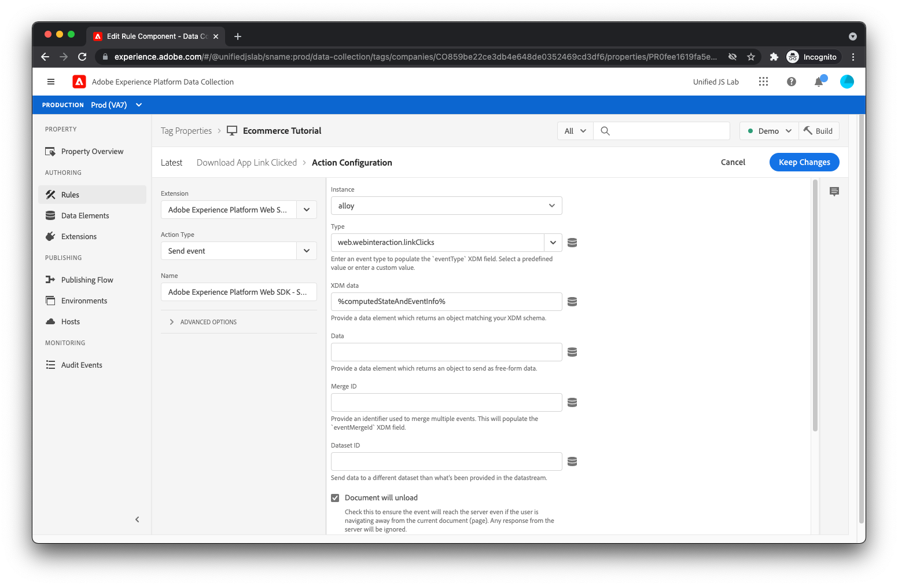

# Creare un elemento dati e una regola per monitorare i download delle app

Come promemoria, quando un utente fa clic su [!UICONTROL Scaricare l’app] , hai inviato al livello dati come segue:

```js
window.adobeDataLayer.push({
  "event": "downloadAppClicked",
  "eventInfo": {
    "web": {
      "webInteraction": {
        "URL": "https://example.com/download",
        "name": "App Download",
        "type": "download"
      }
    }
  }
});
```

Hai utilizzato il `eventInfo` , che comunica al livello dati di comunicare questi dati insieme all’evento, ma a _not_ conserva i dati all’interno del livello dati. Per un clic su un collegamento, non è utile aggiungere al livello dati le informazioni sul collegamento selezionato, perché non è applicabile ad altri eventi che possono verificarsi successivamente sulla pagina.

Per questa implementazione, invierai un evento di esperienza a Adobe Experience Platform contenente il risultato unito di (1) lo stato calcolato del livello di dati e (2) il contenuto di `eventInfo`.

A questo scopo, devi innanzitutto creare un elemento dati che unisca questi due blocchi di informazioni.

## Creare un elemento dati

Per creare l’elemento dati appropriato, fai clic su [!UICONTROL Elementi dati] nel menu a sinistra. Fai clic su [!UICONTROL Aggiungi elemento dati] link.

Per il nome dell’elemento dati, immetti `computedStateAndEventInfo`. Per [!UICONTROL Estensione] campo , seleziona [!UICONTROL Core] se non è già selezionato. Per [!UICONTROL Tipo di elemento dati] campo , seleziona [!UICONTROL Oggetti uniti]. Questo elemento dati consente di unire in profondità più oggetti. Il risultato unito viene restituito dall’elemento dati.

Per il primo oggetto da includere nell&#39;unione, immettere `%event.fullState%`. Quando viene utilizzato all&#39;interno di una regola attivata da un [!UICONTROL Dati scaricati] evento di regola, fa riferimento allo stato calcolato di Adobe Client Data Layer al momento dell&#39;attivazione della regola.

Fai clic su [!UICONTROL Aggiungi un altro].

Per il secondo oggetto, immettere `%event.eventInfo%`. Quando viene utilizzato all&#39;interno di una regola attivata da un [!UICONTROL Dati scaricati] evento di regola, fa riferimento al `eventInfo` porzione inviata ad Adobe Client Data Layer.


L&#39;elemento dati è completo. Salva l’elemento dati facendo clic sul pulsante [!UICONTROL Salva] pulsante .

## Creare una regola

Per creare la regola per tracciare i clic sul pulsante [!UICONTROL Scaricare l’app] collegamento, primo clic [!UICONTROL Regole] nel menu a sinistra.

Fai clic su [!UICONTROL Aggiungi regola].

Per il nome della regola, immetti _Fai clic sul collegamento Scarica app_.

## Aggiungere un evento

Fai clic sul pulsante [!UICONTROL Aggiungi] pulsante sotto [!UICONTROL Eventi]. Ora puoi visualizzare la visualizzazione dell’evento. Per [!UICONTROL Estensione] campo , seleziona [!UICONTROL Livello dati client di Adobe]. Per [!UICONTROL Tipo evento] campo , seleziona [!UICONTROL Dati scaricati].

Perché desideri che questa regola venga attivata solo quando `downloadAppClicked` l&#39;evento viene inviato al livello dati, seleziona [!UICONTROL Evento specifico] radio sotto [!UICONTROL Ascolta] e tipo _downloadAppClic_ nel [!UICONTROL Evento / Chiave per la registrazione]  campo di testo visualizzato.


Fai clic su [!UICONTROL Mantieni modifiche].

## Aggiungi un&#39;azione

Ora che ti trovi nuovamente nella visualizzazione delle regole, fai clic sul pulsante [!UICONTROL Aggiungi] pulsante sotto [!UICONTROL Azioni]. Ora dovresti essere nella visualizzazione delle azioni. Per [!UICONTROL Estensione] campo , seleziona [!UICONTROL Adobe Experience Platform Web SDK]. Per [!UICONTROL Tipo di azione] campo , seleziona [!UICONTROL Invia evento].

Sul lato destro dello schermo, trova la [!UICONTROL Tipo] campo e seleziona `web.webinteraction.linkClicks`.

Per [!UICONTROL Dati XDM] , fai clic sul pulsante del selettore degli elementi dati e seleziona [!UICONTROL computedStateAndEventInfo]. Questo è l&#39;elemento dati appena creato.

Per questa regola (a differenza delle altre regole che hai creato), controllerai la [!UICONTROL Il documento verrà scaricato] casella di controllo. Questo essenzialmente comunica all’SDK che l’utente sta navigando lontano dalla pagina quando fa clic sul collegamento. Questo è importante, perché consente all’SDK di effettuare la richiesta in modo che, anche se l’utente si allontana dalla pagina, la richiesta continuerà a essere in esecuzione in background e raggiungerà il server. Se questa casella di controllo è deselezionata, la richiesta non verrà effettuata in questo modo e quindi probabilmente verrà annullata quando il documento corrente viene scaricato.

Potreste chiedervi, &quot;Sembra carino. Perché questa opzione non è sempre abilitata allora?&quot;

Beh, è un po&#39; complicato, ma quando utilizzi questa funzione, l&#39;SDK utilizza un metodo del browser chiamato [`sendBeacon`](https://developer.mozilla.org/en-US/docs/Web/API/Navigator/sendBeacon) per inviare la richiesta. Quando si invia una richiesta utilizzando `sendBeacon`, il browser non consente all&#39;SDK (o a qualsiasi altra cosa) di accedere ai dati restituiti dal server. Se l’SDK dovesse utilizzare questa funzione per ogni richiesta, non sarebbe mai in grado di ricevere dati dal server. Per questo motivo, è importante controllare il [!UICONTROL Il documento verrà scaricato] selezionare solo quando il documento corrente verrà scaricato, nel qual caso i dati di risposta possono essere comunque scartati.



Salva l’azione facendo clic sul pulsante [!UICONTROL Mantieni modifiche] pulsante .

## Salva la regola

La regola dovrebbe ora essere completa.


Salva la regola facendo clic su [!UICONTROL Salva].
