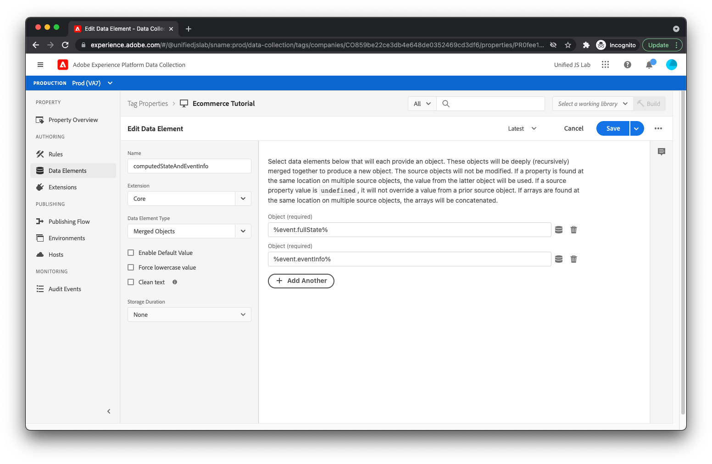

# Creare un elemento dati e una regola per tenere traccia dei download dell’app

Come promemoria, quando si tiene traccia di quando un utente fa clic su [!UICONTROL Scaricare l’app] , hai eseguito il push al livello dati come segue:

```js
window.adobeDataLayer.push({
  "event": "downloadAppClicked",
  "eventInfo": {
    "web": {
      "webInteraction": {
        "URL": "https://example.com/download",
        "name": "App Download",
        "type": "download"
      }
    }
  }
});
```

Hai utilizzato il `eventInfo` chiave, che comunica al livello dati di comunicare questi dati insieme all’evento, ma a _non_ conservare i dati all’interno del livello dati. Per un clic su un collegamento, non è utile aggiungere informazioni sul collegamento su cui è stato fatto clic al livello dati, perché non è applicabile ad altri eventi che potrebbero verificarsi in un secondo momento sulla pagina.

Per questa implementazione, invierai a Adobe Experience Platform un evento esperienza contenente il risultato combinato di (1) lo stato calcolato del livello dati e (2) il contenuto di `eventInfo`.

A questo scopo, devi innanzitutto creare un elemento dati che unisca questi due blocchi di informazioni.

## Creare un elemento dati

Per creare l’elemento dati appropriato, fai clic su [!UICONTROL Elementi dati] nel menu di sinistra. Quindi, fai clic su [!UICONTROL Aggiungi elemento dati] collegamento.

Per il nome dell’elemento dati, immetti `computedStateAndEventInfo`. Per [!UICONTROL Estensione] campo, seleziona [!UICONTROL Core] se non è già selezionato. Per [!UICONTROL Tipo di elemento dati] campo, seleziona [!UICONTROL Oggetti uniti]. Questo elemento dati consente di unire in profondità più oggetti. Il risultato dell’unione viene restituito dall’elemento dati.

Per il primo oggetto da includere nell&#39;unione, immettete `%event.fullState%`. Quando utilizzato all&#39;interno di una regola attivata da un [!UICONTROL Dati inviati] evento della regola, fa riferimento allo stato calcolato di Adobe Client Data Layer al momento dell’attivazione della regola.

Clic [!UICONTROL Aggiungi un altro].

Per il secondo oggetto, immetti `%event.eventInfo%`. Quando utilizzato all&#39;interno di una regola attivata da un [!UICONTROL Dati inviati] evento regola, fa riferimento al `eventInfo` porzione inviata a Adobe Client Data Layer.



L’elemento dati è completo. Salva l’elemento dati facendo clic sul pulsante [!UICONTROL Salva] pulsante.

## Creare una regola

Per creare la regola per il tracciamento dei clic su [!UICONTROL Scaricare l’app] collegamento, primo clic [!UICONTROL Regole] nel menu di sinistra.

Fai clic su [!UICONTROL Aggiungi regola].

Per il nome della regola, immetti _Collegamento all&#39;app di download cliccato_.

## Aggiungere un evento

Fai clic su [!UICONTROL Aggiungi] pulsante sotto [!UICONTROL Eventi]. Ora mostri di essere nella visualizzazione evento. Per [!UICONTROL Estensione] campo, seleziona [!UICONTROL Adobe Client Data Layer]. Per [!UICONTROL Tipo di evento] campo, seleziona [!UICONTROL Dati inviati].

Perché desideri che questa regola venga attivata solo quando `downloadAppClicked` viene inviato al livello dati, seleziona la [!UICONTROL Evento specifico] radio sotto [!UICONTROL Ascolta] e tipo _downloadAppClicked_ in [!UICONTROL Evento/Chiave per cui registrarsi]  campo di testo visualizzato.


Clic [!UICONTROL Mantieni modifiche].

## Aggiungi un&#39;azione

Ora che sei tornato alla visualizzazione della regola, fai clic sul pulsante [!UICONTROL Aggiungi] pulsante sotto [!UICONTROL Azioni]. Ora dovresti essere nella visualizzazione azione. Per [!UICONTROL Estensione] campo, seleziona [!UICONTROL Adobe Experience Platform Web SDK]. Per [!UICONTROL Tipo di azione] campo, seleziona [!UICONTROL Invia evento].

Sul lato destro dello schermo, individua [!UICONTROL Tipo] e seleziona `web.webinteraction.linkClicks`.

Per [!UICONTROL Dati XDM] , fai clic sul pulsante di selezione dell’elemento dati e seleziona [!UICONTROL computedStateAndEventInfo]. Questo è l’elemento dati appena creato.

Per questa regola (a differenza delle altre regole create), controllerai [!UICONTROL Il documento verrà scaricato] casella di controllo. In sostanza, questo comunica all&#39;SDK che l&#39;utente si allontanerà dalla pagina quando farà clic sul collegamento. Questo è importante, perché consente all’SDK di effettuare la richiesta in modo che, anche se l’utente si allontana dalla pagina, la richiesta continui a essere eseguita in background e raggiunga il server. Se questa casella di controllo non è selezionata, la richiesta non verrà eseguita in questo modo e probabilmente verrà annullata al momento dello scaricamento del documento corrente.

Forse vi starete chiedendo, &quot;Sembra bello. Perché questa opzione non è sempre abilitata?&quot;

Beh, è un po’ complicato, ma quando si utilizza questa funzione, l’SDK utilizza un metodo del browser denominato [`sendBeacon`](https://developer.mozilla.org/en-US/docs/Web/API/Navigator/sendBeacon) per inviare la richiesta. Quando si invia una richiesta tramite `sendBeacon`, il browser non consente all’SDK (o a nient’altro) di accedere ai dati restituiti dal server. Se l’SDK utilizzasse questa funzione per ogni richiesta, non sarebbe mai in grado di ricevere dati dal server. Per questo motivo, è importante controllare il [!UICONTROL Il documento verrà scaricato] casella di controllo solo quando il documento corrente verrà scaricato, nel qual caso i dati di risposta possono essere comunque eliminati.


Salva l’azione facendo clic su [!UICONTROL Mantieni modifiche] pulsante.

## Salva la regola

La regola ora dovrebbe essere completa.


Salva la regola facendo clic su [!UICONTROL Salva].
